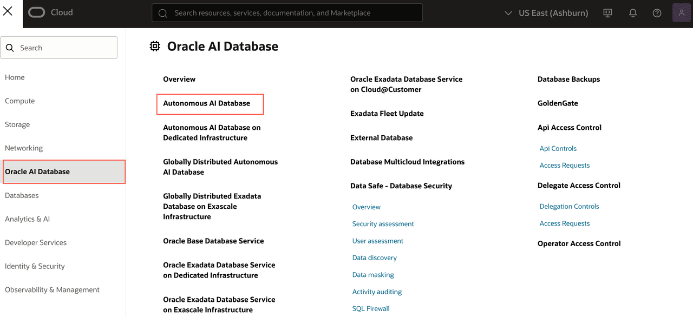
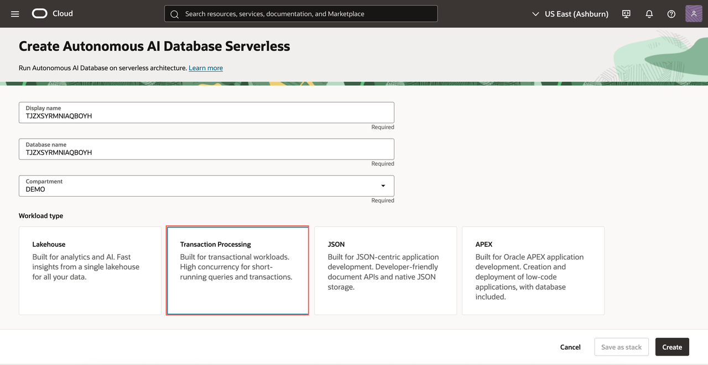
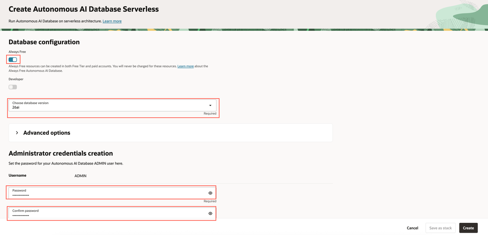
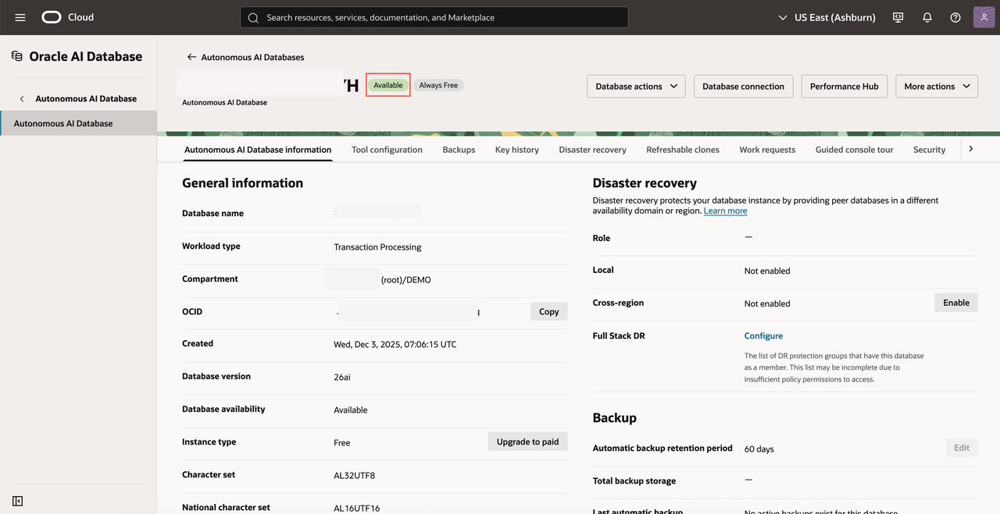
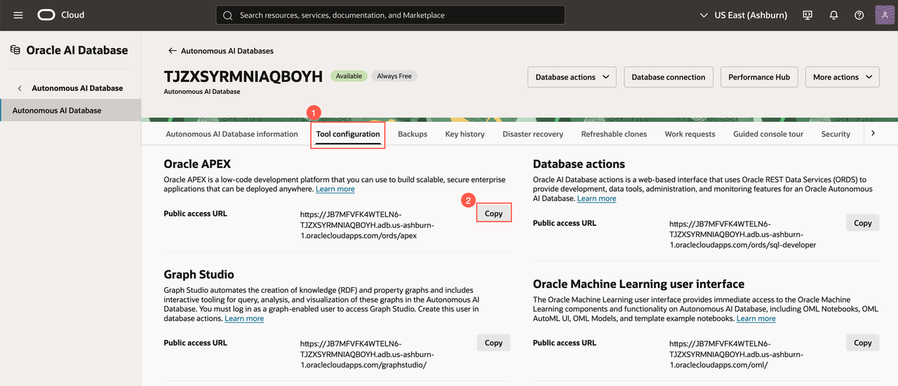
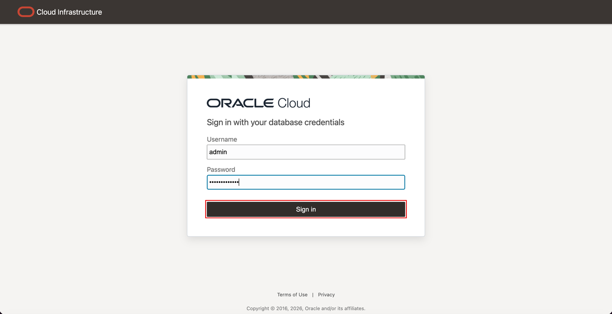
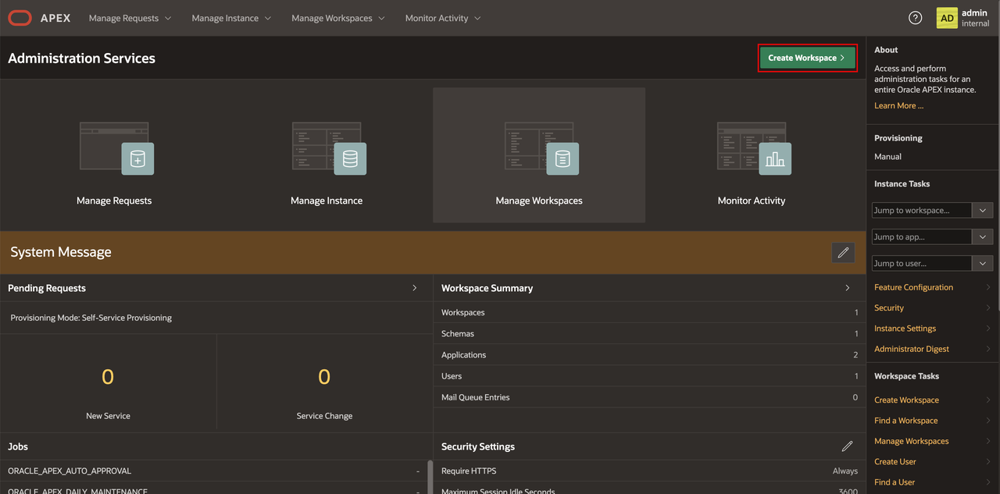
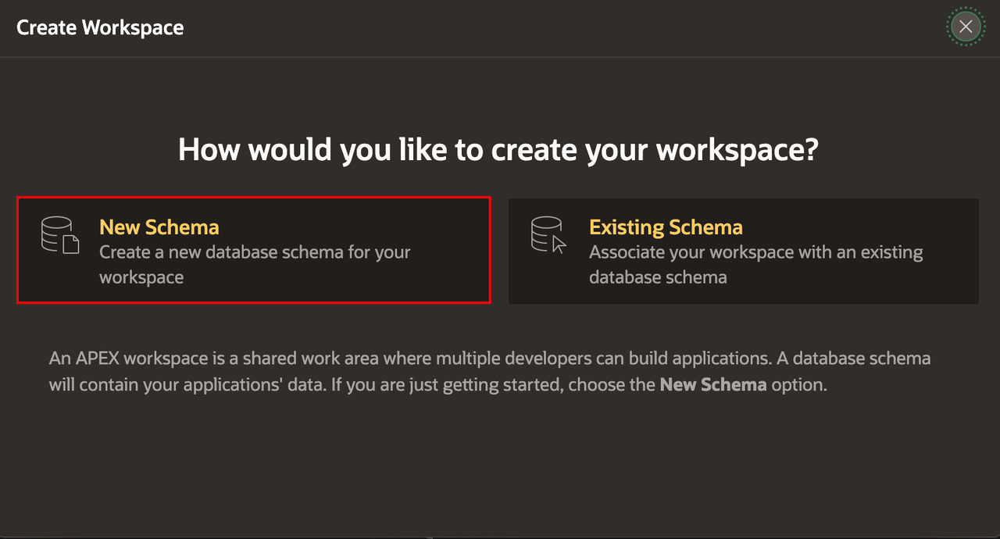
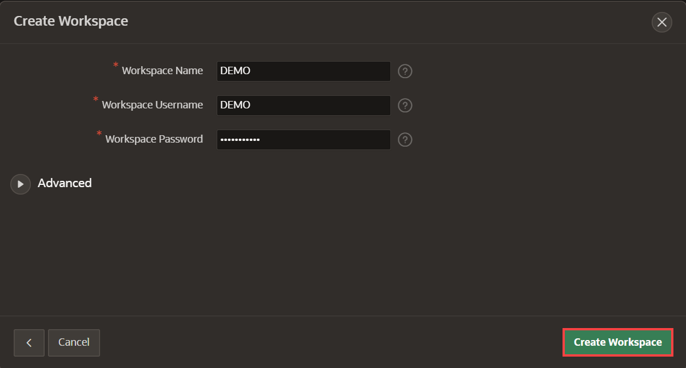
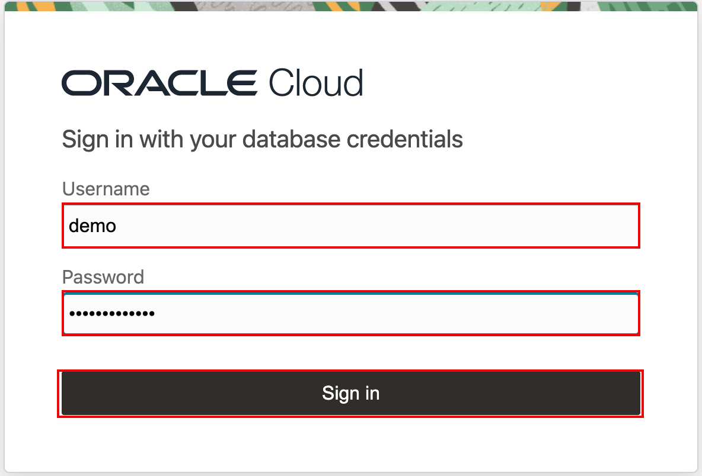

# Provision an Autonomous AI Database

## Introduction

This workshop runs on **Oracle Autonomous AI Database 26ai** with Oracle APEX 26.1. In this lab you create
that database in your own tenancy and open an APEX workspace inside it.

Two things you set here are used much later, so do them deliberately rather than clicking through: the
**database version**, which every AI feature in this workshop depends on, and the **ADMIN password**, which
Lab 7 needs in order to grant your workspace schema the privileges it uses.

> **Already have an Autonomous AI Database 26ai with APEX 26.1?** Skip to Task 3 and create a workspace in
> it. You can check the APEX version from the workspace home page footer.

Estimated Time: 15 minutes

### Objectives

In this lab, you will:

* Create an Autonomous AI Database on version 26ai
* Open APEX and sign in as the instance administrator
* Create the workspace you build in for the rest of the workshop

### Prerequisites

This lab assumes you have:

* An Oracle Cloud account — a [free trial](https://signup.cloud.oracle.com) is enough
* Permission to create an Autonomous AI Database in a compartment of that tenancy

## Task 1: Create the Autonomous AI Database

1. Sign in to the OCI Console. From the navigation menu, choose **Oracle AI Database**, then
    **Autonomous AI Database**.

    

2. Check the **compartment** the list is filtered to, shown as an *Applied filters* chip above the table.
    A fresh tenancy defaults to the root compartment; if you were given a specific compartment, switch to
    it, otherwise the list may look empty or return a permissions error.

3. Click **Create Autonomous AI Database**. The page that opens is titled **Create Autonomous AI Database
    Serverless** — that is the right page.

    

4. Fill in the form, top to bottom:

    * **Display name** and **Database name** — both are pre-filled with a random string like
      `Q4QY2GKQ81XOBOWK`. Replace both; `HELPDESK` is used throughout this workshop.
    * **Compartment** — this is a field on the form, not just the list filter. Confirm it is the
      compartment you intend.
    * **Workload type** — choose **Transaction Processing**.

        > **⚠️ The form preselects `Lakehouse`, and one of the other cards is a trap.** There is an
        > **APEX** workload card, which looks like the obvious choice for an APEX workshop. It is not:
        > that shape is tuned for APEX-only use and does not give you the `ADMIN` database access Lab 7
        > needs for its grants. Pick **Transaction Processing**.

    * Under **Database configuration**, toggle **Always Free** ON if it is offered, and leave the
      **Developer** toggle off.
    * **Choose database version: `26ai`** — set this *after* Always Free, and see the warning below.

        > **⚠️ Toggling Always Free resets the version back to `19c`.** Set Always Free first, then the
        > version — and glance at the version field one more time immediately before you click Create.
        > Flipping Always Free after choosing `26ai` silently reverts it, with no message. The same
        > happens if your console session drops and you sign in again: the form comes back with the name
        > fields regenerated and Always Free switched off, while workload type and version appear to
        > survive. Re-check every field after any interruption.

        > **⚠️ This selector defaults to `19c`, and that silently breaks the workshop.** Verified on a paid
        > tenancy, not just a sandbox: the only two options are `26ai` and `19c`, and `19c` is preselected.
        > AI Interactive Reports, the AI Agent and in-database vector search all need **26ai**. A 19c
        > database provisions perfectly happily and then fails several labs in, with errors that never
        > mention the version.

    * Under **Administrator credentials creation**, the username is fixed as **ADMIN**. Set a password you
      will remember and **write it down now**.

        > **⚠️ Keep the ADMIN password.** Lab 7 signs in to Database Actions as `ADMIN` to grant your
        > workspace schema two privileges. That is the only place it is needed — but there is no way
        > through Lab 7 without it, and resetting it means a detour through the console.

    * Under **Network access**, leave the default **Secure access from everywhere**. With Always Free on,
      the private-endpoint option is greyed out anyway, and APEX needs the public endpoint.

    

    

    

    > **Always Free greyed out, or refused with a capacity message?** That is common and nothing to fix.
    > Always Free can only be created in your tenancy's **home region**, individual regions run out of
    > Always Free capacity (`adb-free-count=0`), and a tenancy is limited to two Always Free databases.
    > **Leave Always Free OFF and continue** — a trial or paid instance is identical for this workshop's
    > purposes.

    > **Always Free databases stop themselves.** Turning the toggle on raises a warning worth reading: an
    > Always Free database with no activity for **7 consecutive days is stopped automatically**. Your data
    > is preserved and you restart it from the console — but if you come back to this workshop after a
    > week, start the database before wondering why APEX will not load.

    > **Which region?** Any. Your database does not have to sit in a region that offers OCI Generative AI —
    > APEX calls that service over REST, so the two are independent. Lab 1 covers the region requirement
    > for Generative AI itself.

5. Click **Create**. Provisioning takes a few minutes.

6. Wait for the state to change from **Provisioning** to **Available** before continuing.

    

    

## Task 2: Open APEX and Sign In as Instance Administrator

APEX ships with the database but has no workspace yet, so your first visit is as the instance
administrator.

1. On the database details page, open the **Tool configuration** tab. Under **Oracle APEX**, click
    **Copy** next to the public access URL and open it in a new browser tab.

    > **Copy the URL, do not retype it.** The console displays the host upper-cased
    > (`GC9C36CF5A92CB1-…`). Browsers do not care, but it is easy to mistype by hand.

    

2. The URL does **not** open APEX directly. It opens the Autonomous AI Database sign-in page —
    *"Sign in with your database credentials"*, with Username and Password fields above a row of external
    identity providers. Enter **`ADMIN`** and the ADMIN password you set in Task 1, and click **Sign in**.

    

    > **This is a database sign-in, not an APEX one.** Ignore the external identity provider buttons
    > (OCI IAM, Azure, GCP, AWS, Okta) — they are for federated database users, not for this workshop.

3. You land directly in **APEX Administration Services**. There is no second sign-in.

    > **Ignore the Workspace Summary tile.** On a database this new it may already claim several
    > workspaces and applications. Those are stale daily-aggregate counts, and the `INTERNAL` workspace
    > alone holds nearly 200 Oracle-supplied applications. Your instance is empty until you create a
    > workspace in Task 3.

## Task 3: Create Your Workspace

1. Click **Create Workspace**, at the top right of Administration Services.

    

2. Choose **New Schema** — the workshop creates its own tables, so there is nothing to reuse.

    

3. Enter a **Workspace Name**, **Workspace Username** and **Workspace Password**, then click **Create
    Workspace**. This workshop uses workspace `HELPDESK` with username `helpadmin`; any names work as long
    as you remember them. Leave the **Advanced** section alone — its optional *Database Password* and
    *Workspace ID* are not needed.

    

    > **⚠️ If you see "Workspace name already exists", check before you retry.** The dialog can stay open
    > after a *successful* create, so clicking Create Workspace a second time reports a name clash for the
    > workspace you just made. Go to **Manage Workspaces > Existing Workspaces** and look for your
    > workspace — if it is listed with a recent *Provisioned* time, it worked. Do **not** delete it and
    > start over; that throws away the workspace the error is complaining about.

    > **You cannot choose the schema name.** There is no schema field, even under Advanced. Autonomous AI
    > Database derives it by prefixing the workspace name, so workspace `HELPDESK` runs on schema
    > **`WKSP_HELPDESK`**. Nothing in this workshop schema-qualifies anything, so it simply works — but
    > Lab 7 asks you to type the schema name, and the prefixed form is the one it wants. SQL Workshop
    > shows it in the header.

4. Sign in at the same APEX URL with your workspace username and password. APEX then asks you to **select
    a workspace** — click your workspace name to continue.

    

You should land on the APEX home page with **0 applications and 0 tables**, and the footer showing your
APEX release. That empty workspace is exactly what Lab 1 expects.

You may now **proceed to the next lab**.

## Learn More

* [Provisioning Autonomous AI Database](https://docs.oracle.com/en-us/iaas/autonomous-database-serverless/doc/autonomous-provision.html)
* [Oracle APEX Release Notes, Release 26.1](https://docs.oracle.com/en/database/oracle/apex/26.1/htmrn/index.html)

## Acknowledgements

* **Author** - Rick Houlihan
* **Last Updated By/Date** - Rick Houlihan, August 2026
