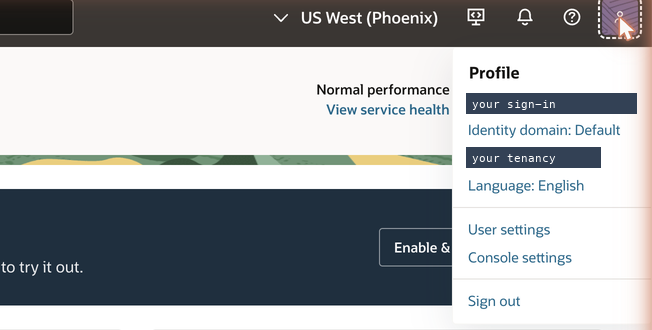
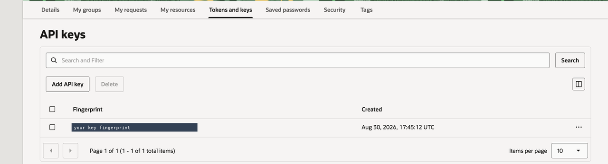
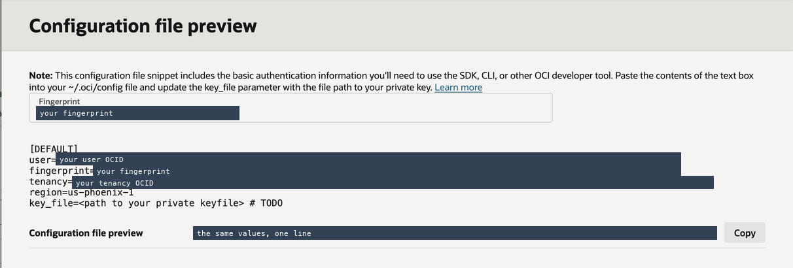
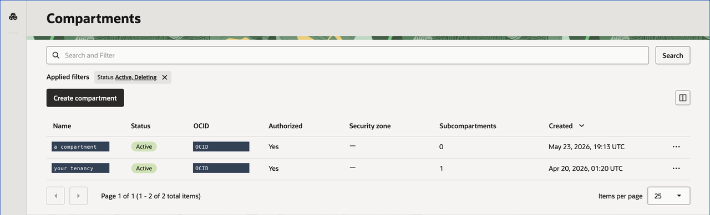
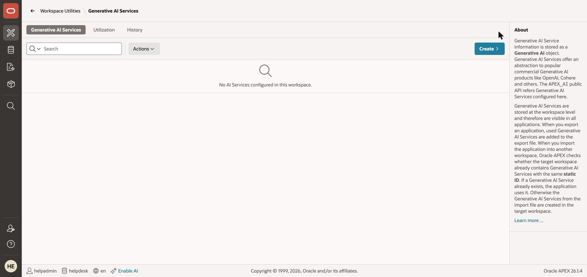
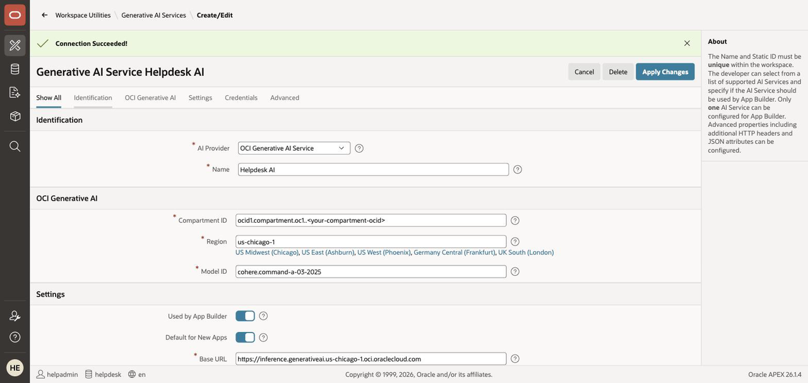
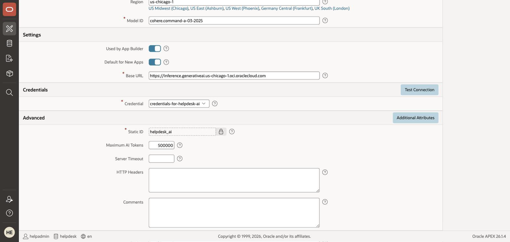
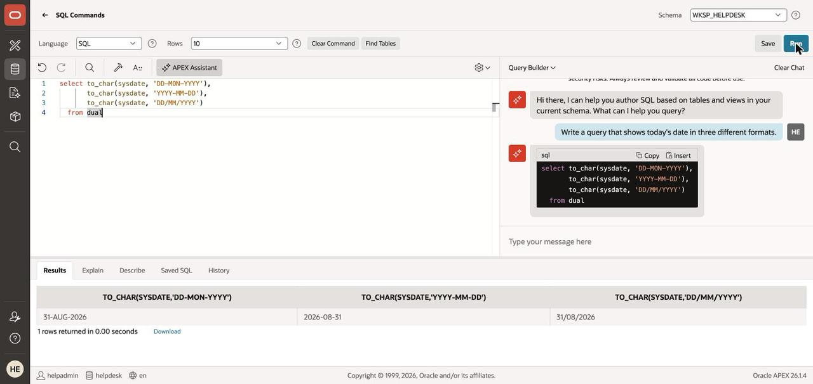

# Lab 1: Connect APEX to Generative AI

## Introduction

Every AI feature in this workshop — the APEX Assistant, app generation, AI Interactive Reports, and the help desk agent — talks to a Generative AI service that you configure once, at the workspace level. In this lab you create that service and prove it works.

You can use **OCI Generative AI** (default for this workshop) or **OpenAI** (bring your own API key). Use the selector at the top of this page to switch instructions.

Estimated Time: 10 minutes

### Objectives

In this lab, you will:

* Create an API key for your AI provider
* Configure a Generative AI service in your APEX workspace
* Set a token quota on the service
* Test the wiring with the APEX Assistant

### Prerequisites

This lab assumes you have:

* An APEX workspace (previous lab) with your Autonomous Database up and running

<if type="OCIGenAI">

## Before You Start: Confirm You Are Subscribed to a Generative AI Region

OCI Generative AI runs in a limited set of regions, and your tenancy must be **subscribed** to the region you point APEX at. On the LiveLabs Sandbox this is already done for you — **skip to Task 2**. On your own tenancy, check it now: skipping this step produces an `HTTP-401` later in this lab that looks exactly like a bad credential.

1. In the OCI Console, click the **region menu** in the top-right corner. Your subscribed regions are listed under **Home region**.

2. If **US Midwest (Chicago)** is not listed, click **Manage regions**, find `us-chicago-1`, open its **⋯** menu and choose **Subscribe to this region**.

    > **Region subscriptions are permanent.** You can add a region to a tenancy, but you cannot remove it afterwards. Subscribing costs nothing on its own.

3. **Wait a few minutes before continuing.** A newly subscribed region needs time to replicate your identity data. Until it finishes, every request signed against that region returns `HTTP-401` even though your credentials are perfectly valid. Five minutes is typical.

## Task 1: Generate API Keys using the OCI Console

OCI API keys are a public/private key pair used to authenticate REST calls to OCI services — including OCI Generative AI.

1. In the OCI Console, click **Profile** at the top-right corner and select **User settings**.

    

2. Switch to the **Tokens and keys** tab and click **Add API key**.

    

3. Select **Generate API Key Pair**, then click **Download Private Key**. A *.pem* file is saved to your device — you paste its contents into APEX in the next task.

    > **The Add button stays greyed out until you download the private key.** That is expected, not a broken dialog — the key is shown only once, so the console makes you save it first.

    > **Keep the private key private.** Never share the .pem file or upload it anywhere; anyone holding it can call OCI services as you.

4. Click **Add**. The **Configuration File Preview** appears — copy the whole snippet into a scratch note. It contains your **user OCID**, **tenancy OCID**, and **key fingerprint**, all needed in the next task.

    

5. You also need your **assigned compartment's OCID** — this one is *not* in the configuration file. In the LiveLabs Sandbox, open your reservation details to find your assigned compartment, or in the OCI Console navigate to **Identity & Security > Compartments** and copy the OCID shown next to your compartment.

    > **Running in your own tenancy's root compartment?** Then the compartment OCID *is* the tenancy OCID — reuse the `tenancy=` value from the Configuration File Preview and skip this step.

    

## Task 2: Configure the Generative AI Service in APEX

1. In APEX, from the workspace home page navigate to **App Builder > Workspace Utilities > Generative AI**, and click **Create**.

    

2. Enter/select the following:

    * AI Provider: **OCI Generative AI Service**
    * Name: **Helpdesk AI**
    * Static ID: **helpdesk\_ai** — and it becomes **read-only once the service is created**, so get it right now

        > **⚠️ APEX auto-fills this from the Name, and it uses a hyphen.** Typing `Helpdesk AI` gives you
        > `helpdesk-ai`. Overwrite it with the underscore form `helpdesk_ai` before you click Create — the
        > field cannot be changed afterwards.
    * Compartment ID: your assigned compartment OCID from Task 1, step 5
    * Region: **us-chicago-1** (OCI Generative AI runs in a limited set of regions; APEX calls it over REST, so your database can live anywhere)
    * Model ID: **replace the pre-filled value with** `xai.grok-4.3`
    * Used by App Builder: toggle **ON**
    * Default for New Apps: **leave it ON** (it already is) — new applications then pick this service up automatically

    > **🔴 The model matters more than you would expect — do not just pick one.** Labs 4 and 5 drive APEX through **tool calling**, and most models fail at it here. Verified on APEX 26.1.4 against the same report and prompt:
    >
    > | Model ID | Labs 4 & 5 |
    > |---|---|
    > | `xai.grok-4.3` | ✅ works |
    > | `cohere.command-a-03-2025` (**what APEX pre-fills**) | ❌ `INVALID_TOOL_GENERATION` |
    > | `google.gemini-2.5-pro` | ❌ rejects APEX's tool definitions |
    >
    > Leaving the pre-filled Cohere model in place is the single most likely way to break this workshop. If `xai.grok-4.3` has since been retired, pick another **xAI** model from OCI Console > **Generative AI** > **Playground** > **Chat** > model picker, and re-test Lab 4 before continuing.

    > **Lab 5 may want a different model.** The AI Agent in Lab 5 works with `cohere.command-a-03-2025` — the very model that fails Lab 4. Changing the Model ID between the two labs takes ten seconds and is called out where it matters. Also note OCI applies a **per-model service limit** separate from the compartment quota: if a model answers a few times and then returns `HTTP-429 ... service limit for this model has been reached`, that model is rate-limited for your tenancy, and either you request a limit increase in OCI or you switch models.

    > **Model availability is region-specific.** A model offered in `us-chicago-1` may not exist in another region — pointing at the wrong one returns `HTTP-404: Entity with key <model> not found`. Read the model list from the picker **while the console is set to the same region you entered above**.

    > **Don't skip the toggle.** "Used by App Builder" is what lights up the APEX Assistant in the builder — it's the most commonly missed step in this lab.

3. For Credential, select **Create New** and enter, from your Task 1 scratch note:

    * **OCI User ID** (the user OCID)
    * **OCI Private Key** (paste the full contents of the downloaded .pem file)
    * **OCI Tenancy ID** (the tenancy OCID)
    * **OCI Public Key Fingerprint**

4. Click **Test Connection**. When it succeeds, click **Create**.

    

    > **If Test Connection fails, read the error code — each one means something different:**
    >
    > * `HTTP-401` — most often your tenancy is **not subscribed** to the region, or you subscribed only moments ago and identity replication hasn't finished. Re-check **Before You Start** and retry after a few minutes. Failing that, confirm all four credential fields came from the same API key.
    > * `HTTP-404: Entity with key ... not found` — the credentials are **fine** (the request authenticated); the **Model ID** does not exist in that region. Pick one from the Chat playground with the console set to that region.
    > * `HTTP-429 ... max-on-demand-chat-request-per-minute-count ... is exceeded` — a **compartment quota**, not a busy service. At a live event, wait 30 seconds and retry. On a LiveLabs Sandbox this quota may be set to zero, in which case retrying will never help: **switch this page to the OpenAI track** and continue.
    > * `Bad Gateway` — transient. Retry once.

    > **⚠️ A successful Test Connection does NOT prove Labs 4 and 5 will work.** It sends a plain chat request and never exercises **tool calling**, which is what AI Interactive Reports and AI Agents depend on. If Lab 4 or 5 later fails with `INVALID_TOOL_GENERATION`, or a complaint about `$schema` or `function_declarations`, the **Model ID is wrong** — the report and agent configuration are fine. Set it to `xai.grok-4.3` and retry.

</if>

<if type="OpenAI">

## Task 1: Get an OpenAI API Key

1. Sign in at the OpenAI platform site, open **API keys**, and create a new secret key. Copy it immediately — it is shown only once.

    > **Where your data goes on this track.** With OpenAI as the provider, your prompts — and any data the AI features send as context (query results, ticket text) — go to a third party. That's fine for this workshop's synthetic seed data; evaluate it deliberately for your own applications.

    > At an instructor-led event, use the event-provided key shown on screen instead of creating your own. Self-paced? You need your own (paid) OpenAI key on this track — or switch this page to the OCI Generative AI instructions.

## Task 2: Configure the Generative AI Service in APEX

1. In APEX, from the workspace home page navigate to **App Builder > Workspace Utilities > Generative AI**, and click **Create**.

    

2. Enter/select the following:

    * AI Provider: **OpenAI**
    * Name: **Helpdesk AI**
    * Static ID: **helpdesk\_ai** — and it becomes **read-only once the service is created**, so get it right now

        > **⚠️ APEX auto-fills this from the Name, and it uses a hyphen.** Typing `Helpdesk AI` gives you
        > `helpdesk-ai`. Overwrite it with the underscore form `helpdesk_ai` before you click Create — the
        > field cannot be changed afterwards.
    * Model ID: **pick a current chat model that supports tool calling** (for example a recent GPT-4-class or GPT-5-class model) — Labs 4 and 5 depend on tool calling, so avoid older or lightweight models
    * Used by App Builder: toggle **ON**
    * Credential: **Create New**, and paste your API key

    > **Don't skip the toggle.** "Used by App Builder" is what lights up the APEX Assistant in the builder — it's the most commonly missed step in this lab.

3. Click **Test Connection**. When it succeeds, click **Create**.

    

</if>

## Task 3: Set a Token Quota on the Service

> **Glossary — token:** the unit LLMs read and bill by (a short word is roughly one token). Every AI call in this workshop spends tokens.

1. Edit the **Helpdesk AI** service you just created, open the **Advanced** section at the bottom of
    the page, set **Maximum AI Tokens** to **500000**, and click **Apply Changes**.

    > **Advanced is where this setting lives** — it is not in **Settings**, which is the section you
    > would reasonably look in first.

    

2. **Governance beat #1 — you cap your own AI usage declaratively.** This quota is the first of five governance mechanisms you'll meet today; the others appear in Labs 2, 4, and 5. No code, no proxy — a workspace setting.

## Task 4: Prove the Wiring with the APEX Assistant

1. Navigate to **SQL Workshop > SQL Commands** and click the **APEX Assistant** button in the toolbar.

2. **The first time you use an AI feature in a workspace, APEX asks you to accept the third-party AI terms.** Read them and click **Accept** — the Assistant will not open otherwise. This appears once per workspace.

3. Ask it:

    ```
    <copy>Write a query that shows today's date in three different formats.</copy>
    ```

4. The Assistant streams back a query — click **Insert** and run it. If you get SQL and a result, everything downstream of this lab will work.

    

## Go Further (optional)

Paste this block into SQL Commands, select it, and ask the APEX Assistant to *explain* it — you'll meet this exact code again in Lab 5 as your AI agent's write tool:

```
<copy>declare
  l_subject tickets.subject%type;
begin
  select subject into l_subject from tickets where id = :TICKET_ID;
  update tickets set status = 'Resolved' where id = :TICKET_ID;
  apex_ai.set_tool_result(
    p_result => 'Ticket ' || :TICKET_ID || ' ("' || l_subject || '") is now Resolved.');
end;</copy>
```

You may now **proceed to the next lab**.

## Learn More

* [Managing Generative AI Services](https://docs.oracle.com/en/database/oracle/apex/26.1/htmdb/managing-generative-ai-services.html)
* [OCI Generative AI regions and models](https://docs.oracle.com/en-us/iaas/Content/generative-ai/overview.htm)

## Acknowledgements

* **Author** - Rick Houlihan
* **Last Updated By/Date** - Rick Houlihan, August 2026
