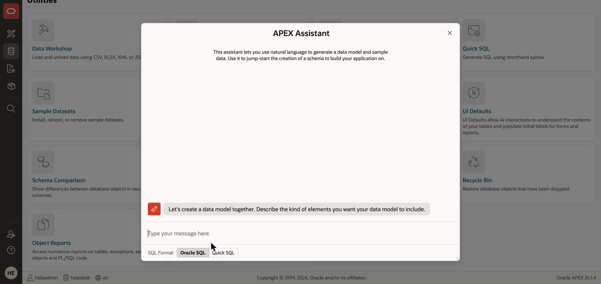
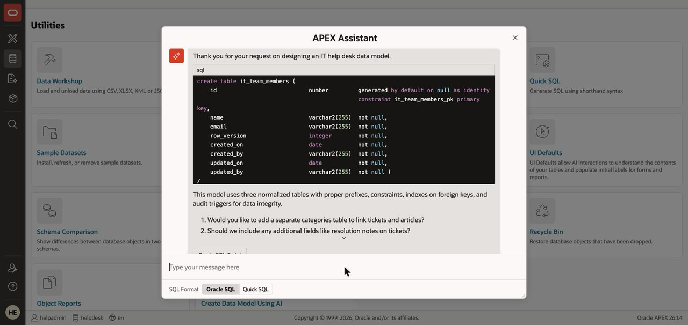
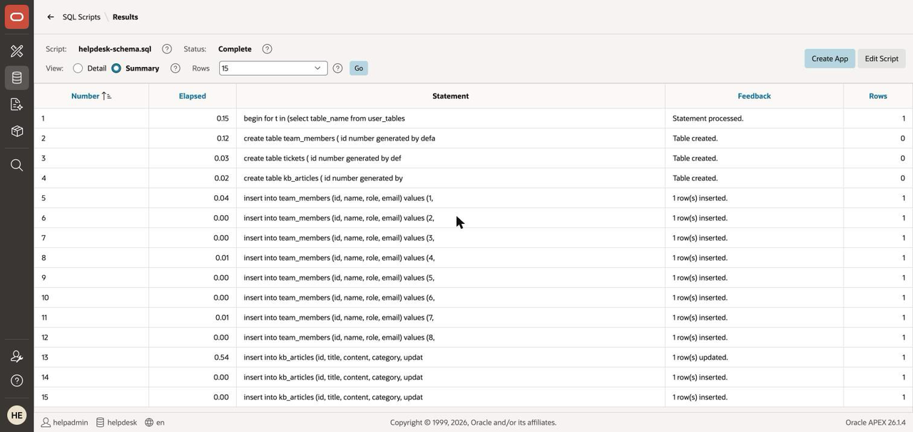
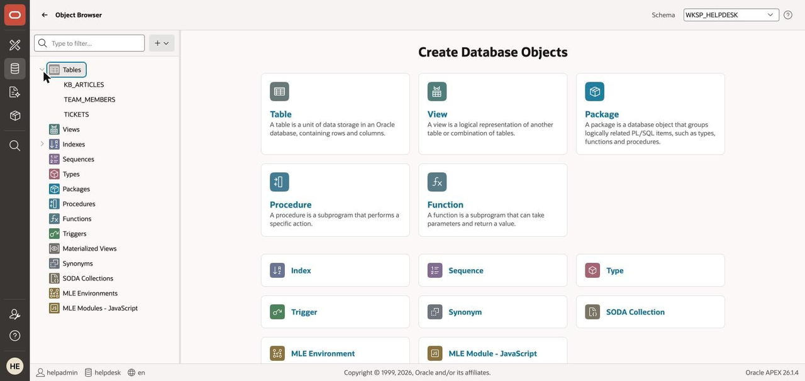

# Lab 2: Design the Data Model with AI

## Introduction

The Horizon Help Desk needs three tables: tickets, knowledge-base articles, and the team that works them. Instead of drawing them by hand, you'll have AI propose the design — then do what a professional does with AI output: **review it, and run the vetted version**.

Estimated Time: 10 minutes

### Objectives

In this lab, you will:

* Generate a data model from a natural-language description
* Review AI-proposed SQL like a reviewer, not a passenger
* Create the canonical workshop schema with seeded data

### Prerequisites

This lab assumes you have:

* Completed Lab 1 (the Generative AI service is configured)

## Task 1: Describe the Data Model to AI

1. Navigate to **SQL Workshop > Utilities > Create Data Model Using AI**. It is the **last tile on the
    page**, so scroll to the bottom — or use the **Create Data Model Using AI** shortcut in the Tasks
    list on the SQL Workshop home page.

    > **Leave SQL Format on `Oracle SQL`.** The dialog that opens offers `Oracle SQL` or `Quick SQL`.
    > Quick SQL returns shorthand rather than runnable DDL, which is not what this lab reviews.

    

2. Paste this description and send it:

    ```
    <copy>Create a data model for an IT help desk: support tickets with subject, description,
    status, priority, category, created date and an assigned team member; knowledge base
    articles with title, content and category; and a small team members table.</copy>
    ```

3. Watch the AI propose tables, columns, and relationships.

    

## Task 2: Review the Proposal — You Are the Reviewer

1. Read the generated SQL the way you'd read a colleague's pull request. Check:

    * **Keys** — does each table have a sensible primary key? Is the ticket-to-team-member relationship a foreign key?
    * **Types and sizes** — are text columns sized realistically? Are dates actually dates?
    * **Naming** — will you still understand these names in six months?

    > **What it actually proposed when we ran this.** The AI prefixed every table (`it_team_members`,
    > not `team_members`), gave each one identity primary keys plus `row_version`, `created_on`,
    > `created_by`, `updated_on`, `updated_by` audit columns and audit triggers, and finished by asking
    > two follow-up questions. All defensible choices — and all different from the schema the rest of
    > this workshop is built on. That gap *is* the lesson: AI output is a proposal, and you decide.

    > **Governance beat #2 — you review AI's SQL before anything runs.** The habit you just practiced is the whole trick to trustworthy AI-assisted development: AI proposes, you approve. Nothing the AI wrote has touched your database yet.
    >
    > Oracle makes the same point in the product: the APEX Assistant panel tells you, unprompted, that
    > *"AI-generated code may contain errors or security risks. Always review and validate all code before
    > use."* This lab is that sentence turned into a habit.

2. **Do not run the wizard's script.** Close the wizard after your review. (The wizard's final step *saves* a script rather than running it — we're skipping even that, because in the next task the whole room runs one vetted, identical version, so every lab, screenshot, and AI answer that follows matches what you see.)

    > Already ran the AI's script before reading this? No problem — the next task's script replaces those tables cleanly.

## Task 3: Run the Canonical Schema and Seed Data

1. Download [helpdesk-schema.sql](files/helpdesk-schema.sql), then navigate to **SQL Workshop > SQL Scripts**, click **Upload**, choose the file, and **Run** it. The script drops and recreates `TICKETS`, `KB_ARTICLES`, and `TEAM_MEMBERS`, then seeds 50 tickets, 30 knowledge-base articles, and 8 team members — it's a state-reset checkpoint, safe to re-run at any point today.

    

    > **Uploading a second time fails with "a script with this name already exists".** SQL Scripts are
    > stored at the *workspace* level, so a script you uploaded earlier survives dropping every table
    > in the schema. If you need to re-upload — a corrected file, or a fresh download — tick the old
    > script on the **SQL Scripts** page and use **Delete Checked** first. Re-*running* the script you
    > already have is always safe; it is the re-*upload* that collides.

2. Verify the seed loaded:

    ```
    <copy>select count(*) tickets from tickets;</copy>
    ```

    Expected result: **50**.

3. Open **SQL Workshop > Object Browser** and confirm the three tables exist with data.

    

## Go Further (optional)

Ask the APEX Assistant (SQL Commands toolbar) for:

```
<copy>Open ticket count by category, ordered by count descending.</copy>
```

Review its SQL — then run it. That's the Lab 2 habit, applied in five seconds.

You may now **proceed to the next lab**.

## Learn More

* [AI-assisted data modeling in APEX](https://blogs.oracle.com/apex/blog-create-data-model-using-ai)

## Acknowledgements

* **Author** - Rick Houlihan
* **Last Updated By/Date** - Rick Houlihan, July 2026
