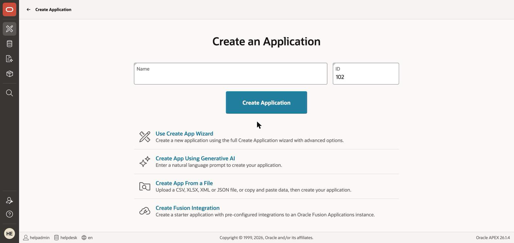
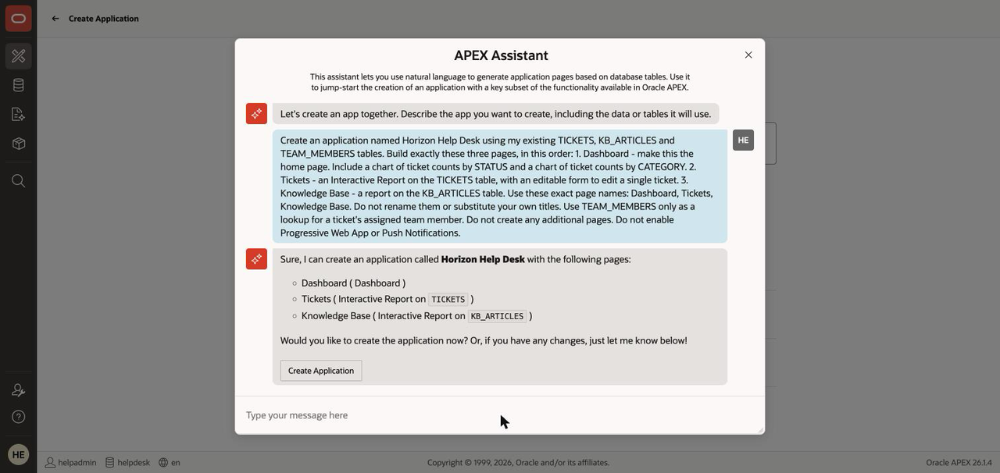
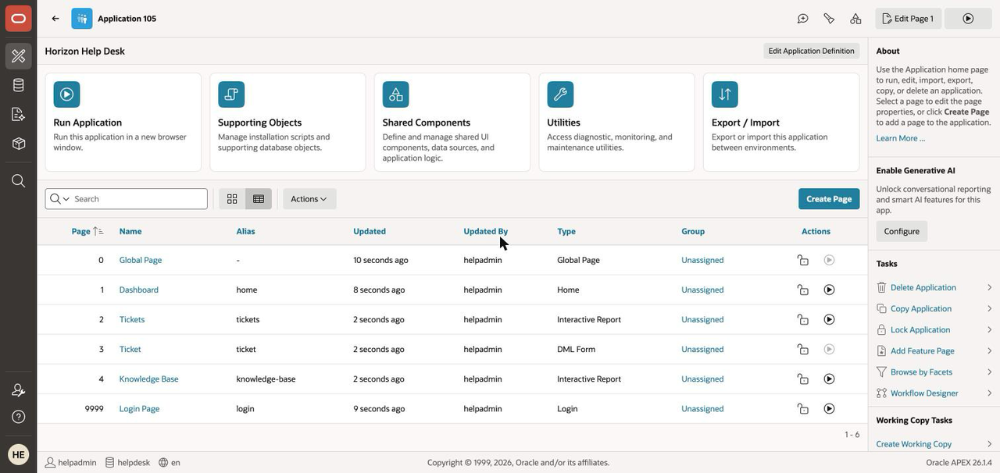

# Lab 3: Generate the App from a Prompt

## Introduction

Your data is in place. Now describe the application you want — and review the blueprint AI proposes before a single page is created. Ten minutes from now you'll be logged into a real web app with authentication and a URL.

Estimated Time: 10 minutes

### Objectives

In this lab, you will:

* Generate an application blueprint from a natural-language prompt
* Verify the blueprint has the pages later labs depend on
* Create, run, and tour the Horizon Help Desk

### Prerequisites

This lab assumes you have:

* Completed Lab 2 (the three tables exist with seed data)

## Task 1: Describe the App

1. Navigate to **App Builder > Create**, then choose **Create App Using Generative AI**.

    

2. Paste this prompt and send it:

    ```
    <copy>Create an application named Horizon Help Desk using my existing TICKETS, KB_ARTICLES
    and TEAM_MEMBERS tables. Build exactly these three pages, in this order:
    1. Dashboard - make this the home page. Include a chart of ticket counts by STATUS and a
    chart of ticket counts by CATEGORY.
    2. Tickets - an Interactive Report on the TICKETS table, with an editable form to edit a
    single ticket.
    3. Knowledge Base - a report on the KB_ARTICLES table.
    Use these exact page names: Dashboard, Tickets, Knowledge Base. Do not rename them or
    substitute your own titles.
    Use TEAM_MEMBERS only as a lookup for a ticket's assigned team member. Do not create any
    additional pages. Do not enable Progressive Web App or Push Notifications.</copy>
    ```

    > **Why this prompt is so specific.** Generated apps vary between runs, but Labs 4, 5 and 6 build on
    this one. Naming the pages, pinning the Dashboard as the home page, and asking for an **Interactive
    Report** by name are what make the rest of the workshop work first time. The full contract is in
    *Task 2*.

    > **Note the wording of item 2.** The report and its edit form are asked for as **one page entry**, not
    two. Listing them separately makes the wizard build *two* report-and-form pairs, leaving you with two
    pages both named Tickets — and Lab 4 then can't tell you which one to open.

3. AI responds with an application **blueprint** — a proposed set of pages. Read it, then click **Create Application** *in the chat*.

    > **🔴 Check the page names against the blueprint anyway.** Without the "use these exact page
    > names" line above, our first run came back as **Overview**, **Ticket List** and **Article
    > Library** — right page types and tables, wrong names. That line is in the prompt precisely to
    > stop it, but generation varies between runs: if the names still drift, rename them in the
    > wizard (Task 2). It matters because Labs 4, 5 and 6 all tell you to open "the **Tickets** page".

    > **Why the prompt refuses two features.** Left to itself the blueprint enables **Install
    > Progressive Web App** and **Push Notifications** — neither was asked for, and Push Notifications
    > creates a Web Credential that outlives the application (see Lab 8, Task 3). The final line of the
    > prompt suppresses both; with it, the blueprint lists no features at all. If you *want* them, drop
    > that line and turn them on deliberately.

    > **That button does not create anything yet.** It hands off to the Create Application wizard, which is where the blueprint becomes editable — page names, page types, charts, features and authentication. The chat summary lists pages only; the wizard is where you can actually inspect and change them. Task 2 happens there.

    

## Task 2: Review the Blueprint — Pin the Pages Later Labs Need

This is the highest-leverage review in the workshop. Everything below is **free to change now** in the
blueprint editor, and fiddly to change after the app exists.

1. Check the blueprint against all five requirements:

    | # | Check | Needed by |
    |---|---|---|
    | 1 | **Dashboard** is listed **first** — it must become page 1; rename it if the AI called it Overview | Lab 5 |
    | 2 | Dashboard has a **tickets by status** chart and a **tickets by category** chart — click its **Edit**, set the aggregation to **Count** on *both* the **Chart 1** and **Chart 2** tabs, then **delete Chart 3 and Chart 4** | the Lab 3 tour |
    | 3 | A page named **Tickets** whose type is **Interactive Report** — **rename it here** if the AI called it something else | **Lab 4** |
    | 4 | The Tickets entry also produces an **editable form** on TICKETS | **Lab 6** |
    | 5 | A page named **Knowledge Base** reporting on KB_ARTICLES — rename it if the AI called it Article Library | the tour |
    | 6 | There is only **one** page named Tickets | Lab 4 tells you to open "the Tickets page" |

    > **🔴 The Dashboard page has four chart slots, and you only asked for two.** Charts 3 and 4 ship
    > filled with **placeholder data** — a line chart and a pie chart of invented "Series A" to
    > "Series E" values. They are not tied to your tables and they make the finished dashboard look
    > broken. In the **Edit** dialog, open the **Chart 3** tab and click **Delete**, then do the same
    > on **Chart 4**. Like everything else here, free now and fiddly once the app exists.

    > **Check 3 is the one that bites.** Lab 4's AI features exist **only** on Interactive Report regions. If the blueprint chose Faceted Search, Cards, or a plain Classic Report for Tickets, change the page type here — ten seconds, declarative. Left wrong, Lab 4 has no AI settings to turn on.

    > **Check 1 matters for a smaller reason.** Lab 5 puts the agent button on **Page 1**, described there as the Dashboard. If your Dashboard ends up as a different page number, Lab 5 still works — just apply its Task 5 steps to whichever page holds the Breadcrumb Bar.

2. Adjust anything else you like (this is the review habit from Lab 2, applied to app design), then click **Create Application**.

## Task 3: Run It

1. When the builder finishes, click **Run Application** and sign in with your workspace credentials.

    > **"Your session has ended" later on?** Expected, not a failure. APEX expires an idle session after
    > an hour, and this workshop runs about 90 minutes, so you will probably be asked to sign in again
    > once — most likely around Lab 5. Sign in again and carry on; nothing you built is lost.

    

2. Take that in: **a real web application — authentication, a URL you could send to a colleague, responsive UI — from one reviewed prompt.** In most stacks that was your whole afternoon.

    > **Dashboard charts empty, with an `ORA-20987` error?** That means the charts were left on their
    > default aggregation. Verbatim: `ORA-20987: APEX - Column "ID" specified for attribute "" has not
    > been found in data source!`
    >
    > **The cause.** In the blueprint editor each chart defaults to aggregation **Sum** over Value Column
    > **ID** — it sums primary keys. After APEX groups by `STATUS`, the `ID` column that series still
    > refers to no longer exists, and you get the error.
    >
    > **Prevent it in ten seconds** (this is Task 2, check 2): in the wizard, **Edit** the Dashboard page
    > and on both the **Chart 1** and **Chart 2** tabs click **Count**. Value Column flips to
    > *All Columns* — a plain `count(*)` with no `ID` reference — and both charts render.
    >
    > **Already created the app?** Fix it in **Page Designer** instead: open page 1, select the chart
    > region's **Series 1**, set **Source** > **Type** to **SQL Query**, and use:
    >
    > `select status as label, count(*) as value from tickets group by status order by 1`
    >
    > (use `category` for the second chart), then set **Column Mapping** — **Label** to `LABEL`, **Value**
    > to `VALUE` — and **Save**.
    >
    > Asking the prompt to pin the aggregation does **not** work: we tested `use a Count aggregation over
    > all columns, not a Sum of the ID column` and the wizard came back on **Column Value** with no Value
    > Column chosen at all — unconfigured rather than correct. The chart aggregation is a wizard setting,
    > not a promptable one.

## Task 4: A Two-Minute Tour (Vocabulary for the Rest of the Day)

1. Back in the builder, open the app and note what was generated:

    * **Pages** — Dashboard, Tickets, Ticket form, Knowledge Base: each item in your prompt became one
    * **Regions** — the charts and reports inside each page; Lab 4 adds AI to the Tickets report region
    * **Navigation menu** — wired automatically

    

> **Your app looks slightly different from the screenshots?** That's the point of generative AI — blueprints vary. You only need (a) a Tickets **Interactive Report** page and (b) a Knowledge Base report page to continue. Missing one? **Create Page**, describe it in natural language, done in 60 seconds — Lab 4 opens with exactly that recovery step.

## Go Further (optional)

Try **Create Page with natural language** — new in APEX 26.1, so even longtime APEX developers may not have seen it:

```
<copy>Create a bar chart page named Team Workload showing the number of open tickets per team member.</copy>
```

Then inspect the generated page in the builder: what region type did it pick, and what SQL is behind it?

You may now **proceed to the next lab**.

## Learn More

* [Creating an App Using AI and Spec-Driven Development](https://docs.oracle.com/en/database/oracle/apex/26.1/htmdb/creating-an-app-using-spec-driven-development.html)

## Acknowledgements

* **Author** - Rick Houlihan
* **Last Updated By/Date** - Rick Houlihan, August 2026
