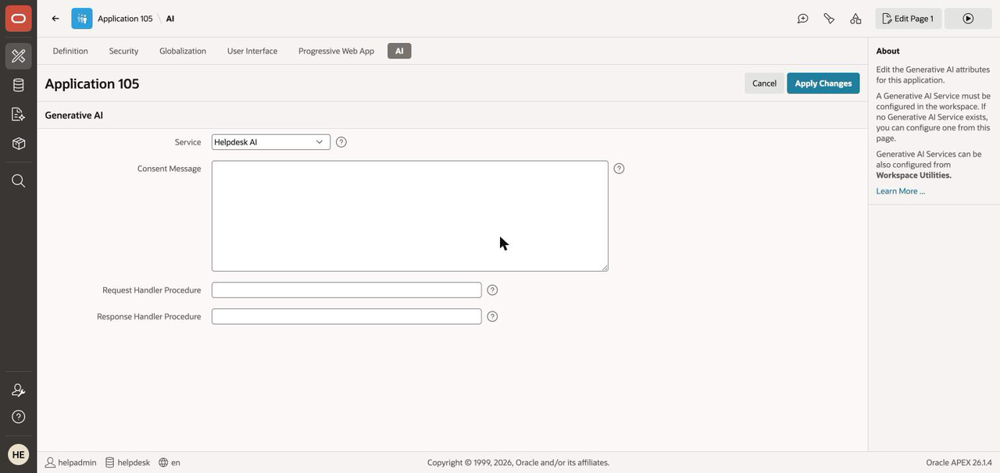
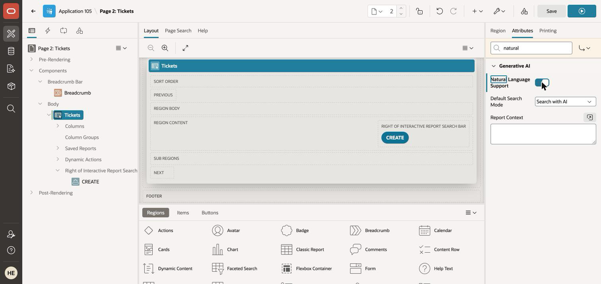
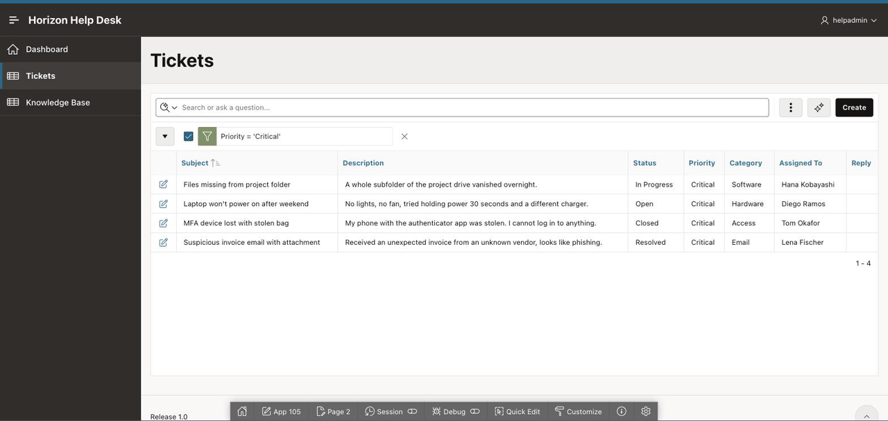

# Lab 4: Ask Your Data Anything with AI Interactive Reports

## Introduction

Your Tickets report already filters, sorts, charts, and pivots — if you know where every menu lives. AI Interactive Reports (new in APEX 26.1) let anyone drive those same declarative settings in plain English. In this lab you wire it up and interrogate your help desk without touching a single menu.

Estimated Time: 10 minutes

### Objectives

In this lab, you will:

* Link your Generative AI service to the application
* Enable natural language support on the Tickets Interactive Report
* Filter, group, and chart the report by prompting it
* See exactly what is — and is not — sent to the model

### Prerequisites

This lab assumes you have:

* Completed Lab 3 (the Horizon Help Desk app exists)
* A Generative AI service whose **Model ID supports tool calling** — `xai.grok-4.3` on the OCI track. This lab is driven entirely by tool calling, and the model APEX pre-fills (`cohere.command-a-03-2025`) **does not work**. See Lab 1, Task 2.

## Task 1: Link the AI Service to Your Application

The workspace-level service from Lab 1 must be selected inside the app before in-app AI features light up.

1. In the builder, open your **Horizon Help Desk** application and select **Shared Components**.

2. Select **AI Attributes** — it is near the **bottom** of the Shared Components page, so scroll down. (The page you land on is titled just **AI**.) Under **Generative AI**, set **Service** to **Helpdesk AI** and click **Apply Changes**. (If it's already selected, app generation linked it for you — carry on.)

    

## Task 2: Open the Tickets Interactive Report

1. In **Page Designer**, open the **Tickets** page and select the Tickets report region.

    > **No Interactive Report on Tickets?** Sixty-second fix: **Create Page**, describe it in natural language — `an interactive report on the TICKETS table` — and continue with the new page.

## Task 3: Enable Natural Language on the Report

1. With the Tickets region selected, open the **Attributes** tab.

2. In the **Generative AI** section, turn **Natural Language Support** **On**, and confirm **Default Search Mode** is **Search with AI**.

    > **Tip — don't scroll for these.** The Attributes property list is long. Type `natural`, then
    > `context`, into the **Filter** box at the top of the property editor to jump straight to each
    > setting. `Default Search Mode` and `Report Context` only appear once Natural Language Support is on.

    

3. In **Report Context**, describe the report so the AI interprets your prompts in help desk terms:

    ```
    <copy>IT help desk support tickets. Status Open or In Progress means unresolved work;
    Resolved and Closed are finished. Priority runs Low, Medium, High, Critical -
    Critical and High need attention first. Category groups tickets by problem area:
    Network, Hardware, Software, Access, or Email.</copy>
    ```

4. **Save and Run Page.** The report opens with a conversational search bar.

    > **`HTTP-429 ... the OCI Generative AI service limit for this model has been reached`** is the
    > other one you may hit, and it is **not** a configuration problem. It is a **per-model service
    > limit** on your tenancy, separate from the compartment chat quota. Symptoms: the first prompt
    > errors, a retry a minute later succeeds, the next prompt errors again. Verbatim:
    >
    > `ORA-20954: ... failed with HTTP-429: 429: The requested model is throttled because the OCI`
    > `Generative AI service limit for this model has been reached. Request a service limit increase`
    > `for Generative AI in OCI, then retry.`
    >
    > **Important: a 429 does not always mean the prompt failed.** We repeatedly saw the error appear
    > in the Assistant panel while the chip was applied anyway — the tool call landed and only the
    > follow-up narration was throttled. **Reload the page before concluding it did not work.**
    >
    > The throttle is **xAI-family-wide, not per-model**: `xai.grok-4.3` and
    > `xai.grok-4.20-reasoning` both hit it, while `cohere.command-a-03-2025` was never throttled in
    > the same session. And it is **not your tenancy allocation** — the tenancy limit
    > `grok-4-3-tokens-per-minute-count` is 200,000 tokens/minute and this lab uses a tiny fraction
    > of that, so requesting a limit increase will not help. It is shared on-demand capacity for the
    > xAI models in the region. Retry, or run the lab at a quieter time.

    > **If prompting the report returns an error instead of chips**, read the error text:
    > `INVALID_TOOL_GENERATION`, or a complaint about `$schema` / `function_declarations`, means your
    > **Model ID cannot drive APEX's tool calling**. Nothing on this page is wrong. Go to
    > **App Builder > Workspace Utilities > Generative AI > Helpdesk AI**, set **Model ID** to
    > `xai.grok-4.3`, **Apply Changes**, and reload this page.

## Task 4: Interrogate Your Help Desk

1. Try these prompts, one at a time:

    ```
    <copy>show open tickets by priority as a chart</copy>
    ```

    ```
    <copy>group by category, oldest first</copy>
    ```

2. Watch each prompt land as **removable chips** above the report — the same filters, breaks, and charts you could build from the Actions menu, applied for you.

    

    > **Governance beat #3 — APEX never executes AI-generated SQL.** To interpret your prompt, APEX sends the model the report's *metadata* — column definitions, reference values, current report state — **not your ticket rows**. The model maps your intent onto declarative report settings, which appear as chips you can inspect, adjust, or remove. Nothing opaque ran against your data.

3. Click the chips to see exactly what was applied; remove one and the report reverts instantly.

## Go Further (optional)

* Keep prompting: `critical and high tickets assigned to Priya`, `pivot categories by status`.
* Explore **column-level AI attributes** (per-column descriptions that sharpen the AI's interpretation) — the dedicated [AI Interactive Report LiveLab](https://livelabs.oracle.com) covers them in depth.

You may now **proceed to the next lab**.

## Learn More

* [Introducing APEX AI Interactive Reports](https://blogs.oracle.com/apex/introducing-apex-ai-interactive-reports)

## Acknowledgements

* **Author** - Rick Houlihan
* **Last Updated By/Date** - Rick Houlihan, August 2026
