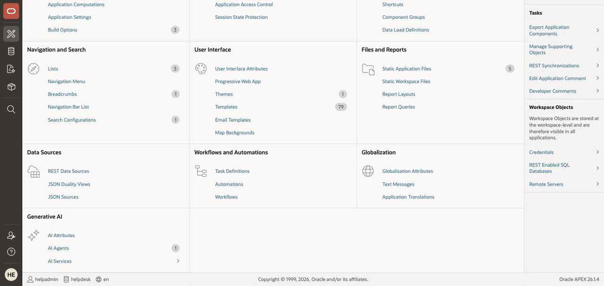
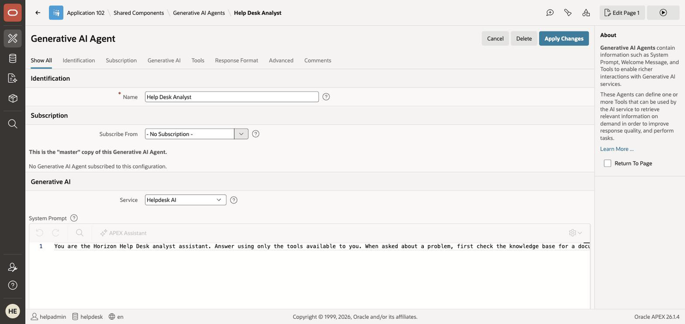
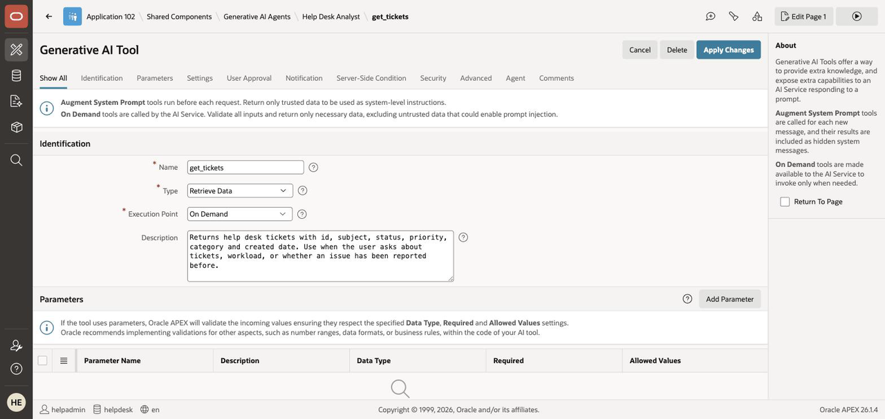
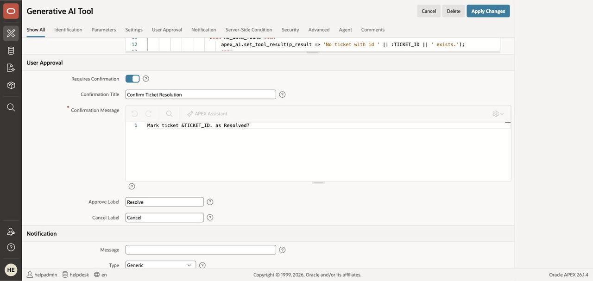
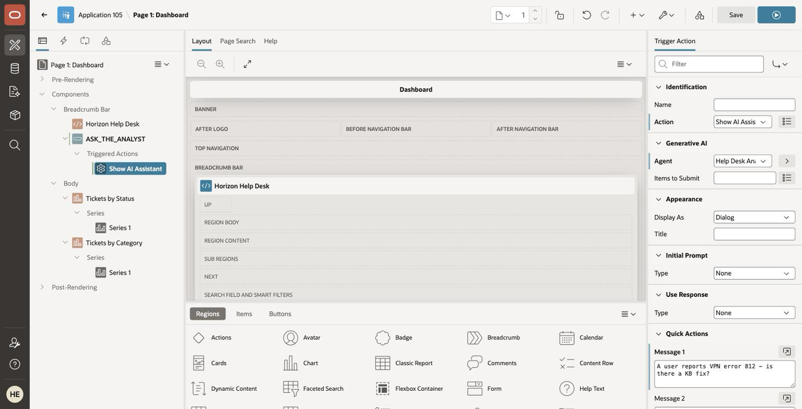
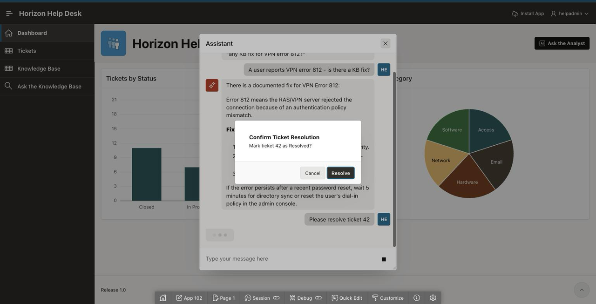

# Lab 5: Build the Help Desk AI Agent

## Introduction

This is the payoff lab. You'll build an **AI Agent** — an LLM that can call the tools you attach to it, and *only* those — give it read access to your tickets and knowledge base, one carefully-governed write action, and a chat panel in your app. Then you'll watch it look up a fix, find the affected tickets, and resolve one — after asking your permission.

Everything here is declarative: no JavaScript, and the only PL/SQL is a block you already reviewed in Lab 1.

Estimated Time: 25 minutes

### Objectives

In this lab, you will:

* Create an AI Agent with a help desk persona
* Attach two Retrieve Data tools (tickets and knowledge base)
* Attach a write tool guarded by a user-approval confirmation
* Embed the agent in your app with Show AI Assistant
* Run the full help desk conversation

### Prerequisites

This lab assumes you have:

* Completed Lab 4 (the app is linked to the Helpdesk AI service)
* A Generative AI service whose **Model ID supports *On Demand tools*** — on the OCI track use **`cohere.command-a-03-2025`**, which is what Oracle recommends for agents (APEX will tell you so if you pick an older Cohere model).

    > **⚠️ This lab and Lab 4 want different models.** Lab 4's AI Interactive Report works with `xai.grok-4.3` and fails on `cohere.command-a-03-2025`; this lab is the other way round. Verified on APEX 26.1.4:
    >
    > | Model ID | Lab 4 report | Lab 5 agent |
    > |---|---|---|
    > | `cohere.command-a-03-2025` | ❌ | ✅ |
    > | `xai.grok-4.3` | ✅ | ⚠️ hit an OCI per-model service limit before it could answer |
    > | older Cohere models | — | ❌ rejected: *"does not support On Demand tools"* |
    >
    > **Switch the Model ID between the two labs** (App Builder > Workspace Utilities > Generative AI > Helpdesk AI > Model ID > Apply Changes). It takes ten seconds and needs no other change.

## Task 1: Create the AI Agent

1. From your **Horizon Help Desk** application home page, select **Shared Components**, then under **Generative AI**, select **AI Agents**.

    

2. Select **Create** and enter/select the following:

    * Under **Identification** — Name: **Help Desk Analyst**
    * Under **Generative AI** — Service: **Helpdesk AI**
    * System Prompt:

        ```
        <copy>You are the Horizon Help Desk analyst assistant. Answer using only the tools
        available to you. When asked about a problem, first check the knowledge base for a
        documented fix, then check for related tickets. Be concise. Never invent ticket
        numbers or article titles. Only resolve a ticket when the user explicitly asks,
        and always refer to tickets by their id.</copy>
        ```

    * Welcome Message:

        ```
        <copy>Hi! Ask me about tickets or known fixes - for example: "any KB fix for VPN error 812?"</copy>
        ```

3. Select **Create**.

    

> **Glossary — agent and tool:** an *agent* is an LLM given a goal (your system prompt) and a set of *tools* — declarative capabilities it may call. The model decides *when* to call a tool; APEX controls *what* each tool can do and executes it inside your app's security context. The agent cannot touch anything you didn't attach.

## Task 2: Add the Tickets Tool

> **Why tools come second:** the **Tools** section does not exist until the agent has been created. After Task 1 you are returned to the agent's edit page, and a **Tools** tab is now there. That is where the next three tasks happen.

> **Glossary — RAG (Retrieval-Augmented Generation):** the agent's answers are grounded in rows retrieved from your tables at question time — not in whatever the model memorized during training. The next two tools are exactly that.

1. On the **Help Desk Analyst** page, in the **Tools** section, select **Add Tool** and enter/select:

    * Name: **get\_tickets**
    * Type: **Retrieve Data**
    * Execution Point: leave it on **On Demand**

        > **This one is a real choice, and only for `Retrieve Data` tools.** `On Demand` lets the model
        > call the tool when it decides it needs the data; `Augment System Prompt` runs it before
        > *every* message and injects the result as system-level context. Pick **On Demand** for both
        > retrieval tools. On the `Execute Server-side Code` tool later, APEX greys this field out and
        > fixes it at On Demand for you.

    * Description:

        ```
        <copy>Returns help desk tickets with id, subject, status, priority, category and created
        date. Use when the user asks about tickets, workload, or whether an issue has been
        reported before.</copy>
        ```

    * SQL Query:

        ```
        <copy>select id, subject, status, priority, category, created_on from tickets</copy>
        ```

2. Select **Create**.

    

## Task 3: Add the Knowledge Base Tool

1. **Add Tool** again, and enter/select:

    * Name: **get\_kb\_articles**
    * Type: **Retrieve Data**
    * Description:

        ```
        <copy>Returns knowledge base articles with id, title, content and category. Use when the
        user asks how to fix a problem or whether a documented solution exists.</copy>
        ```

    * SQL Query:

        ```
        <copy>select id, title, content, category from kb_articles</copy>
        ```

2. Select **Create**. The payoff conversation depends on this tool — it's how the agent finds the VPN fix.

    

## Task 4: Add the Write Tool — with a User-Approval Confirmation

This tool changes data, so you'll turn on **Requires Confirmation** — a built-in capability on every tool, no custom code — and APEX will show a confirmation dialog before it runs.

1. **Add Tool** and enter/select:

    * Name: **resolve\_ticket**
    * Type: **Execute Server-side Code**
    * Execution Point: **On Demand** — greyed out and fixed at this value, because the Type above is *Execute Server-side Code*
    * Description:

        ```
        <copy>Marks a help desk ticket as Resolved, given its ticket id. Only call this when the
        user explicitly asks to resolve or close a specific ticket number.</copy>
        ```

2. Under **Parameters**, click **Add Parameter**. A row appears in an editable grid — **double-click a cell** to type in it (a single click only selects the row):

    | Parameter | Description | Data Type | Required |
    | --- | --- | --- | --- |
    | `TICKET_ID` | The id of the ticket to mark Resolved. | NUMBER | Yes |

3. Under **Settings**, for PL/SQL Code, **paste** the following — do not retype it, the editor auto-indents and you will end up with cascading whitespace. (This is the block you asked the Assistant to explain in Lab 1 — also in [resolve-ticket.sql](files/resolve-ticket.sql)):

    ```
    <copy>declare
      l_subject tickets.subject%type;
    begin
      select subject into l_subject from tickets where id = :TICKET_ID;
      update tickets set status = 'Resolved' where id = :TICKET_ID;
      apex_ai.set_tool_result(
        p_result               => 'Ticket ' || :TICKET_ID || ' ("' || l_subject || '") is now Resolved.',
        p_notification_message => 'Ticket ' || :TICKET_ID || ' resolved.',
        p_notification_type    => 'success');
    exception
      when no_data_found then
        apex_ai.set_tool_result(p_result => 'No ticket with id ' || :TICKET_ID || ' exists.');
    end;</copy>
    ```

    > `apex_ai.set_tool_result` is how the tool reports back: `p_result` is what the agent reads to form its reply; the notification parameters pop a toast in the page. Without it, the agent never learns whether the write worked.

4. Under **User Approval**, enter/select:

    * Requires Confirmation: **confirm it is On** — APEX defaults it on for Execute Server-side Code tools. That default *is* the governance story: Oracle assumes a tool that runs your code needs human approval.
    * Confirmation Title: **Confirm Ticket Resolution**
    * Confirmation Message:

        ```
        <copy>Mark ticket &TICKET_ID. as Resolved?</copy>
        ```

    * Approve Label: **Resolve** — Cancel Label: **Cancel**

    

5. Select **Create**.

## Task 5: Put the Agent in Your App

1. Open **Page 1** (the Dashboard) in **Page Designer**. Under **Rendering > Breadcrumb Bar**, right-click the region inside it and select **Create Button Below**.

    > **That region is probably named after your application** (for example `Horizon Help Desk`), not "Breadcrumb" — on the Dashboard the generator puts a Hero region in the Breadcrumb Bar slot. Right-click whatever sits under **Breadcrumb Bar**; the button lands in the right place either way.

    Configure it:

    * Button Name: **ASK\_THE\_ANALYST**
    * Region: the Breadcrumb Bar region you just right-clicked — Slot: **Next**
    * Button Template: **Text with Icon** — Hot: **On** — Icon: **fa-ai-square**

2. Right-click the new button and select **Create Trigger Action**. Configure it:

    * Action: **Show AI Assistant**
    * Under **Generative AI** — Agent: **Help Desk Analyst**
    * Under **Quick Actions** — Message 1: **A user reports VPN error 812 - is there a KB fix?**

    

3. **Save & Run** the page.

## Task 6: The Conversation

1. Click **Ask the Analyst**. The chat panel opens with your welcome message and the quick-action chip. Click the chip (or type it):

    > A user reports VPN error 812 - is there a KB fix?

    The agent calls `get_kb_articles` and answers from *"Fixing VPN Error 812"* — the MS-CHAP v2 fix, cited from your own knowledge base.

2. Follow up:

    ```
    <copy>Are there open tickets about it?</copy>
    ```

    The agent calls `get_tickets` and surfaces ticket **42** (and the other open VPN tickets).

3. Now the write:

    ```
    <copy>Resolve ticket 42</copy>
    ```

    **The confirmation dialog appears** — *Mark ticket 42 as Resolved?* Click **Resolve**. The toast fires, the agent confirms, and if you refresh the Tickets report, ticket 42 is Resolved.

    

    > **Governance beat #4 — the agent is allow-listed and gated.** It can only call the three tools you attached; its SQL is *your* SQL; and the one tool that writes required your explicit approval — you saw Cancel right there. That's the difference between an AI demo and an AI feature you'd ship.

    > **What leaves the database here:** the rows returned by the Retrieve Data tools ARE sent to the model as conversation context — that's what grounds its answers. You control the exposure by scoping each tool's query. Contrast Lab 4, where only report *metadata* was sent.

> **At a live event:** if the room is running behind, your instructor may drive Tasks 5–6 from the podium — follow along; the export in Take It Home preserves everything you built.

## Go Further (optional)

* Add a **create\_ticket** write tool (same pattern: parameters, insert, `set_tool_result`, Requires Confirmation).
* Ask the agent something outside its tools — *"What's the weather in Austin?"* — and watch it decline instead of hallucinating. That's the system prompt and tool allow-list doing their job.
* Tighten `get_tickets` to exclude Closed tickets and see how the agent's answers change.

You may now **proceed to the next lab**.

## Learn More

* [AI Agents in Oracle APEX](https://blogs.oracle.com/apex/ai-agents-in-oracle-apex)

## Acknowledgements

* **Author** - Rick Houlihan
* **Last Updated By/Date** - Rick Houlihan, August 2026
