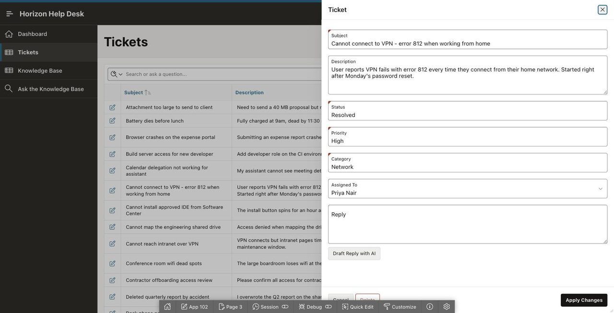
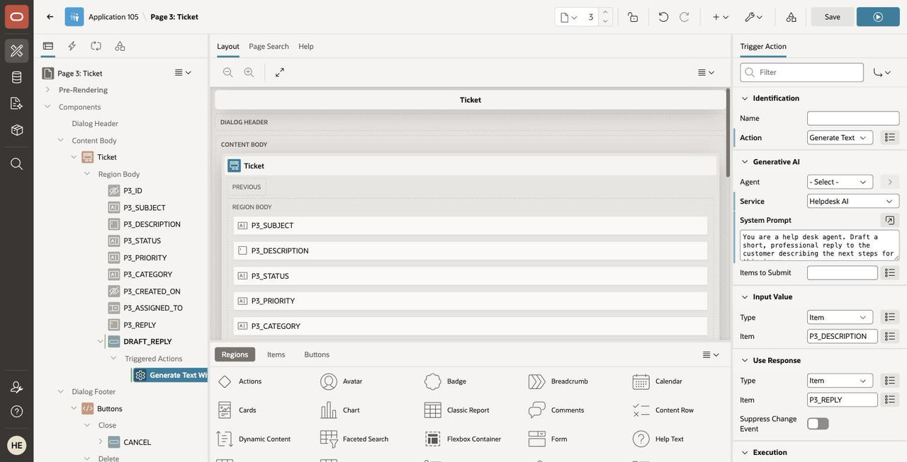
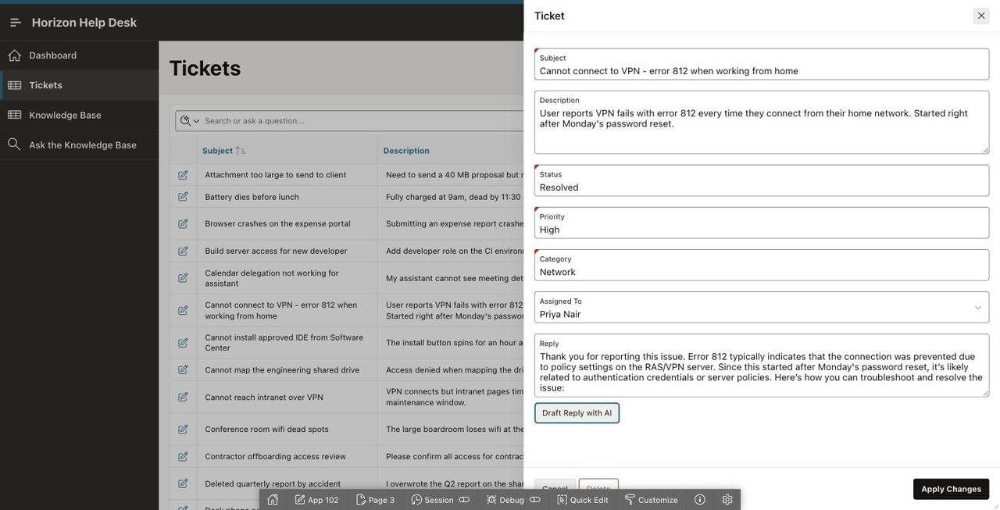

# Lab 6: Draft Replies with AI

## Introduction

Your analysts spend half their day writing the same courteous reply. In this optional lab you add a one-click **Generate Text with AI** action to the ticket form: AI drafts the customer-facing reply from the ticket description, and the analyst edits before sending. **AI drafts, human sends** — a pattern you can lift into any of your own apps in ten minutes.

> **Before you start:** extend your LiveLabs reservation now — one click on your reservation page while it is still active. This lab and the next run past the original 90 minutes.

Estimated Time: 10 minutes

### Objectives

In this lab, you will:

* Add a reply column to tickets and surface it on the form
* Wire a Generate Text with AI dynamic action
* Draft, review, and edit an AI-written reply

### Prerequisites

This lab assumes you have:

* Completed Lab 5

## Task 1: Surface the Reply Field on the Form

The `TICKETS` table already has a `REPLY` column (it shipped in the canonical schema, waiting for this lab).

1. In **Page Designer**, open the ticket form page — the one the Tickets report opens when you edit a row (with the Lab 3 prompt this is usually **page 3, `Ticket`**, and it renders as a drawer).

    The generated form almost always **already has a Reply item**, because `REPLY` shipped in the Lab 2
    schema: just select it and set **Type** to **Textarea**. Only if it is missing do you need to
    right-click the form region, select **Synchronize Columns**, and then set the new item's type.

    

## Task 2: Add the Generate Text with AI Action

1. On the form page, right-click the **Reply** item and select **Create Button Below**. Name it
    **DRAFT\_REPLY** with Label **Draft Reply with AI** (Button Template: **Text**).

2. Right-click the new button and select **Create Trigger Action** — for buttons the menu says *Trigger
    Action*, not "Dynamic Action". Configure it:

    * Action: **Generate Text With AI**
    * Under **Generative AI** — Service: **Helpdesk AI**
    * System Prompt:

        ```
        <copy>You draft courteous, concise help desk replies. Address the user's reported problem,
        walk them through the fix step by step if one is known, and close by inviting them
        to reply if the problem persists. Plain text, no signatures.</copy>
        ```

    * Under **Input Value** — Type: **Item**, Item: your description item (for example `P3_DESCRIPTION`)
    * Under **Use Response** — Type: **Item**, Item: your Reply item (for example `P3_REPLY`)

    > **These are item pickers, not substitution strings.** You type or pick the item *name*
    > (`P3_DESCRIPTION`), not `&P3_DESCRIPTION.`. The page number prefix depends on which page your ticket
    > form landed on — check the Rendering tree; with the Lab 3 prompt it is usually page 3.

    

3. **Save & Run.** Open ticket **27** (the new-laptop VPN ticket), click **Draft Reply with AI**, and watch a reply draft land in the textarea.

    

4. Now edit it — tighten a sentence, fix the tone. **The human touch before sending is the feature, not a workaround.**

    > **What leaves the database here:** the ticket description you referenced is sent to the model as context — same rule as Lab 5's tools, scoped to exactly the items you wired.

## Go Further (optional)

Make the draft smarter: change the Message to also include the matching KB article content (add a hidden page item populated by a query against `kb_articles`, and reference both items). The draft will now cite the documented fix.

You may now **proceed to the next lab**.

## Learn More

* [Generate Text with AI dynamic action](https://blogs.oracle.com/apex/whats-new-in-apex-242-dynamic-action-generate-text-with-ai)

## Acknowledgements

* **Author** - Rick Houlihan
* **Last Updated By/Date** - Rick Houlihan, August 2026
