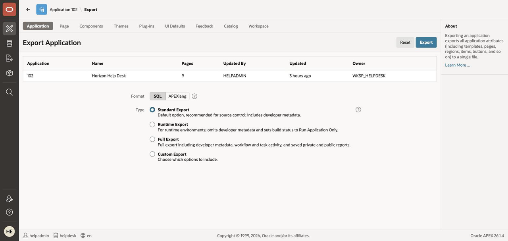

# Take It Home

## Introduction

Ninety minutes ago this was an empty workspace. Now it's a running help desk with an AI-designed schema, an app generated from a prompt, natural-language analytics, and a governed AI agent. This last stop makes sure you leave with all of it.

> **Your sandbox is deleted when the reservation ends — export now, not later.** Everything below takes about seven minutes.

Estimated Time: 7 minutes

### Objectives

In this lab, you will:

* Export your application and keep the workshop scripts
* Recap the five governance mechanisms you used
* Clean up the credentials, scripts and services that outlive the application
* Pick up the trail: where APEX developers actually keep learning

### Prerequisites

This lab assumes you have:

* Completed **Lab 5** — the AI agent is the thing you are exporting (the optional Labs 6 and 7 are not required)

## Task 1: Export Your Application

1. In the builder, open **Horizon Help Desk** and choose **Export / Import**. Pick **Export** on the
    "What task would you like to perform?" screen and click **Next** — Export is a two-step wizard, not
    a single click. On the **Export Application** page leave Format on **SQL** and Type on
    **Standard Export**, then click **Export**. The file imports into any APEX 26.1 workspace —
    including a free one at apex.oracle.com.

    

    > Exports are also how you version-control APEX today — and APEX 26.1's **APEXlang** (`.apx` application spec, readable by humans, diff tools, and LLMs alike) plus **SQLcl Projects** are the modern, source-control-native path. One search for "APEXlang" gets you started.

2. Keep the scripts — they rebuild the schema anywhere:

    * [helpdesk-schema.sql](../2-data-model-ai/files/helpdesk-schema.sql) — schema + seed (state-reset checkpoint)
    * [resolve-ticket.sql](../5-ai-agent/files/resolve-ticket.sql) — the agent's write tool
    * [embed-kb.sql](../7-vector-search/files/embed-kb.sql) — the one-statement embedding pipeline

3. Want to keep building for free? [apex.oracle.com](https://apex.oracle.com) gives you a permanent free workspace; [Oracle Cloud Free Tier](https://www.oracle.com/cloud/free/) gives you two Always Free Autonomous Databases with APEX included.

## Task 2: What Made It Trustworthy — the Recap

You met five governance mechanisms today, one per AI feature:

1. **Token quotas** you set on the service yourself (Lab 1)
2. **Human review of AI-generated SQL** before anything runs (Lab 2)
3. **No AI-executed SQL** — natural language maps to declarative, inspectable settings (Lab 4)
4. **Tool allow-lists** — the agent can only call what you attached (Lab 5)
5. **User-approval confirmations on write tools** — the human clicks Resolve (Lab 5)

And in every lab, you knew **exactly what data was sent to the model** — from metadata-only (Lab 4) to scoped query results (Lab 5) to nothing at all (Lab 7, in-database). That's the difference between an AI demo and an AI feature you'd ship: *AI as amplifier, with you as the reviewer.*

## Task 3: Clean Up What Outlives the Application

Deleting your application — or even dropping every table in the schema — leaves a surprising amount
behind, because these objects live at the **workspace** level, not inside the schema. All of the
following were verified on APEX 26.1.4.

1. **Web Credentials** — **App Builder > Workspace Utilities > Web Credentials**.

    * Delete `Credentials for helpdesk ai`. Deleting the Generative AI service does **not** remove it,
      so your OCI user OCID, tenancy OCID, fingerprint and **private key** stay stored in the workspace.
      APEX will not even offer the credential back when you create a new service, so it is stranded
      rather than reusable.
    * Delete any `App NNN Push Notifications Credentials`. APEX creates one per application and leaves
      it behind when the application is deleted, so they accumulate silently.

2. **SQL Scripts** — **SQL Workshop > SQL Scripts**. Delete `helpdesk-schema.sql`.

    > **This one can bite you rather than just clutter.** A script you uploaded survives dropping every
    > table it created. Re-running an out-of-date copy silently reseeds the *old* data — and you get no
    > error, just different results. If you ever need to upload a corrected version, APEX refuses with
    > *"a script with this name already exists"* until you tick the old one and use **Delete Checked**.

3. **Generative AI service and Vector Provider** — both under **Workspace Utilities**. Delete
    `Helpdesk AI` and, if you did Lab 7, `KB MiniLM`.

4. **The Lab 7 bucket** — confirm its **pre-authenticated request** and object are gone. That was Lab 7's
    own last task, and the PAR is a bearer token that works for anyone holding the URL.

> **Why this is the right note to end on.** Every governance mechanism in this workshop controls what the
> AI can reach *while it runs*. This one covers what is left over *after* — the credentials, and the
> stale scripts that quietly produce the wrong answer. That is the part people forget.

## Task 4: Where APEX Developers Actually Keep Learning

* **[Oracle LiveLabs](https://livelabs.oracle.com)** — your next workshops, hands-on and free. Natural sequels to today: *Build an AI Procurement Agent in Oracle APEX* (deeper agent tooling) and *Spec-Driven Development with AI and APEXlang*.
* **[APEX Office Hours](https://apex.oracle.com/officehours)** — live sessions with the APEX product managers.
* **[Insum APEX Instant Tips](https://www.youtube.com/playlist?list=PLCAYBJ7ynpQQQrdwKFBZu8Kx9VTFt-pRP)** — weekly, short, practical.
* **[Cloud Nueva blog](https://blog.cloudnueva.com)** — hands-on APEX + AI engineering write-ups.
* **[apex.world](https://apex.world)** — community news, jobs, Slack.

Thanks for building with us — see you at the next developer day.

## Learn More

* [Oracle APEX and AI](https://www.oracle.com/apex/ai/)

## Acknowledgements

* **Author** - Rick Houlihan
* **Last Updated By/Date** - Rick Houlihan, July 2026
