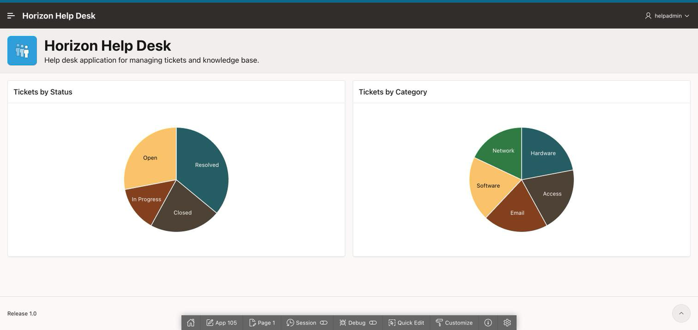
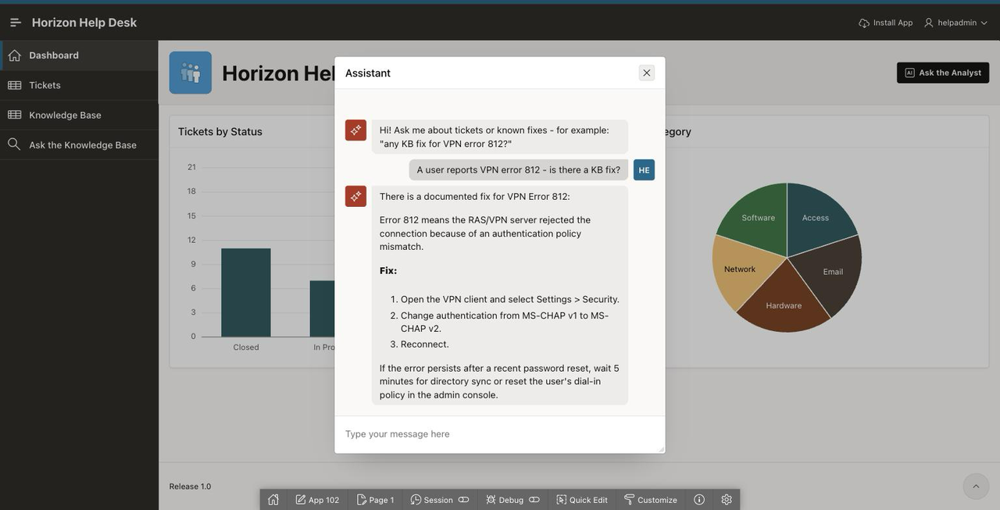
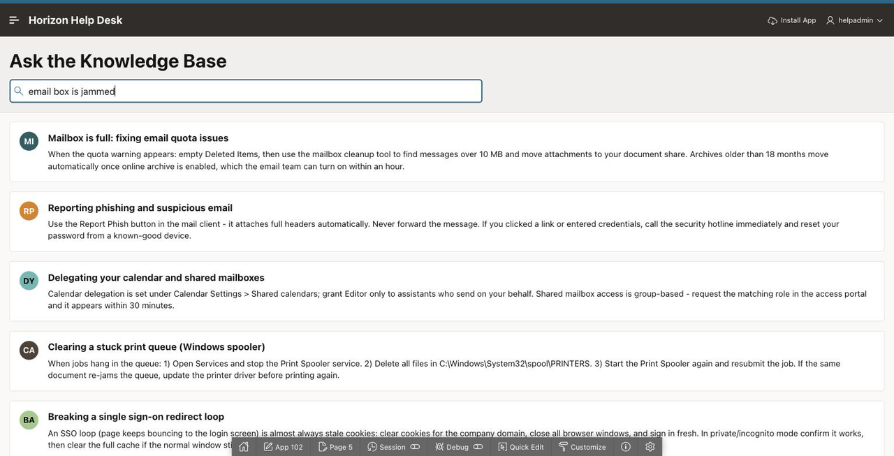

# Introduction

## About this Workshop

Build a complete AI-powered help desk application in 90 minutes with Oracle APEX — design the data model with AI, generate the app from a prompt, ask your data questions in plain English, and ship a governed AI agent that acts on your tickets. Nothing to install, no tenancy to bring: just a browser and a free Oracle account.

The workshop tells one story in three acts — **Prompt → App → Trustworthy App**:

1. **AI builds it with you.** You describe the Horizon Help Desk in natural language; APEX and AI produce the data model and a working web application.
2. **AI works inside it, on your data.** You add natural-language analytics to a report, then build an AI Agent that answers from your tickets and knowledge base — and resolves a ticket only after you approve.
3. **You stay in charge.** At every step you review and approve what AI produces. AI here is an amplifier for your SQL and data skills, not a replacement for them.

Estimated Workshop Time: 90 minutes

### What Data Leaves Your Database?

Each AI feature sends a different, well-defined slice of context to the model — and each lab calls out its own. In short: AI Interactive Reports send your prompt plus report *metadata*, never your rows; the agent's Retrieve Data tools and the Generate Text action send *query results and ticket text* as context; semantic search sends knowledge-base article text to the embedding model. Nothing else leaves the database, and the optional vector lab runs entirely in-database.

### Workshop Overview

| Lab | Title | Duration |
|---|---|---|
| — | Get Started: log in to the LiveLabs Sandbox *(sandbox only)* | 5 min |
| — | Provision an Autonomous AI Database and an APEX workspace | 10–15 min |
| 1 | Connect APEX to Generative AI | 10 min |
| 2 | Design the Data Model with AI | 10 min |
| 3 | Generate the App from a Prompt | 10 min |
| 4 | Ask Your Data Anything: AI Interactive Reports | 10 min |
| 5 | Build the Help Desk AI Agent | 25 min |
| 6 | OPTIONAL: Draft Replies with AI | 10 min |
| 7 | OPTIONAL: Semantic Knowledge-Base Search | 15 min |
| — | Take It Home | 7 min |

### Objectives

In this workshop, you will learn how to:

* Connect APEX to a Generative AI provider, enable the APEX Assistant, and set token quotas on the service.
* Use AI to design a data model and generate a working application from a natural-language prompt.
* Add natural-language analytics to a report with AI Interactive Reports.
* Build a governed AI Agent with declarative tools (read data, act with user-approval confirmation) and embed it in your app.
* Explain how APEX keeps AI governed — human review of generated SQL, no AI-executed SQL, tool allow-lists, user-approval confirmations on write tools, token quotas — and what data is (and is not) sent to the model by each feature.

### Prerequisites

This workshop assumes you have:

* A free Oracle.com account and a modern browser — no OCI tenancy, no local install
* Familiarity with SQL (helpful but not required)

## Before You Begin: What This Workshop Needs

* **Oracle APEX 26.1 or later.** Every AI feature used here — AI Interactive Reports, AI Agents, Generate
  Text with AI — is new in 26.1 and does not exist in 24.2 or earlier.
* Screens in this workshop were captured on **APEX 26.1.x**. Oracle ships patch releases regularly, so a
  label or a menu position may differ slightly from a screenshot. The steps still apply; where a control
  has moved, the property **Filter** box in Page Designer will find it by name.
* **Your APEX workspace schema will be prefixed.** On Autonomous Database, asking for a schema named
  `HELPDESK` gets you **`WKSP_HELPDESK`**. That is expected. The workshop's SQL never schema-qualifies
  anything, so it just works — but Lab 7 asks you to type your schema name, and this is the name it wants.

## Learn More

* [Oracle APEX and AI](https://www.oracle.com/apex/ai/)
* [Oracle APEX 26.1 Release Notes](https://docs.oracle.com/en/database/oracle/apex/26.1/htmrn/index.html)

## Acknowledgements

* **Author** - Rick Houlihan
* **Last Updated By/Date** - Rick Houlihan, July 2026
