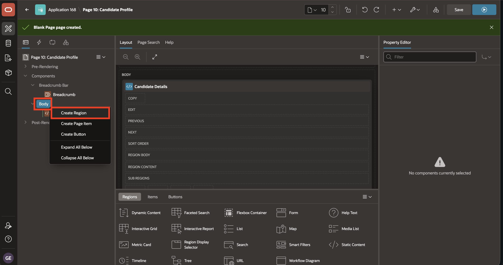

# Lab 1: Create Candidate Profile Page Manually

## Introduction

A page is the basic building block of an application. Developers add pages to an application by running the Create Page Wizard.

A region is an area on a page that serves as a container for content.

Use Page Designer to maintain and enhance pages within an Oracle APEX application. Page Designer includes the Rendering tree, Layout tab, Property Editor, and other tools for working with page components.

In this lab, you use the Create Page Wizard to create a blank **Candidate Profile** page in the Talent Acquisition Portal (TAP). You then review the Page Designer panes, display help for an attribute, and add two Static Content regions to **Body**.

Estimated time: 5 minutes

### Objectives

In this lab, you will learn how to:

- Create a blank page manually in TAP.
- Review the main Page Designer panes.
- Display help for a Page Designer attribute.
- Add Candidate Details and Application History regions.
- Save and run the Candidate Profile page.

## Task 1: Create and Inspect the Page

In this task, you will create a blank **Candidate Profile** page. You will then review the three main Page Designer panes and display help for the Breadcrumb **Type** attribute.

1. In APEX App Builder, open the **Talent Acquisition Portal** application.

    

2. On the application home page, select **Create Page**.

    

3. Select **Blank Page**, then select **Next**.

    

4. For **Name**, enter **Candidate Profile**, then select **Create Page**.

    

5. After the page is created, Page Designer opens automatically.

    The Page Designer window is divided into three main panes:

    - **Left Pane** - Includes four tabs that display as a tree: **Rendering**, **Dynamic Actions**, **Processing**, and **Shared Components**.
    - **Central Pane** - Includes the following tabs: **Layout**, **Page Search**, and **Help**.
    - **Right Pane** - Displays the **Property Editor**. Use the Property Editor to update attributes for the selected component. When you select multiple components, the Property Editor only displays common attributes. Updating a common attribute updates that attribute for all selected components.

    

6. In Page Designer, select **Breadcrumb** in the **Rendering Tree** (Left Pane), select **Identification > Type** in the **Property Editor** (Right Pane), then select **Help** on the toolbar.

    The help text for **Type** is displayed.

    

## Task 2: Add Candidate Profile Regions

In this task, you will create the **Candidate Details** and **Application History** Static Content regions in **Body**. This task demonstrates two methods for creating a region manually in Page Designer.

1. In the newly created page, navigate to the **Gallery Menu** at the bottom and confirm that the **Regions** tab is selected.

    

2. Drag a **Static Content** region and drop it in the **Body** section.

    

3. In the **Property Editor**, enter/select the following:

    - Under Identification:

        - Name: **Candidate Details**

    

4. In the **Rendering Tree**, right-click **Body**, then select **Create Region**.

    

5. In the **Property Editor**, enter/select the following:

    - Under Identification:

        - Name: **Application History**

    

6. Select **Save and Run**.

    

7. Confirm that the page displays **Candidate Details** followed by **Application History**.

    

## Summary

You learned how to add a page with the Create Page Wizard and maintain it in Page Designer.

You also learned how Page Designer represents page components in the **Rendering Tree** and displays their settings in the **Property Editor**. Attribute help explains individual settings while you work.

You learned how to create regions from the **Gallery Menu** and the **Rendering Tree** context menu. You used both methods to add Static Content regions to **Body**.

At the end of this lab, you are on the running **Candidate Profile** page. In the next lab, you will return to the TAP application home page and open the **Candidate Pipeline** page in Page Designer.

You may now proceed to the next lab.

## Learn More

* [About Page Designer](https://docs.oracle.com/en/database/oracle/apex/26.1/htmdb/about-page-designer.html)
* [Managing Pages in an Application](https://docs.oracle.com/en/database/oracle/apex/26.1/htmdb/managing-pages-in-an-application.html)
* [About Regions](https://docs.oracle.com/en/database/oracle/apex/26.1/htmdb/about-regions.html)

## Acknowledgements

- **Author** - Sahaana Manavalan, Senior Product Manager
- **Last Updated By/Date** - Sahaana Manavalan, Senior Product Manager, July 2026
