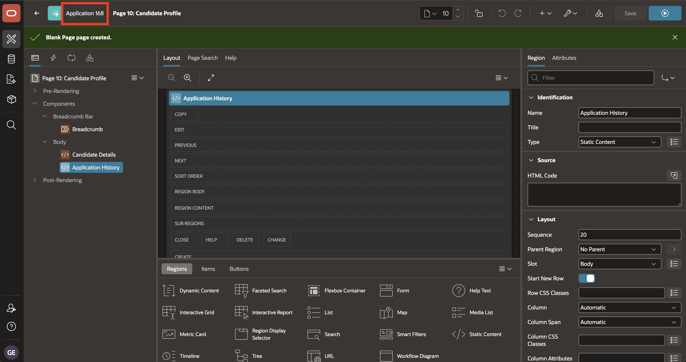
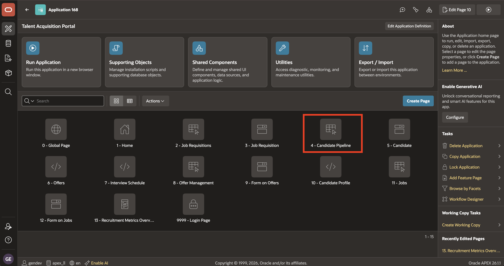
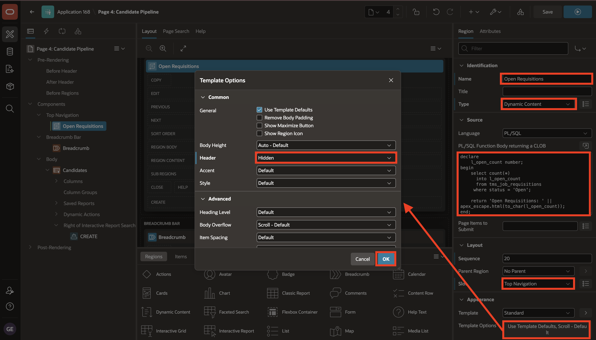
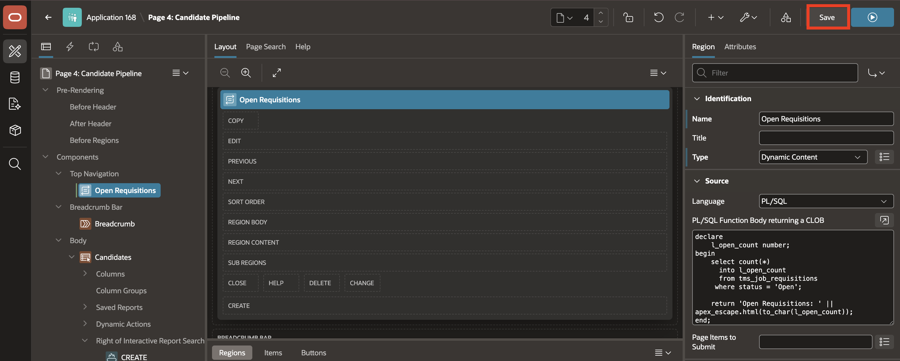
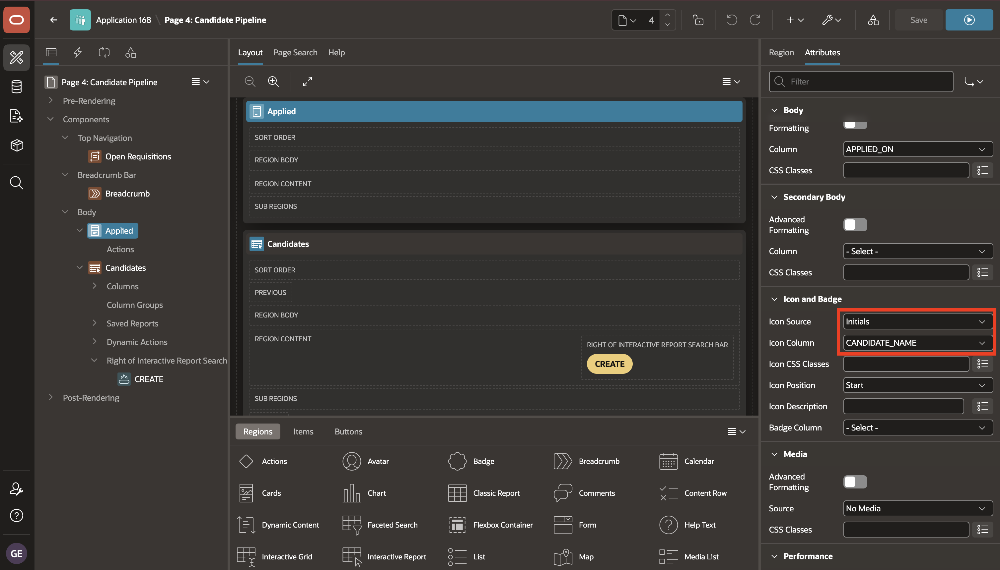
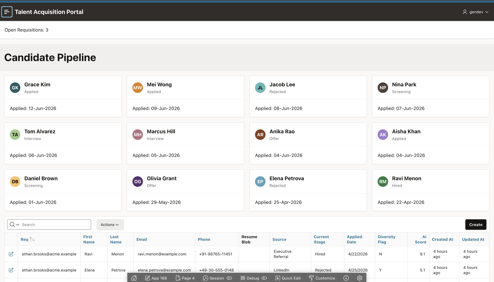

# Lab 2: Add Regions to the Candidate Pipeline Page

## Introduction

The region **Type** determines how a region is rendered at runtime.

The **Source** attributes define the content or data used by a region. For a SQL-based region, the **Source > Type** attribute determines how the data is retrieved.

In this lab, you configure two supported region types on the TAP **Candidate Pipeline** page:

- **Dynamic Content** - Displays the HTML content returned by a function.
- **Cards** - A cards page features an orderly layout of information tiles.

The Dynamic Content region uses a PL/SQL function to display the number of open requisitions. The Cards region uses a SQL Query to display candidate information.

Estimated time: 10 minutes

### Objectives

In this lab, you will learn how to:

- Add a Dynamic Content region in the Top Navigation position.
- Display a live count of open job requisitions.
- Add an Applied Cards region for candidate pipeline data.
- Configure card title, subtitle, body, and icon attributes.
- Run the page and review the candidate card layout.


## Task 1: Add the Open Requisitions Banner

In this task, you will create an **Open Requisitions** Dynamic Content region. You will add a PL/SQL function that counts open requisitions and returns the count as HTML. You will place the region in **Top Navigation** so it appears above the Candidate Pipeline content.

1. From the running **Candidate Profile** page, use the **Developer Toolbar** at the bottom of the page to return to the TAP application home page in App Builder.

    

2. On the application home page, select **4 - Candidate Pipeline** to open the page in Page Designer.

    

3. In the **Rendering Tree**, right-click **Components**, then select **Create Region**.

    

4. In the **Property Editor**, enter/select the following:

    - Under Identification:

        - Title: **Open Requisitions**
        - Type: **Dynamic Content**

    - Under Source:

        - PL/SQL Function Body returning HTML: Copy and paste the following:

            ```sql
            <copy>
            declare
                l_open_count number;
            begin
                select count(*)
                  into l_open_count
                  from tms_job_requisitions
                 where status = 'Open';

                return 'Open Requisitions: ' || apex_escape.html(to_char(l_open_count));
            end;
            </copy>
            ```

    - Under Layout:

        - Position: **Top Navigation**

    - Under Appearance:

        - Template Options:
            - Header: **Hidden but Accessible**

    

5. Select **Save**.

    

## Task 2: Add the Candidate Cards Region

In this task, you will create an **Applied** Cards region based on a SQL Query. The query returns the candidate name, current stage, and applied date for the card title, subtitle, body, and initials.

1. In the **Rendering Tree**, right-click **Body**, then select **Create Region**.

    

2. In the **Property Editor**, enter/select the following:

    - Under Identification:

        - Name: **Applied**
        - Type: **Cards**

    - Under Source:

        - Type: **SQL Query**
        - SQL Query: Copy and paste the following:

            ```sql
            <copy>
            select
                candidate_id,
                first_name || ' ' || last_name as candidate_name,
                current_stage,
                'Applied: ' || to_char(applied_date, 'DD-Mon-YYYY') as applied_on
            from tms_candidates
            order by applied_date desc
            </copy>
            ```

    - Under Layout:

        - Sequence: **5**

    

3. Select the **Attributes** tab and configure the Cards attributes:

    - Under Card:

        - Title Column: **CANDIDATE_NAME**
        - Subtitle Column: **CURRENT_STAGE**
        - Body Column: **APPLIED_ON**

    

    - Under Icon and Badge:

        - Icon Type: **Initials**
        - Icon Initials Column: **CANDIDATE_NAME**

    

4. Select **Save and Run**.

    

5. Confirm that each card shows the candidate name, current stage, and applied date.

    

## Summary

You learned that the region **Type** determines how a region is rendered at runtime.

A Dynamic Content region runs PL/SQL during page rendering and displays the returned HTML. You used this behavior to calculate the open-requisition count at runtime.

You also learned how to configure a Cards region based on a SQL Query and select columns for the card title, subtitle, body, and initials.

At the end of this lab, you are on the running **Candidate Pipeline** page. In the next lab, you will return to the TAP application home page and open **Page 0: Global Page**.

You may now proceed to the next lab.

## Learn More

* [Supported Region Types](https://docs.oracle.com/en/database/oracle/apex/26.1/htmdb/supported-region-types.html)
* [Developing Reports](https://docs.oracle.com/en/database/oracle/apex/26.1/htmdb/developing-reports.html)

## Acknowledgements

- **Author** - Sahaana Manavalan, Senior Product Manager
- **Last Updated By/Date** - Sahaana Manavalan, Senior Product Manager, July 2026
