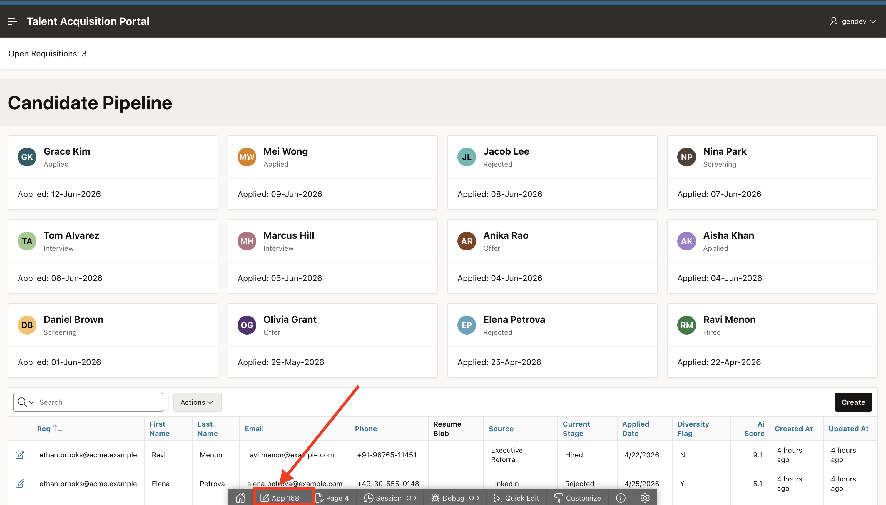
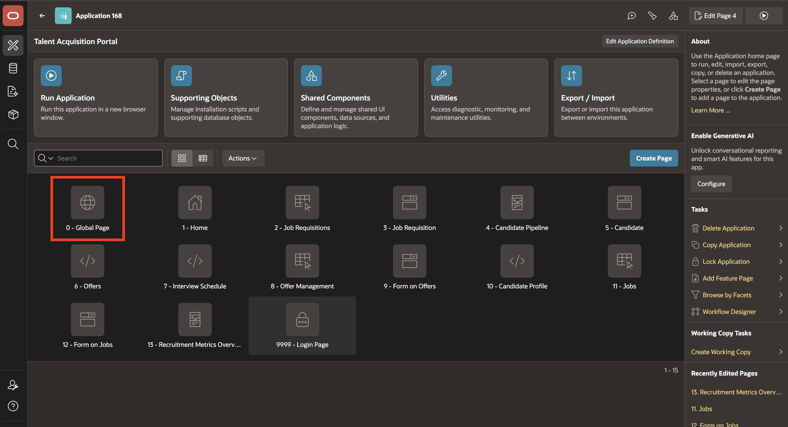
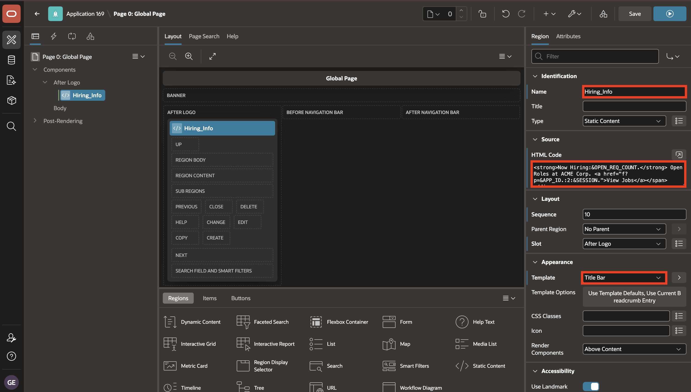
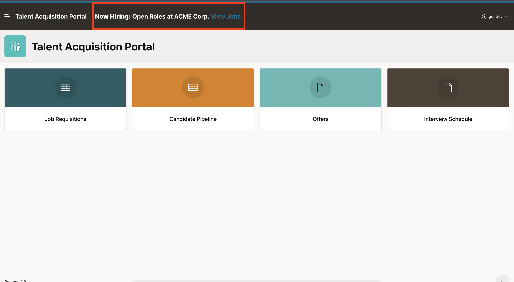

# Lab 3: Configure the Global Page

## Introduction

In APEX, Page 0 is the Global Page. The Oracle APEX engine renders all components you add to a Global page on every page within your application.

The **Layout > Position** attribute selects the template position used to display a region. A page template must include the selected position for the region to appear there.

In this lab, you add a **Hiring_Info** Static Content region to the TAP Global Page. You place it in **After Logo** so the same hiring message appears near the top of TAP pages.

Estimated time: 5 minutes

### Objectives

In this lab, you will learn how to:

- Add a Static Content region to Page 0.
- Place the banner in the After Logo region.
- Configure the Hiring_Info region source and template.
- Run a TAP page and confirm that the banner appears globally.


## Task 1: Add the Global Banner

In this task, you will create the **Hiring_Info** Static Content region in **After Logo**. The region uses the **Title Bar** template and HTML source to display a shared hiring banner across TAP pages.

The region position controls where shared content appears. For this banner, you place the region in **After Logo** so the message appears near the top of TAP pages that use that position.

1. From the running **Candidate Pipeline** page, use the **Developer Toolbar** at the bottom of the page and select the **Application ID**.

    Your Application ID may be different from the one shown in the screenshot.

    

2. Open **Page 0: Global Page** in **Page Designer**.

    

3. From the Gallery, drag a **Static Content** region and drop it in the **After Logo** region.

    

4. In the **Property Editor**, enter/select the following:

    - Under Identification:

        - Name: **Hiring_Info**

    - Under Source:

        - HTML Code: Copy and paste the following:

            ```html
            <copy>
            <strong>Now Hiring:</strong> Open Roles at ACME Corp. <a href="f?p=&APP_ID.:2:&SESSION.">View Jobs </a>
            </copy>
            ```

    - Under Appearance:

        - Template: **Title Bar**

    

5. Select **Save and Run**.

    

6. Confirm that the banner appears.

    

## Summary

You learned that the Oracle APEX engine renders all components you add to a Global page on every page within your application.

You also learned how to use **After Logo** as the position for the **Hiring_Info** region.

At the end of this lab, you are on a running TAP page with the global banner visible. In the next lab, you will open **1 - Home** in Page Designer and add a dynamic region.

You may now proceed to the next lab.

## Learn More

* [Creating a Global Page to Display Components on Every Page](https://docs.oracle.com/en/database/oracle/apex/26.1/htmdb/creating-a-global-page-to-display-components-on-every-page.html)

## Acknowledgements

- **Author** - Sahaana Manavalan, Senior Product Manager
- **Last Updated By/Date** - Sahaana Manavalan, Senior Product Manager, July 2026
