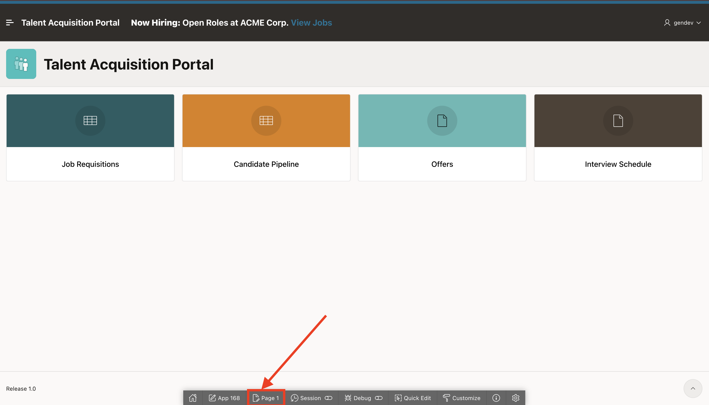
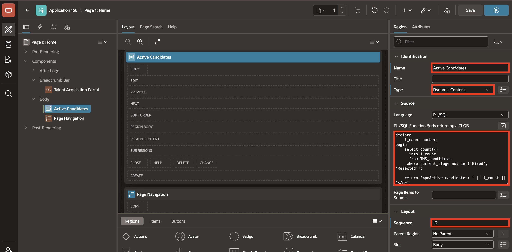
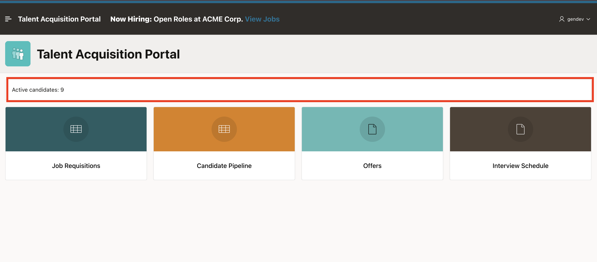

# Lab 4: Add a Dynamic Content Region

## Introduction

The Dynamic Content region lets you programmatically generate all its HTML markup. In this lab, the PL/SQL function returns that markup in a CLOB (Character Large Object).

In Lab 2, you used Dynamic Content for the open-requisitions banner. In this lab, you use the same region type on TAP Home to display the number of active candidates.

Estimated time: 5 minutes

### Objectives

In this lab, you will learn how to:

- Add a Dynamic Content region to TAP Home.
- Add a PL/SQL function body returning a CLOB.
- Configure the region layout and template options.
- Run the page and confirm that the active candidate count appears.


## Task 1: Create the Active Candidates Region

In this task, you will create an **Active Candidates** Dynamic Content region on TAP Home. You will add a PL/SQL function that counts candidates whose stage is not **Hired** or **Rejected**. The function returns the count in a CLOB containing HTML, which APEX displays when it renders the region.

1. From the running TAP page, use the **Developer Toolbar** at the bottom of the page and select **1 - Home** to open the Home page in Page Designer.

    

2. In the **Rendering Tree**, right-click **Body**, then select **Create Region**.

    

3. In the **Property Editor**, enter/select the following:

    - Under Identification:

        - Title: **Active Candidates**
        - Type: **Dynamic Content**

    - Under Source:

        - PL/SQL Function Body returning a CLOB: Copy and paste the following:

            ```sql
            <copy>
            declare
                l_active_candidates number;
            begin
                select count(*)
                  into l_active_candidates
                  from tms_candidates
                 where current_stage not in ('Hired', 'Rejected');

                return '<p>Active candidates: ' || apex_escape.html(to_char(l_active_candidates)) || '</p>';
            end;
            </copy>
            ```

    - Under Layout:

        - Sequence: **10**

    

    - Under Appearance:

        - Template Options:
            - Header: **Hidden but Accessible**

    

4. Select **Save and Run**.

    

5. Confirm that the Home page displays the active candidate count.

    

## Summary

You learned how a Dynamic Content region uses a function to generate HTML markup.

The PL/SQL source can query database data before generating that HTML. You used it to calculate the active-candidate count whenever the page renders.

At the end of this lab, you are on the running TAP **Home** page. In the next lab, you will enable debugging and review the Home page debug output.

You may now proceed to the next lab.

## Learn More

* [Dynamically Formatting Data](https://docs.oracle.com/en/database/oracle/apex/26.1/apxdc/dynamically-formatting-data.html)

## Acknowledgements

- **Author** - Sahaana Manavalan, Senior Product Manager
- **Last Updated By/Date** - Sahaana Manavalan, Senior Product Manager, July 2026
