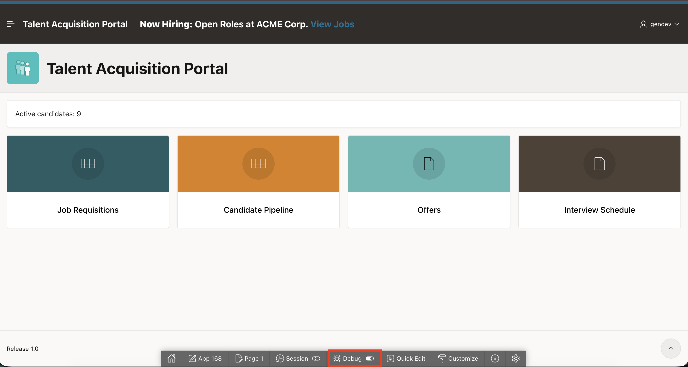
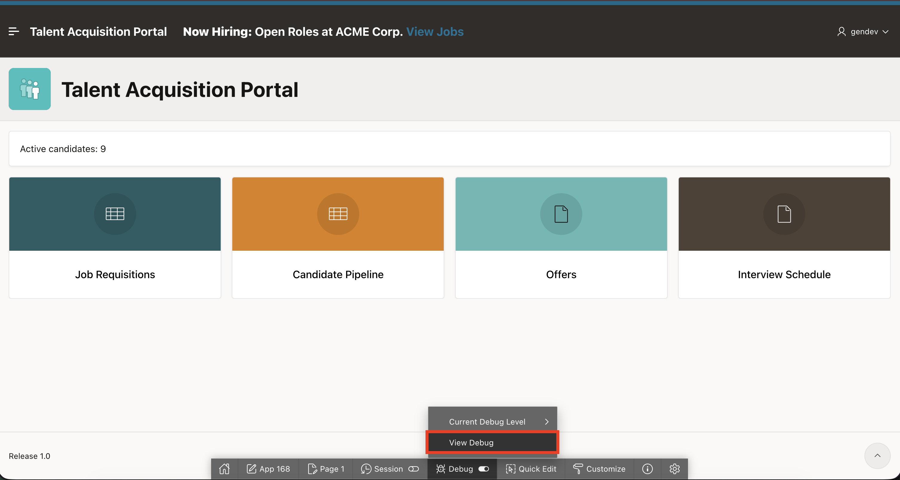
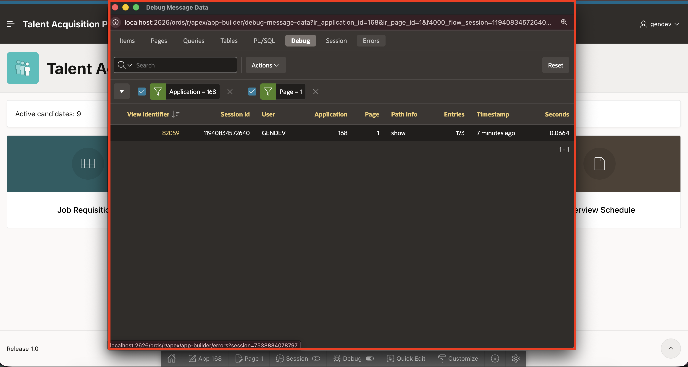
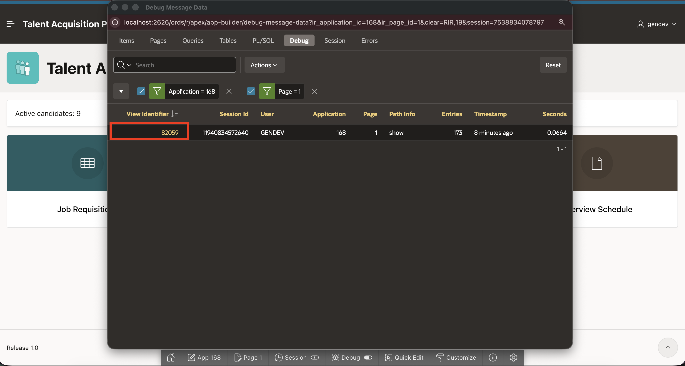

# Lab 5: Enable Debugging and Review

## Introduction

Use Debug mode to track down unexpected application behavior.

The debug level controls which messages APEX records. Setting a specific level logs messages at that level and below. A higher level includes more detailed messages and can require more resources.

APEX provides the following debug levels in the Developer Toolbar:

- **Off** - Disables debug mode.
- **Info (Level 4)** - Contains the normal amount of information.
- **App Trace (Level 6)** - Contains messages up to Level 6. You will use this level in this lab.
- **Full Trace (Level 9)** - Contains the maximum amount of information. Full Trace can slow request processing.

APEX debug messages include **Error (Level 1)**, **Warning (Level 2)**, **Information (Level 4)**, **Enter (Level 5)**, and **Trace (Level 6)** messages.

In this lab, you enable **App Trace** and inspect the TAP Home page debug output. You review page and region rendering, SQL execution, and elapsed times, and then turn debugging off.

Estimated time: 5 minutes

### Objectives

In this lab, you will learn how to:

- Enable APEX debugging.
- Compare the available debug levels.
- Open the debug output.
- Review Home page rendering steps, elapsed times, and SQL activity.
- Disable debugging after the review.

## Task 1: Enable Debugging

In this task, you will enable **App Trace (Level 6)** to record application messages for TAP Home page and region processing.

1. From the running TAP **Home** page, select **Debug** in the **Developer Toolbar**.

    

2. Select **Enable Debug**, then select **App Trace**.

    

3. Confirm that the debug toolbar appears.

    

## Task 2: Review and Disable Debugging

In this task, you will review the debug messages for the page request. The messages show page and region rendering steps, SQL queries, and elapsed times that can help identify slow processing. You will then disable debugging.

1. Select **Debug**, then select **View Debug**.

    

2. Review page and region rendering steps, SQL queries, and elapsed times.

    

3. Select the debug identifier and review the detailed timing and execution messages.

    

4. Identify regions or queries with long elapsed times.

    

5. To disable debugging, select **Debug > Current Debug Level > Off** in the **Developer Toolbar**.

    

## Summary

You learned that **Info** contains the normal amount of information, **App Trace** contains messages up to Level 6, and **Full Trace** contains the maximum amount of information.

You used **App Trace** to examine the page-rendering sequence, region processing, SQL execution, and elapsed times. This information helps identify slow regions, queries, and other unexpected application behavior.

At the end of this lab, you are on the running TAP **Home** page with debugging disabled. In the next lab, you will switch to the Employee Self Service (ESS) application and open **Home** in Page Designer.

You may now proceed to the next lab.

## Learn More

* [Utilizing Debug Mode](https://docs.oracle.com/en/database/oracle/apex/26.1/htmdb/utilizing-debug-mode.html)
* [Developer Toolbar](https://docs.oracle.com/en/database/oracle/apex/26.1/htmdb/runtime-developer-toolbar.html)

## Acknowledgements

- **Author** - Sahaana Manavalan, Senior Product Manager
- **Last Updated By/Date** - Sahaana Manavalan, Senior Product Manager, July 2026
