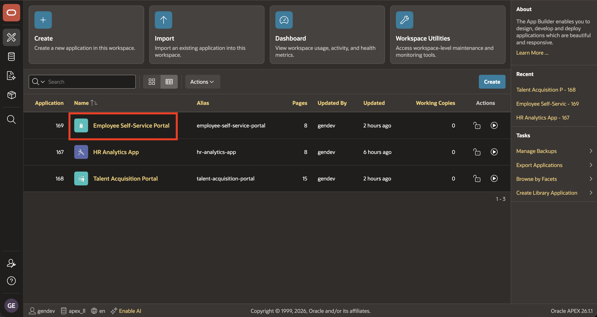
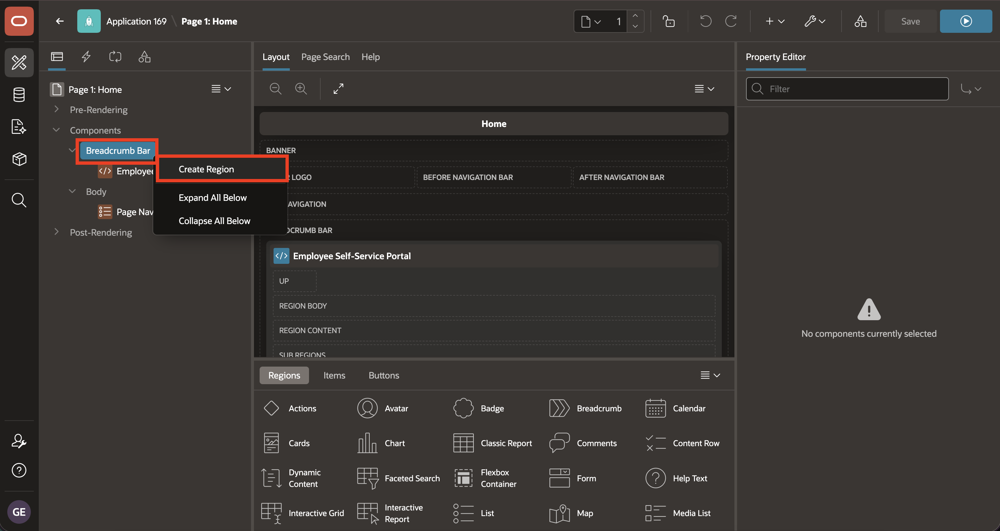
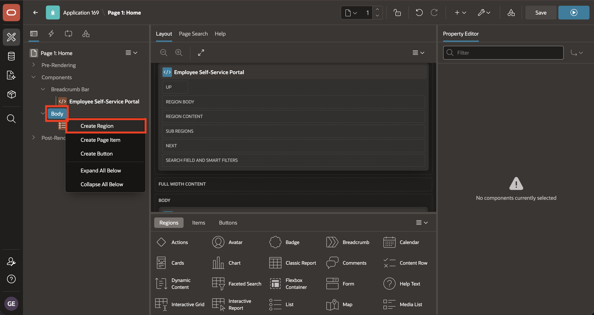
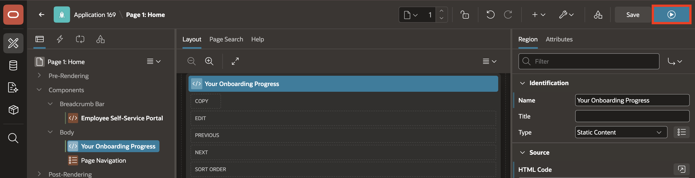
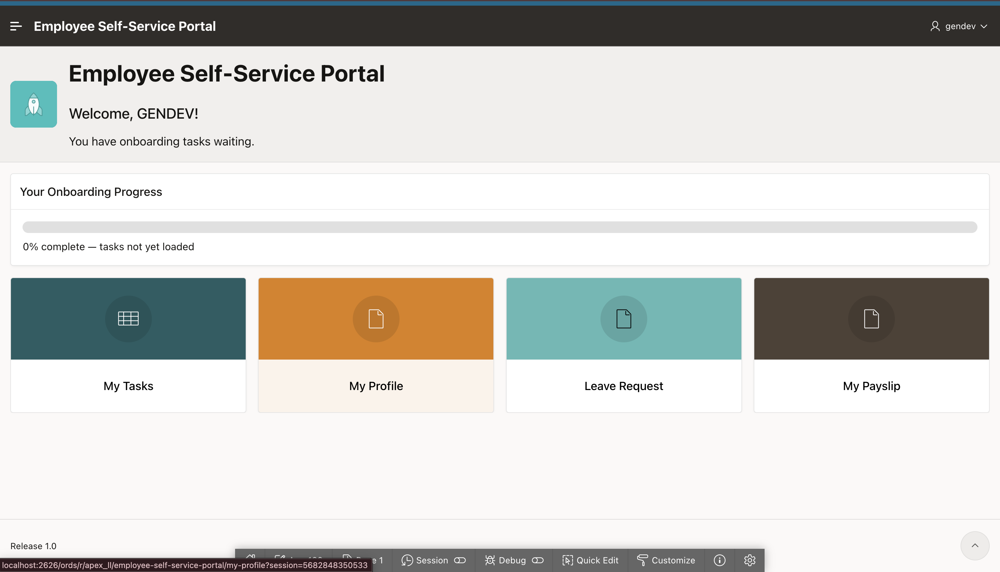

# Lab 6: Employee Self Service - Add Home Regions

## Introduction

Use the **Layout > Position** attribute to select the template position for a region.

Static Content displays text content. `APP_USER` is the current user running the application, and its substitution string syntax is `&APP_USER.`.

In this lab, you apply these concepts in the Employee Self Service (ESS) application. You add a welcome region to **Breadcrumb Bar** and an onboarding-progress region to **Body**.

Estimated time: 5 minutes

### Objectives

In this lab, you will learn how to:

- Open the Employee Self Service (ESS) Home page in Page Designer.
- Add a personalized welcome message to the ESS breadcrumb region.
- Add a static onboarding progress region.
- Run the ESS Home page and confirm that both regions appear.


## Task 1: Add the Welcome Banner

In this task, you will switch from TAP to the **Employee Self Service** application and open its Home page in Page Designer. You will create a Static Content region in **Breadcrumb Bar** and add HTML that uses `&APP_USER.` to display the current application user.

1. Return to **Page Designer** and, in the left navigation, select the **App Builder** icon.

    

2. Return to the App Builder **Applications** page and open the **Employee Self Service** application.

    

3. On the ESS application home page, select **1 - Home** to open the page in Page Designer.

    

4. In the **Rendering Tree**, right-click **Breadcrumb Bar**, then select **Create Region**.

    

5. In the **Property Editor**, enter/select the following:

    - Under Source:

        - HTML Code: Copy and paste the following:

            ```html
            <copy>
            <h2>Welcome, <span>&APP_USER.</span>!</h2>
            <p>You have onboarding tasks waiting.</p>
            </copy>
            ```

## Task 2: Add the Onboarding Progress Region

In this task, you will create the **Your Onboarding Progress** Static Content region in **Body**. You will add HTML for a progress bar with a fixed value of zero.

1. In the **Rendering Tree**, right-click **Body**, then select **Create Region**.

    

2. In the **Property Editor**, enter/select the following:

    - Under Identification:

        - Title: **Your Onboarding Progress**

    - Under Source:

        - HTML Code: Copy and paste the following:

            ```html
            <copy>
            <div style="width:100%;height:16px;overflow:hidden;background:#e0e0e0;border-radius:8px;">
              <div id="prog" role="progressbar" aria-valuemin="0" aria-valuemax="100" aria-valuenow="0" style="width:0%;height:100%;background:#3B82F6;border-radius:8px;">
              </div>
            </div>
            <p id="prog-status" style="margin:8px 0 0;">0% complete - tasks not yet loaded</p>
            </copy>
            ```

    - Under Layout:

        - Sequence: **10**

    

3. Select **Save and Run**.

    

4. Confirm that the welcome banner and static progress bar appear.

    

## Summary

You learned how to use **Layout > Position** to place regions in **Breadcrumb Bar** and **Body**.

You also learned that `APP_USER` is the current user running the application and that its substitution string syntax is `&APP_USER.`.

You added HTML to Static Content regions for the welcome message and onboarding progress placeholder.

Across this module, you learned how APEX pages contain regions, how region types and sources control their output, how Page 0 shares components, and how debug output reveals page and region processing.

This completes the module.

## Learn More

* [Editing Regions](https://docs.oracle.com/en/database/oracle/apex/26.1/htmdb/editing-regions.html)
* [Using Built-in Substitution Strings](https://docs.oracle.com/en/database/oracle/apex/26.1/htmdb/using-available-built-in-substitution-strings.html)

## Acknowledgements

- **Author** - Sahaana Manavalan, Senior Product Manager
- **Last Updated By/Date** - Sahaana Manavalan, Senior Product Manager, July 2026
