# Lab 1: Create Candidate Profile Page Manually

## Introduction

In this lab, you create a Candidate Profile page in the Talent Acquisition Portal (TAP). You also use Page Designer to inspect page structure, view attribute help, and add static content regions to the page body.

Estimated time: 5 minutes

### Objectives

In this lab, you will learn how to:

- Create a blank page manually in TAP.
- Review the main Page Designer panes.
- Display help for a Page Designer attribute.
- Add Candidate Details and Application History regions.
- Save and run the Candidate Profile page.

### Prerequisites

- The Talent Acquisition Portal application is available in your APEX Workspace.
- You have developer access to the application.

## Task 1: Create and Inspect the Page

In this task, you will create a blank Candidate Profile page and review Page Designer. Page Designer is where you arrange page components, edit component attributes, and access attribute-level help.

1. In APEX App Builder, open the **Talent Acquisition Portal** application.

    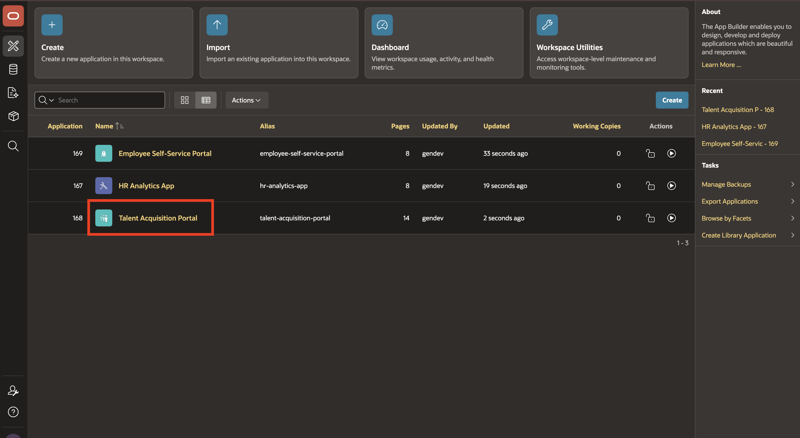

2. On the application home page, select **Create Page**.

    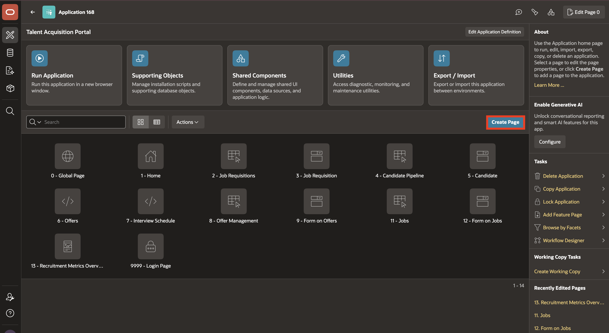

3. Select **Blank Page**.

    Select **Next**.

    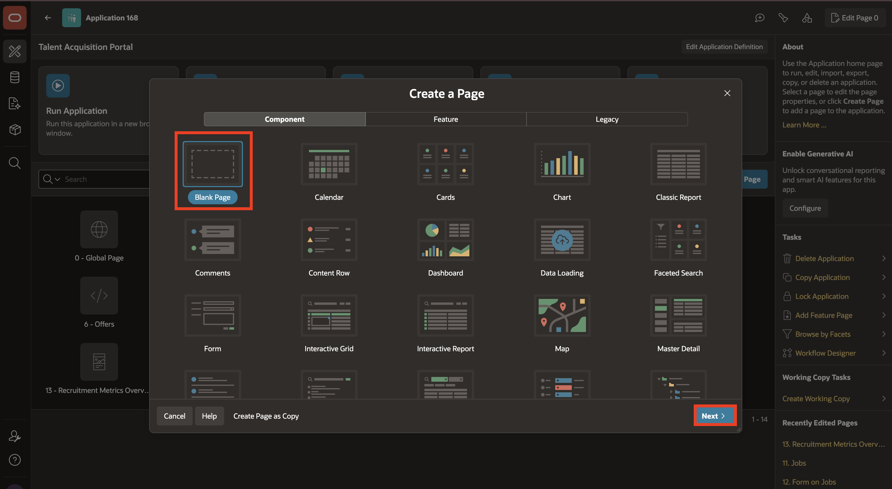

4. For **Name**, enter **Candidate Profile**.

    Select **Create Page**.

    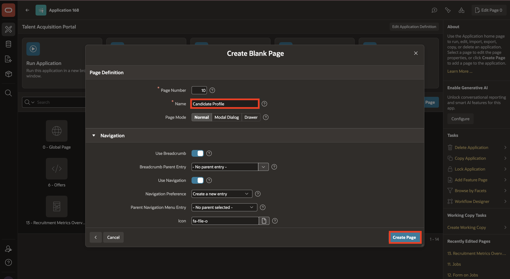

5. After the page is created, Page Designer opens automatically.

    The Page Designer window is divided into three main panes:

    - **Left Pane** - Includes four tabs that display as a tree: **Rendering**, **Dynamic Actions**, **Processing**, and **Shared Components**.
    - **Central Pane** - Includes the following tabs: **Layout**, **Page Search**, and **Help**.
    - **Right Pane** - Displays the **Property Editor**. Use the Property Editor to update attributes for the selected component. When you select multiple components, the Property Editor only displays common attributes. Updating a common attribute updates that attribute for all selected components.

    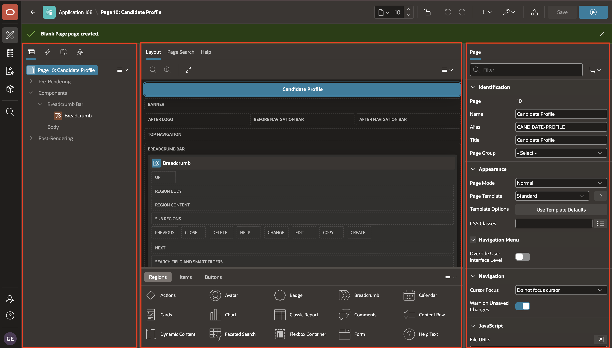

6. The Page Designer toolbar displays at the top of the page and contains buttons and menu options.

    To view an online summary of Page Designer, select **Help > Getting Started with Page Designer**.

    To view help for a selected attribute, select a component and then select an attribute in the Property Editor.

    In the **Rendering Tree** (Left Pane), select **Breadcrumb**.

    In the **Property Editor** (Right Pane), select **Identification > Type**.

    Select **Help**.

    The help text for **Type** is displayed.

    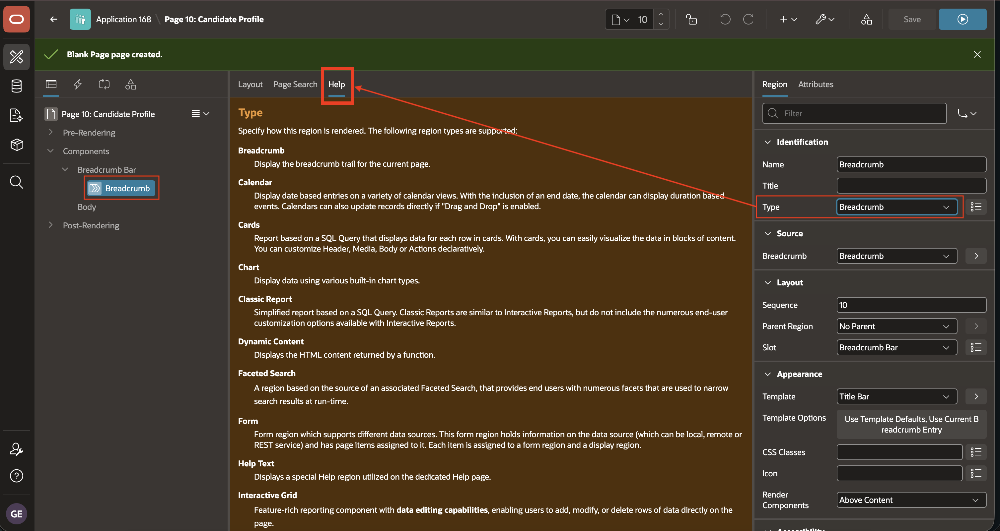

## Task 2: Add Candidate Profile Regions

In this task, you will add two Static Content regions to the Candidate Profile page. These regions establish the page layout that later modules can extend with candidate details and application activity.

1. In the newly created page, navigate to the **Gallery Menu** at the bottom.

    The Gallery Menu shows **Regions**, **Items**, and **Buttons** categories.

    Confirm that the **Regions** tab is selected.

    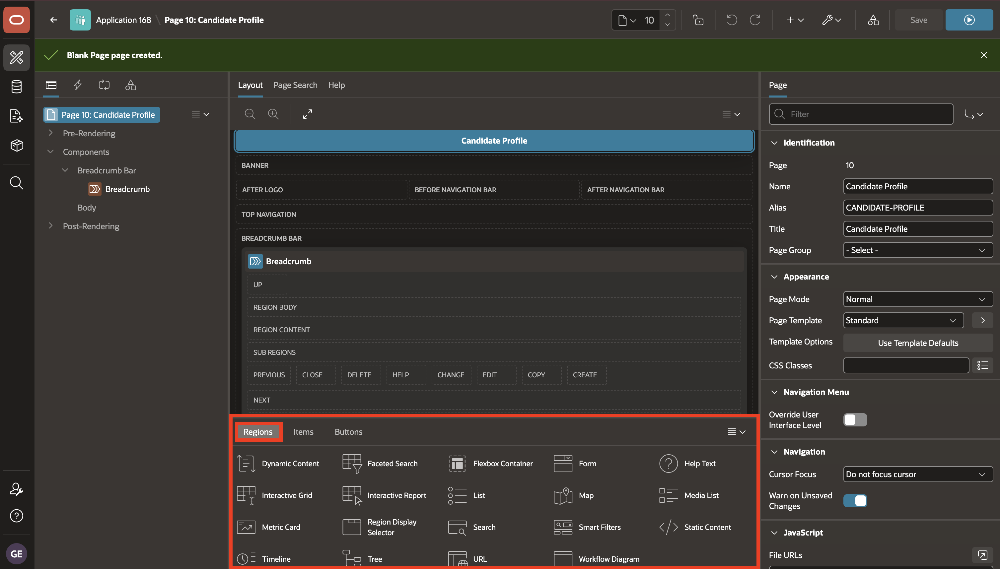

2. Drag a **Static Content** region and drop it in the **Body** section.

    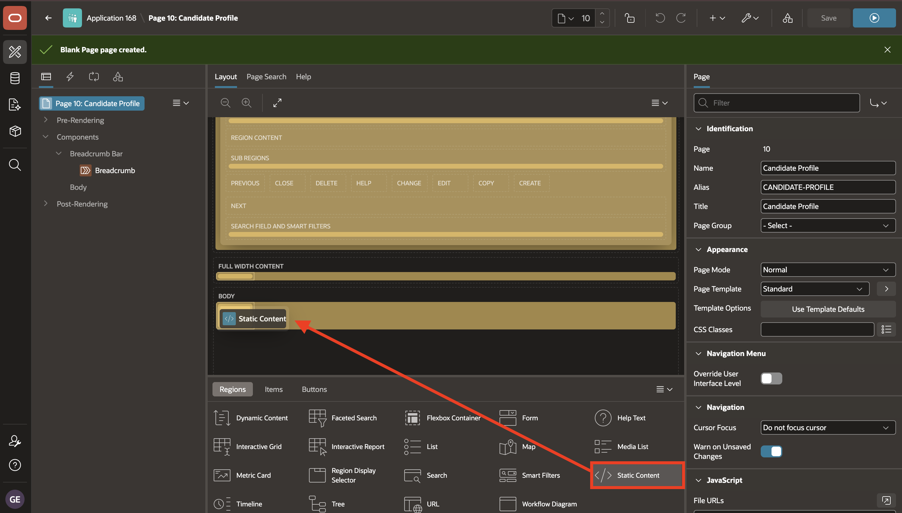

3. In the **Property Editor**, enter/select the following:

    - Under Identification:

        - Name: **Candidate Details**

    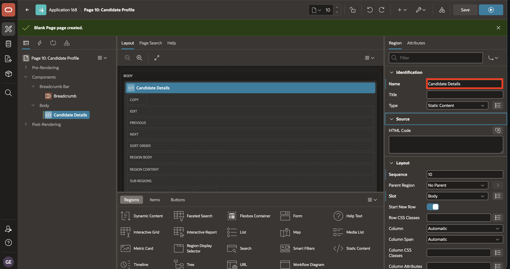

4. In the **Rendering Tree**, right-click **Body**.

    Select **Create Region**.

    

5. In the **Property Editor**, enter/select the following:

    - Under Identification:

        - Name: **Application History**

    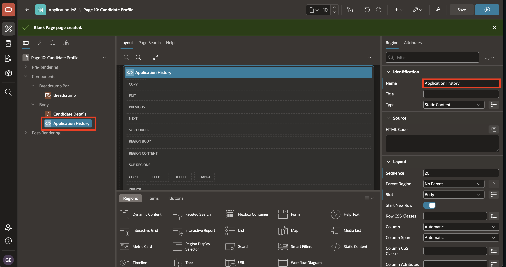

6. Select **Save and Run**.

    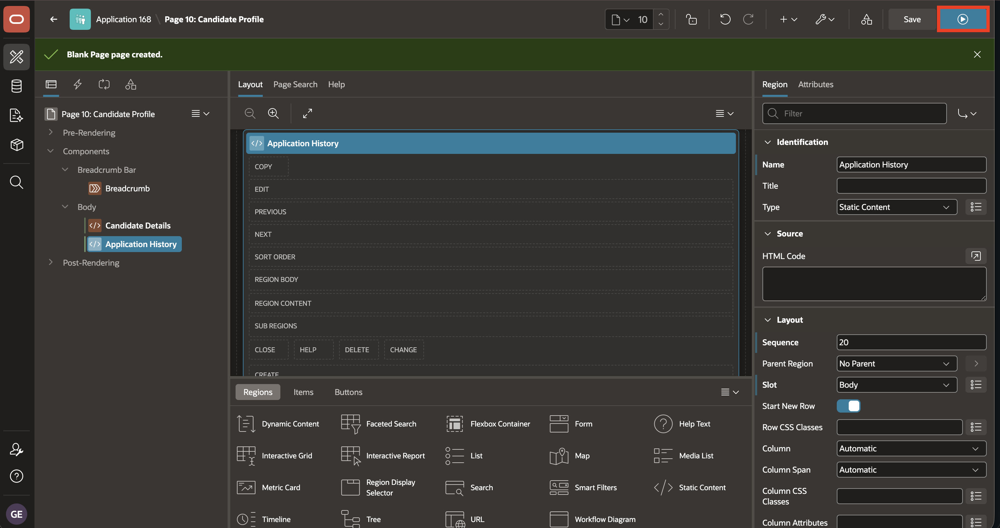

7. Confirm that the page displays **Candidate Details** followed by **Application History**.

    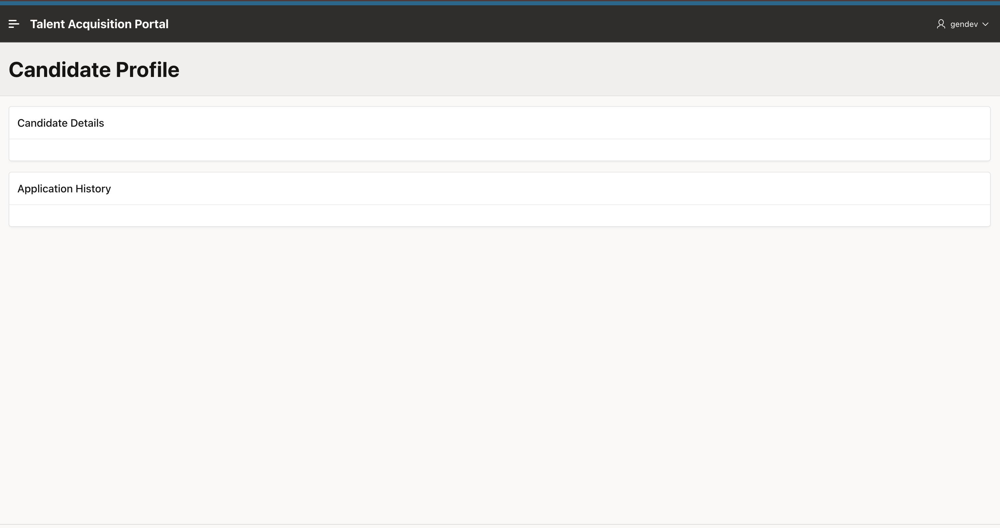

## Learn More

* [Oracle APEX Page Designer](https://docs.oracle.com/en/database/oracle/apex/26.1/htmdb/using-page-designer.html)

## Summary

In this lab, you created the **Candidate Profile** page manually and opened it in Page Designer.

You reviewed the main Page Designer areas, used attribute help, and added the first two page regions: **Candidate Details** and **Application History**.

These regions create the basic page structure that later modules can extend with candidate data and application activity.

At the end of this lab, you are on the running **Candidate Profile** page. In the next lab, you will return to the TAP application home page and open the **Candidate Pipeline** page in Page Designer.

You may now proceed to the next lab.

## Acknowledgements

- **Author** - Sahaana Manavalan, Senior Product Manager
- **Author** - Roopesh Thokala, Principal Product Manager
