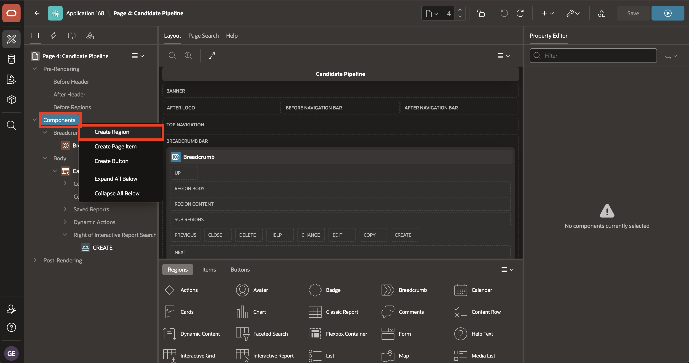
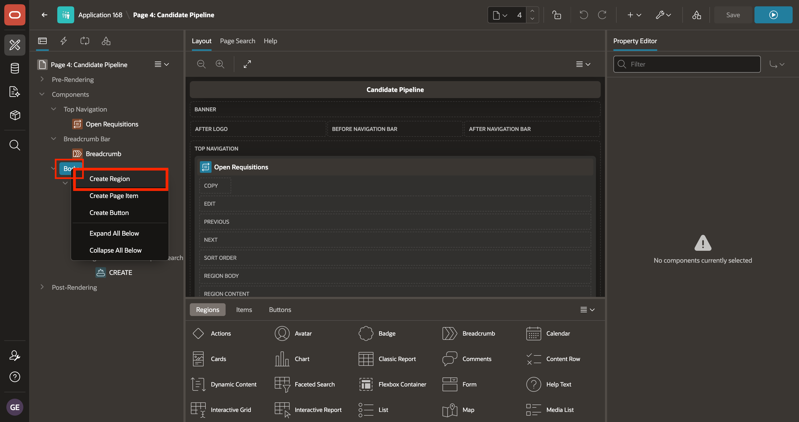
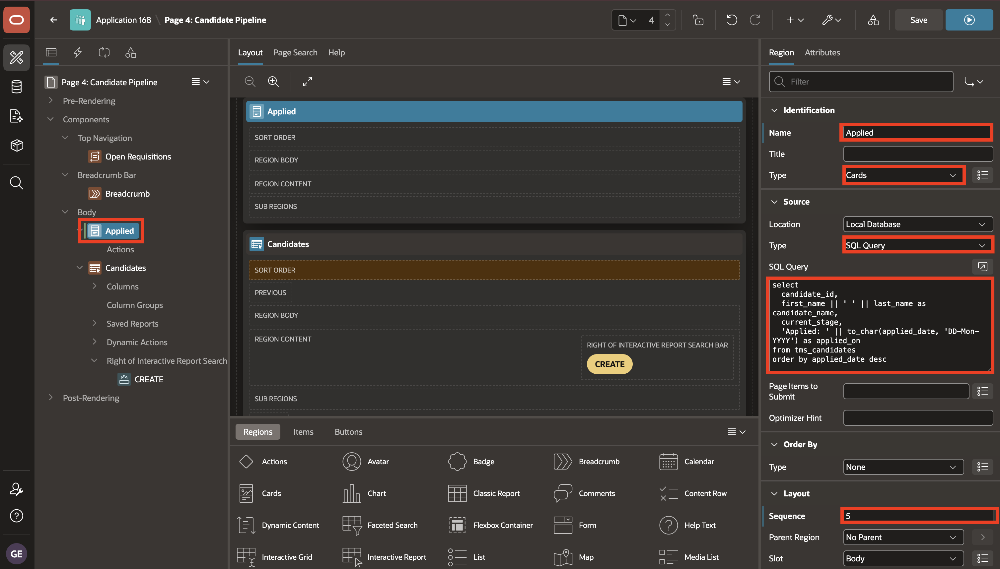
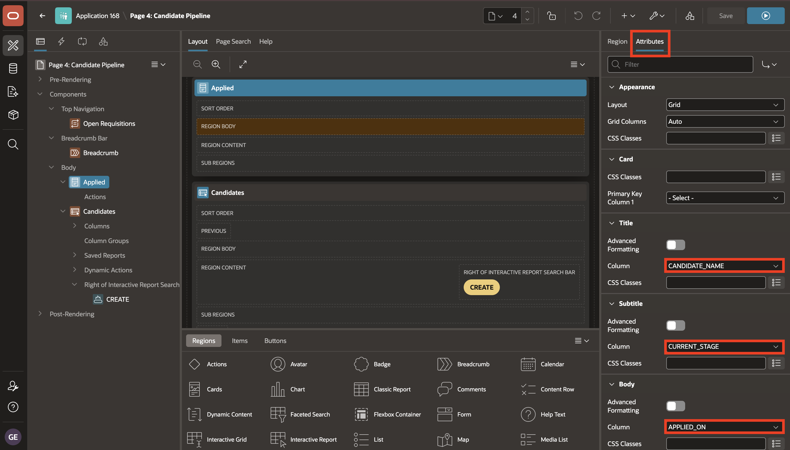
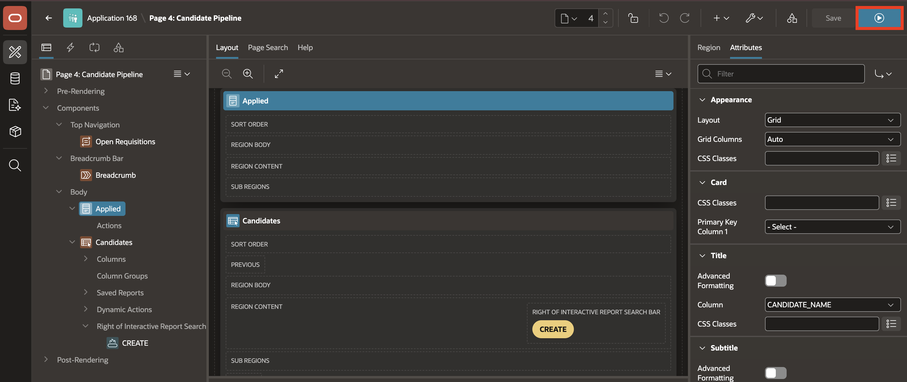

# Lab 2: Add Regions to the Candidate Pipeline Page

## Introduction

In this lab, you add a live open-requisitions banner and a Cards region to the TAP Candidate Pipeline page.

Estimated time: 10 minutes

### Objectives

In this lab, you will learn how to:

- Add a Dynamic Content region before the main page content.
- Display a live count of open job requisitions.
- Add an Applied Cards region for candidate pipeline data.
- Configure card title, subtitle, body, and icon attributes.
- Run the page and review the candidate card layout.


### Prerequisites

- The Talent Acquisition Portal has a **Candidate Pipeline** page.
- The `TMS_JOB_REQUISITIONS` and `TMS_CANDIDATES` tables are available.

## Task 1: Add the Open Requisitions Banner

In this task, you will add a banner region above the Candidate Pipeline content. The banner uses PL/SQL to count open requisitions and display the result at runtime.

1. From the running **Candidate Profile** page, use the **Developer Toolbar** at the bottom of the page to return to the TAP application home page in App Builder.

    

2. On the application home page, select **4 - Candidate Pipeline** to open the page in Page Designer.

    

3. In the **Rendering Tree**, right-click **Components**.

    Select **Create Region**.

    

4. In the **Property Editor**, enter/select the following:

    - Under Identification:

        - Title: **Open Requisitions**
        - Type: **Dynamic Content**

    - Under Source:

        - PL/SQL Function Body returning HTML: Copy and paste the following:

            ```sql
            <copy>
            declare
                l_open_count number;
            begin
                select count(*)
                  into l_open_count
                  from tms_job_requisitions
                 where status = 'Open';

                return 'Open Requisitions: ' || apex_escape.html(to_char(l_open_count));
            end;
            </copy>
            ```

    - Under Layout:

        - Position: **Top Navigation**

    - Under Appearance:

        - Template Options:
            - Header: **Hidden but Accessible**

    

5. Select **Save**.

    

## Task 2: Add the Candidate Cards Region

In this task, you will replace the default tabular view with a Cards region. Cards make each candidate easier to scan by showing the candidate name, current stage, and applied date as separate card fields.

1. In the **Rendering Tree**, right-click **Body**.

    Select **Create Region**.

    

2. In the **Property Editor**, enter/select the following:

    - Under Identification:

        - Name: **Applied**
        - Type: **Cards**

    - Under Source:

        - Type: **SQL Query**
        - SQL Query: Copy and paste the following:

            ```sql
            <copy>
            select
                candidate_id,
                first_name || ' ' || last_name as candidate_name,
                current_stage,
                'Applied: ' || to_char(applied_date, 'DD-Mon-YYYY') as applied_on
            from tms_candidates
            order by applied_date desc
            </copy>
            ```

    - Under Layout:

        - Sequence: **5**

    

3. Select the **Attributes** tab and configure the Cards attributes:

    - Under Card:

        - Title Column: **CANDIDATE_NAME**
        - Subtitle Column: **CURRENT_STAGE**
        - Body Column: **APPLIED_ON**

    

    - Under Icon and Badge:

        - Icon Type: **Initials**
        - Icon Initials Column: **CANDIDATE_NAME**

    

4. Select **Save and Run**.

    

5. Confirm that each card shows the candidate name, current stage, and applied date.

    

## Summary

In this lab, you improved the **Candidate Pipeline** page by adding regions that make the page easier to scan.

The **Open Requisitions** region displays a runtime count of open job requisitions.

The **Applied** Cards region presents candidate pipeline data as cards, with each card showing the candidate name, current stage, applied date, and initials.

At the end of this lab, you are on the running **Candidate Pipeline** page. In the next lab, you will return to the TAP application home page and open **Shared Components**.

You may now proceed to the next lab.

## Acknowledgements

- **Author** - Sahaana Manavalan, Senior Product Manager
- **Author** - Roopesh Thokala, Principal Product Manager
