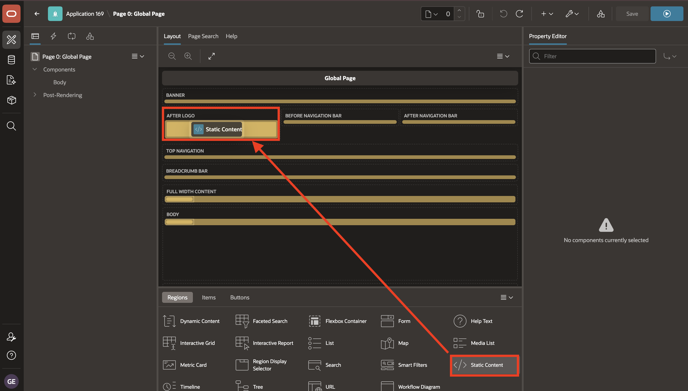
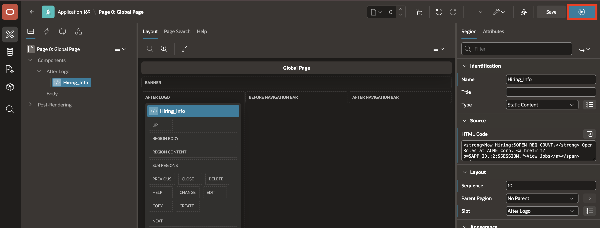

# Lab 3: Configure the Global Page

## Introduction

In this lab, you add a Page 0 banner that displays the current number of TAP open roles on every application page.

Estimated time: 5 minutes

### Objectives

In this lab, you will learn how to:

- Add a Static Content region to Page 0.
- Place the banner in the After Logo region.
- Configure the Hiring_Info region source and template.
- Run a TAP page and confirm that the banner appears globally.


## Task 1: Add the Global Banner

In this task, you will add a Static Content region to the Global Page. Regions on Page 0 render across the application when their display point applies to the current page template.

1. From the running **Candidate Pipeline** page, use the **Developer Toolbar** at the bottom of the page and select the **Application ID**.

    Your Application ID may be different from the one shown in the screenshot.

    

2. Open **Page 0: Global Page** in **Page Designer**.

    

3. From the Gallery, drag a **Static Content** region and drop it in the **After Logo** region.

    

4. In the **Property Editor**, enter/select the following:

    - Under Identification:

        - Name: **Hiring_Info**

    - Under Source:

        - HTML Code: Copy and paste the following:

            ```html
            <copy>
            <strong>Now Hiring:</strong> Open Roles at ACME Corp. <a href="f?p=&APP_ID.:2:&SESSION.">View Jobs </a>
            </copy>
            ```

    - Under Appearance:

        - Template: **Title Bar**

    

5. Select **Save and Run**.

    

6. Confirm that the banner appears.

    

## Summary

In this lab, you configured the **Global Page** to display a banner across the Talent Acquisition Portal.

The **Hiring_Info** region was added to Page 0 and placed in the **After Logo** region so the hiring message appears consistently across TAP pages.

This pattern is useful for global messages, alerts, and navigation prompts that should appear throughout an application.

At the end of this lab, you are on a running TAP page with the global banner visible. In the next lab, you will return to the TAP application home page and open the **Home** page in Page Designer.

You may now proceed to the next lab.

## Acknowledgements

- **Author** - Sahaana Manavalan, Senior Product Manager
- **Author** - Roopesh Thokala, Principal Product Manager
