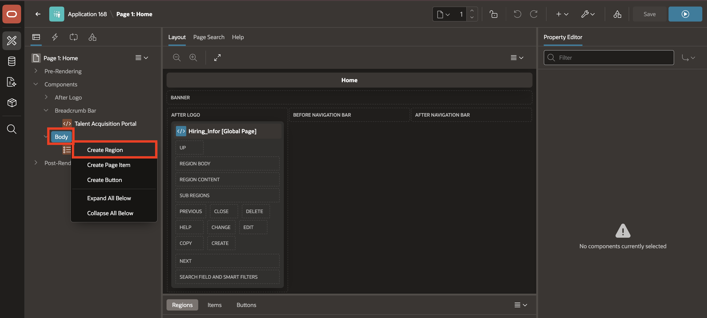
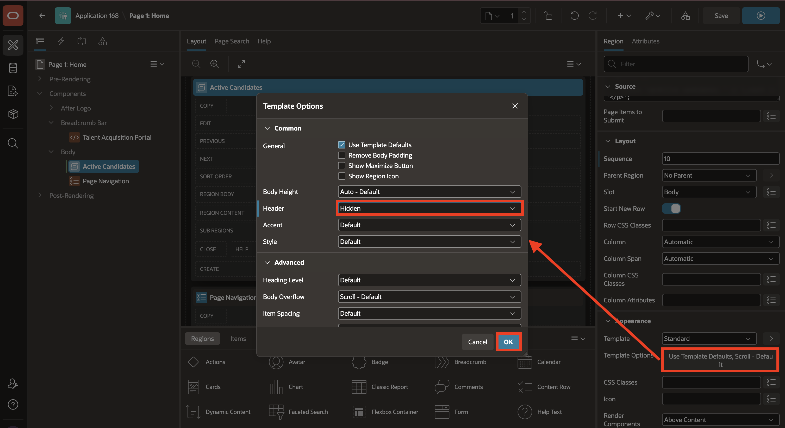
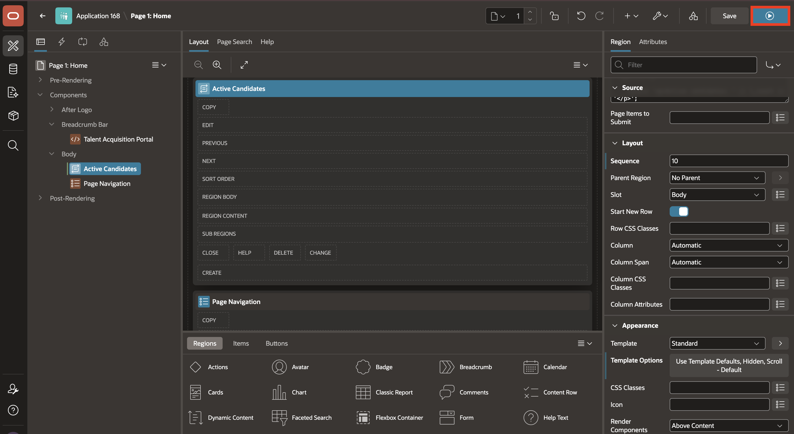

# Lab 4: Add a Dynamic Content Region

## Introduction

In this lab, you add a placeholder Active Candidates region to TAP Home. A later module can refresh it with AJAX without reloading the page.

Estimated time: 5 minutes

### Objectives

In this lab, you will learn how to:

- Add a Dynamic Content region to TAP Home.
- Add a PL/SQL function body returning a CLOB.
- Configure the region layout and template options.
- Run the page and confirm that the active candidate count appears.


## Task 1: Create the Active Candidates Region

In this task, you will add the region shell to TAP Home. The region will later show a dynamic count of candidates who are still active in the hiring process.

1. From the running TAP page, use the **Developer Toolbar** at the bottom of the page and select **1 - Home** to open the Home page in Page Designer.

    

2. In the **Rendering Tree**, right-click **Body**.

    Select **Create Region**.

    

3. In the **Property Editor**, enter/select the following:

    - Under Identification:

        - Title: **Active Candidates**
        - Type: **Dynamic Content**

    - Under Source:

        - PL/SQL Function Body returning a CLOB: Copy and paste the following:

            ```sql
            <copy>
            declare
                l_active_candidates number;
            begin
                select count(*)
                  into l_active_candidates
                  from tms_candidates
                 where current_stage not in ('Hired', 'Rejected');

                return '<p>Active candidates: ' || apex_escape.html(to_char(l_active_candidates)) || '</p>';
            end;
            </copy>
            ```

    - Under Layout:

        - Sequence: **10**

    

    - Under Appearance:

        - Template Options:
            - Header: **Hidden but Accessible**

    

4. Select **Save and Run**.

    

5. Confirm that the Home page displays the active candidate count.

    

## Summary

In this lab, you added a dynamic **Active Candidates** region to the TAP Home page.

The region uses a PL/SQL function body returning a CLOB to calculate and display the number of candidates who are still active in the hiring process.

This creates a simple runtime metric that can be expanded in later modules with refresh behavior and richer dashboard content.

At the end of this lab, you are on the running TAP **Home** page. In the next lab, you will open the **Candidate Pipeline** page and enable debugging.

You may now proceed to the next lab.

## Acknowledgements

- **Author** - Sahaana Manavalan, Senior Product Manager
- **Author** - Roopesh Thokala, Principal Product Manager
