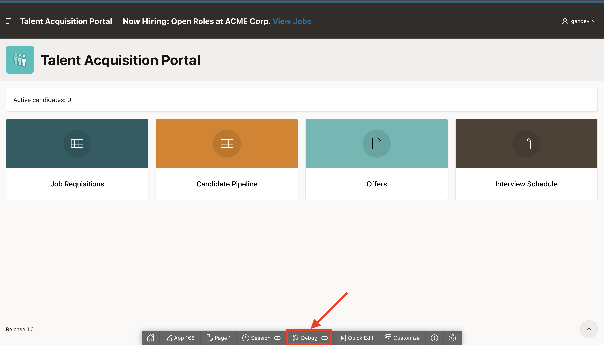
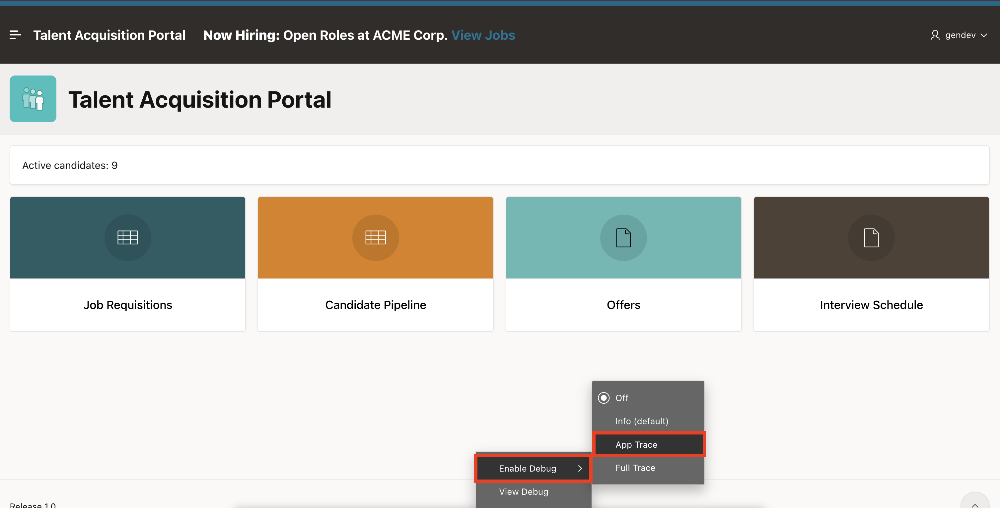
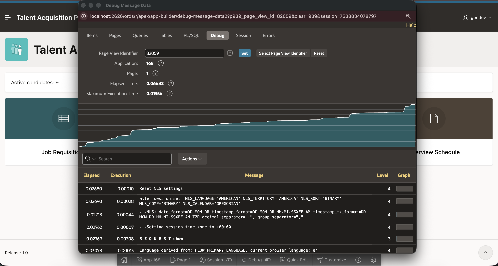
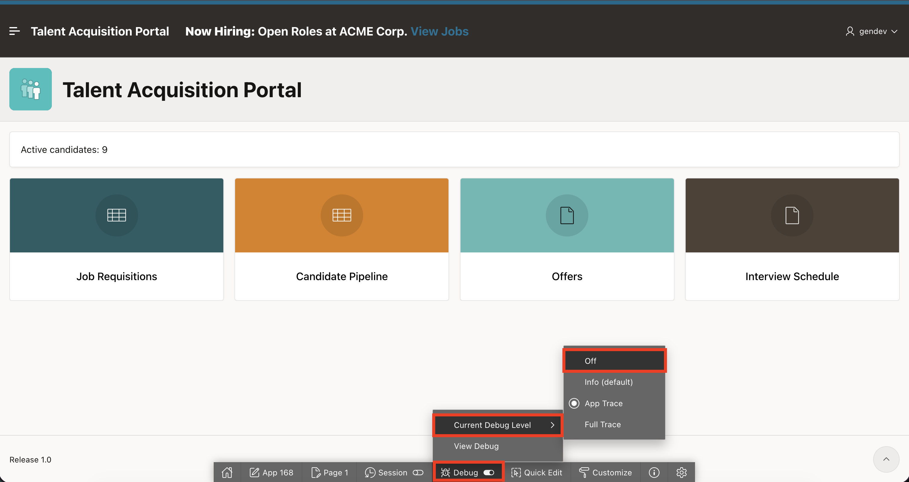

# Lab 5: Enable Debugging and Review

## Introduction

In this lab, you use APEX debug output to inspect TAP Home page rendering, timing, and SQL activity.

Estimated time: 5 minutes

### Objectives

In this lab, you will learn how to:

- Enable APEX debugging.
- Open the debug output.
- Review Home page rendering steps, elapsed times, and SQL activity.
- Disable debugging after the review.

## Task 1: Enable Debugging

In this task, you will enable APEX debugging from the running TAP Home page. Debug mode records page rendering details that help you inspect region execution and SQL behavior.

1. From the running TAP **Home** page, select **Debug** in the **Developer Toolbar**.

    

2. Select **Enable Debug**.

    Select **App Trace**.

    

3. Confirm that the debug toolbar appears.

    

## Task 2: Review and Disable Debugging

In this task, you will review the debug output and identify any slow page-rendering steps. After the review, you will turn debugging off so regular page runs do not collect debug details.

1. Select **Debug**.

    Select **View Debug**.

    

2. Review page and region rendering steps, SQL queries, and elapsed times.

    

3. Select the debug identifier.

    Review the detailed timing and execution messages.

    

    

4. Identify regions or queries with long elapsed times.

5. To disable debugging, select **Debug > Current Debug Level > Off** in the **Developer Toolbar**.

    

## Summary

In this lab, you enabled APEX debugging from the running TAP Home page and reviewed the generated debug output.

You opened the debug message list, selected a debug identifier, and inspected timing and execution messages for the page request.

Debug output helps you understand how a page renders, which regions and SQL statements run, and where performance issues may appear.

At the end of this lab, you are on the running TAP **Home** page with debugging disabled. In the next lab, you will switch to the Employee Self Service (ESS) application and open **Home** in Page Designer.

You may now proceed to the next lab.

## Acknowledgements

- **Author** - Sahaana Manavalan, Senior Product Manager
- **Author** - Roopesh Thokala, Principal Product Manager
