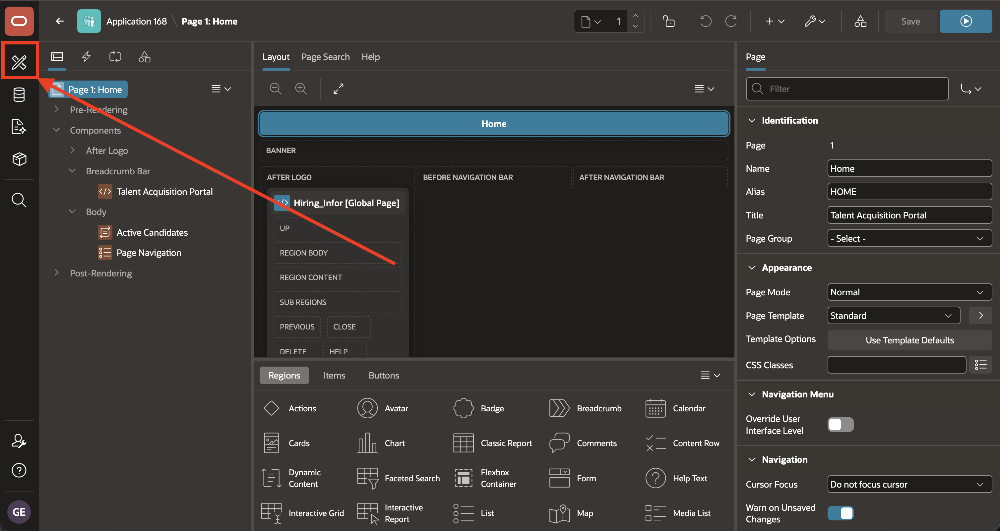
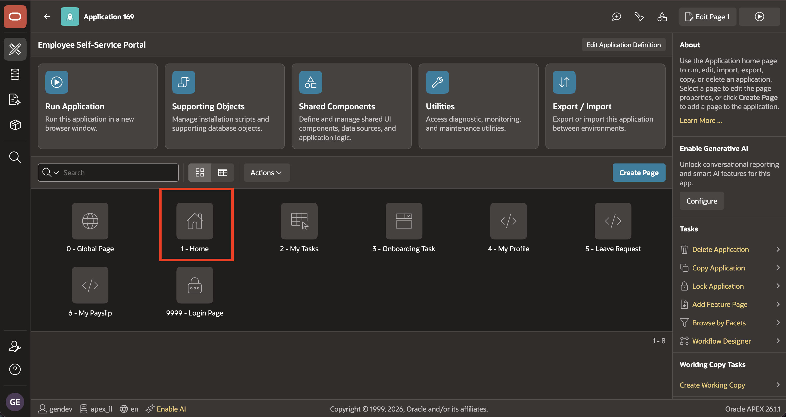
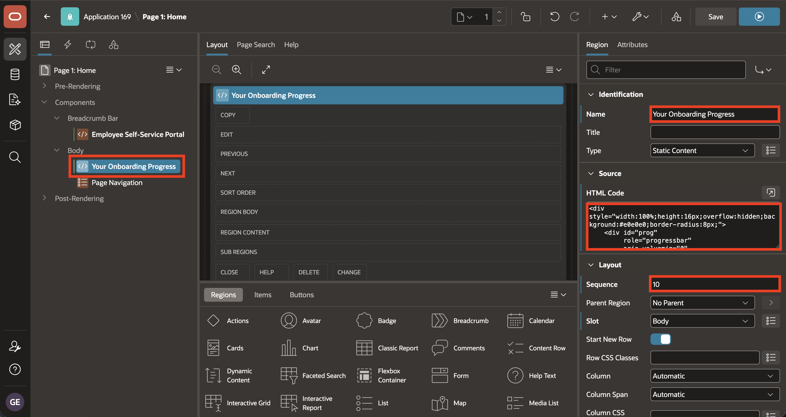

# Lab 6: Employee Self Service - Add Home Regions

## Introduction

In this lab, you add a personalized welcome banner and a static onboarding-progress region to the Employee Self Service (ESS) Home page.

Estimated time: 5 minutes

### Objectives

In this lab, you will learn how to:

- Open the Employee Self Service (ESS) Home page in Page Designer.
- Add a personalized welcome message to the ESS breadcrumb region.
- Add a static onboarding progress region.
- Run the ESS Home page and confirm that both regions appear.


## Task 1: Add the Welcome Banner

In this task, you will add a Static Content region to the ESS Home page. The region greets the signed-in user and gives the Home page a more personal starting point.

1. Return to **Page Designer**.

    In Page Designer, select the **App Builder** icon.

    

2. Return to the App Builder **Applications** page.

    Open the **Employee Self Service** application.

    

3. On the ESS application home page, select **1 - Home** to open the page in Page Designer.

    

4. In the **Rendering Tree**, right-click **Breadcrumb Bar**.

    Select **Create Region**.

    

5. In the **Property Editor**, enter/select the following:

    - Under Source:

        - HTML Code: Copy and paste the following:

            ```html
            <copy>
            <h2>Welcome, <span>&APP_USER.</span>!</h2>
            <p>You have onboarding tasks waiting.</p>
            </copy>
            ```

## Task 2: Add the Onboarding Progress Region

In this task, you will add a second Static Content region with a placeholder progress bar. Module 12 replaces this static value with a computed onboarding progress value.

1. In the **Rendering Tree**, right-click **Body**.

    Select **Create Region**.

    

2. In the **Property Editor**, enter/select the following:

    - Under Identification:

        - Title: **Your Onboarding Progress**

    - Under Source:

        - HTML Code: Copy and paste the following:

            ```html
            <copy>
            <div style="width:100%;height:16px;overflow:hidden;background:#e0e0e0;border-radius:8px;">
              <div id="prog" role="progressbar" aria-valuemin="0" aria-valuemax="100" aria-valuenow="0" style="width:0%;height:100%;background:#3B82F6;border-radius:8px;">
              </div>
            </div>
            <p id="prog-status" style="margin:8px 0 0;">0% complete - tasks not yet loaded</p>
            </copy>
            ```

    - Under Layout:

        - Sequence: **10**

    

3. Select **Save and Run**.

    

4. Confirm that the welcome banner and static progress bar appear.

    

## Summary

In this lab, you made a small update to the **Employee Self Service (ESS)** Home page.

The welcome message uses `&APP_USER.` to personalize the page for the signed-in user.

The onboarding progress region adds a static progress indicator that later modules can replace with a computed onboarding status.

Across this module, you created and configured page regions in TAP and ESS, used Page Designer to place content in specific page areas, added dynamic PL/SQL output, configured a global Page 0 banner, and reviewed page rendering with APEX debug.

This completes the module.

## Acknowledgements

- **Author** - Sahaana Manavalan, Senior Product Manager
- **Author** - Roopesh Thokala, Principal Product Manager
