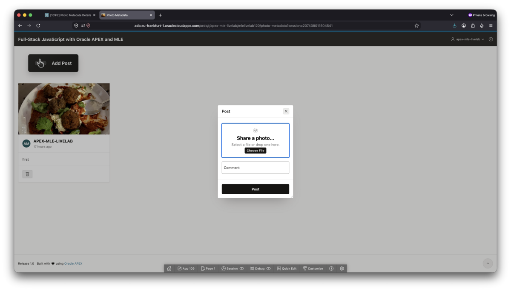
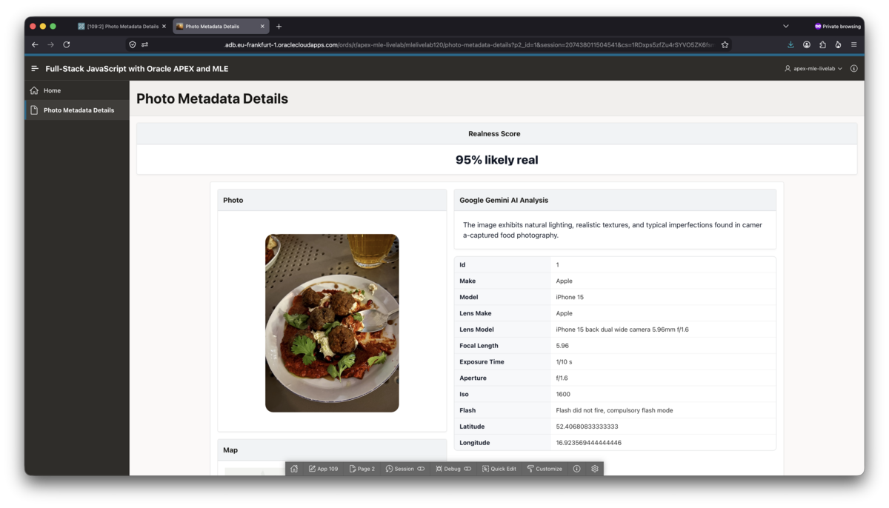

# Full-Stack JavaScript with Oracle APEX and JavaScript

## Introduction

In this workshop you will use JavaScript, powered by Multilingual Engine (MLE), to create an APEX social media app. Its main feature is the analysis of the uploaded photos using AI with the intention of detecting whether the uploaded photo was taken with a real camera, or generated by an AI. This is of course no forensic evidence, AI is getting better and better at creating realistic images, but it's a great showcase how JavaScript code execution is supported in Oracle AI Database 26ai and APEX 26.1.

You will use

- APEX Page Designer to build the application
- AI Services to analyze the picture with the intention of identifying fake, or AI-generated, photos
- JavaScript instead of PL/SQL, to process the data

In the process you will familiarize yourself with JavaScript as an ideal companion to PL/SQL and APEX development. The JavaScript community is one of the most active developer communities and produced a gazillion modules, most of them under an open-source license. These can often perform tasks for which PL/SQL equivalents aren't as readily available. You will get to know one of them in this lab: extracting EXIF information from a photo.

Other examples include parsing YAML files, UUIDv7 generation, and many more. JavaScript complements PL/SQL in areas where it's easy to reuse someone's work. In the JavaScript community you do this via modules. Oracle AI Database 26ai can import most of these out of the box, provided they adhere to the ECMAScript standard, which most of them do. As with all open-source software you need to be mindful of the module's license you include, and you must be careful not to use vulnerable software, but this isn't limited to JavaScript development.

Note that you can optionally write your code in Typescript as well. Native Typescript is not understood by the database, as with every node.js project you must first transpile it to JavaScript to use it. Typescript is not in scope of this Livelab.

The LiveLab features the latest technology stack available at the time of writing

- Oracle AI Database 26ai (Linux)
- Oracle APEX 26.1

Estimated Workshop Time: 55 minutes with an optional part of 15 minutes.

## Objectives

- Obtain an APEX workspace
- Import the application scaffold to start building
- Configure an AI Services for the image assessment
- Add the JavaScript code to the application
- Use these modules to detect fake, AI-generated images
- Optionally add CSS and debug calls

*Note: This workshop assumes you are using Oracle AI Database 26ai and Oracle APEX 26.1.*

## Labs

The following is a list of all tasks in this LiveLab:

| Module | Est. Time |
| --- | --- |
| [Getting Started: Obtain an APEX workspace](?lab=1-sign-up-apex) | 5 minutes |
| [Lab 1: Import the application's scaffold to start building](?lab=lab-1) | 5 minutes |
| [Lab 2: Configure AI Services and JSON Source](?lab=lab-2) | 10 minutes |
| [Lab 3: Import third-party JavaScript modules into the database](?lab=lab-3) | 15 minutes |
| [Lab 4: Use JavaScript modules to detect fake, AI-generated images](?lab=lab-4) | 20 minutes |
| [Lab 5: Optionally add CSS styling and debug calls](?lab=lab-4) | 15 minutes |

This LiveLab is designed to be completed from start to finish.

Feel free to compare your solution with the one created for this lab (see Downloads)

## Downloads

Two downloads are provided:

1. Click here to download the [application scaffold](../solution/scaffold.sql).
1. Click here to get the [finished application](../solution/solution.sql).

The scaffold is intended as your starting point. Use this in the subsequent labs to build the finished app.

## Application Overview

Once finished, your application consists of 2 pages, one showing a card layout with all those photos you uploaded, including a button to upload more:

After clicking on a card, you are taken to the photo details page, which includes the AI assessment and a classic report showing a select few EXIF attributes that came with the photo.

Let's build this app together!

## Learn More

The following links provide additional information about the topic.

- [Generic JavaScript LiveLab with focus on language specific features such as inline functions, SODA, etc.](https://livelabs.oracle.com/ords/r/dbpm/livelabs/view-workshop?wid=3696)
- [APEX at Oracle](https://www.oracle.com/apex/)
- [Oracle APEX in Oracle Cloud](https://apex.oracle.com/en/platform/apex-oracle-cloud/)
- [APEX Collateral](https://www.oracle.com/database/technologies/appdev/apex/collateral/)
- [Further APEX Tutorials](https://apex.oracle.com/en/learn/tutorials)
- [Oracle Database JavaScript Developer's Guide](https://docs.oracle.com/en/database/oracle/oracle-database/26/mlejs/index.html)
- [APEX Community](https://apex.oracle.com/community)
- [External APEX Community Site](https://apex.world)
- [Oracle ACE Program](https://ace.oracle.com)

## Acknowledgements

 - **Author** -  Martin Bach, Senior Principal Product Manager
 - **Contributors** - Sonja Meyer, Consulting Member of Technical Staff
 - **Last Updated By/Date** - Martin Bach, Senior Principal Product Manager, Aug 2026
