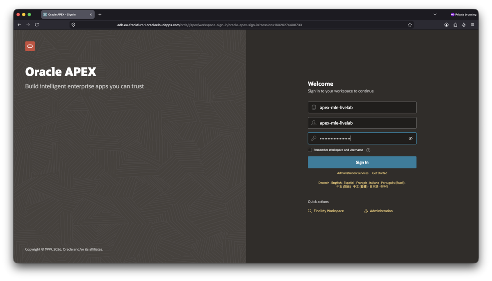
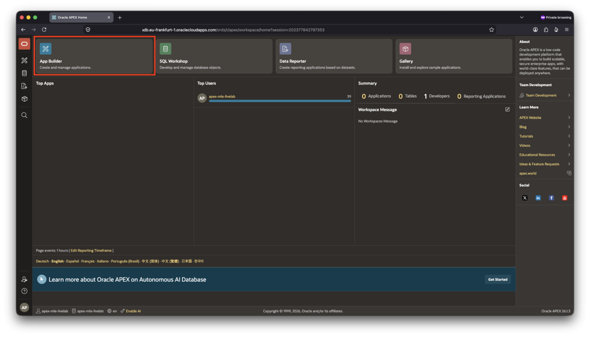
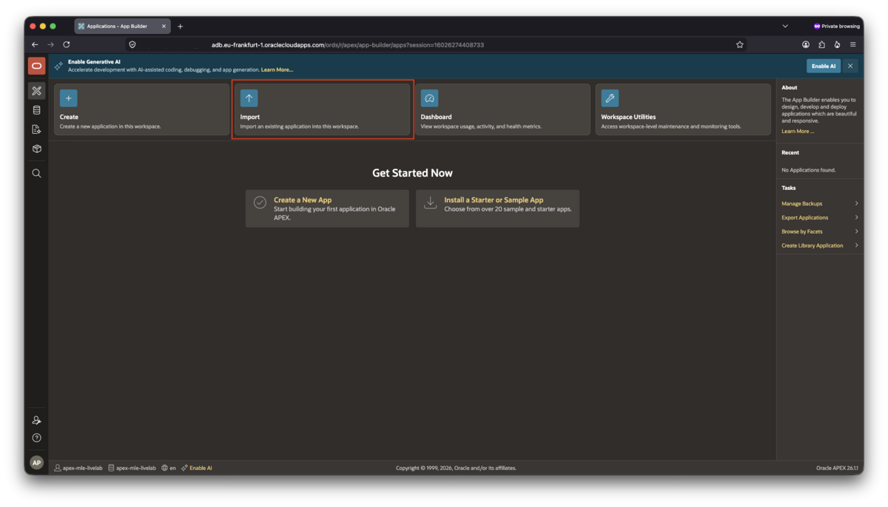
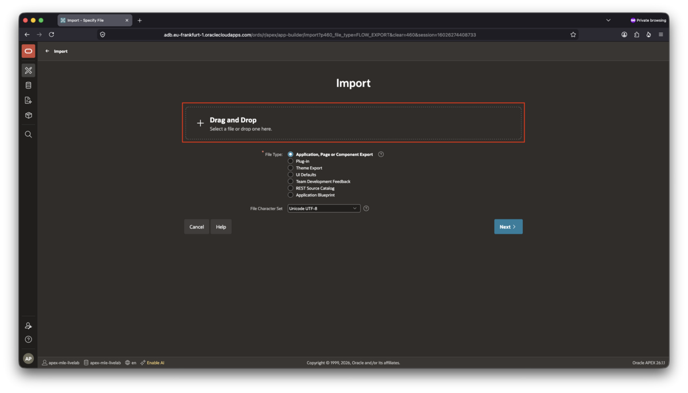
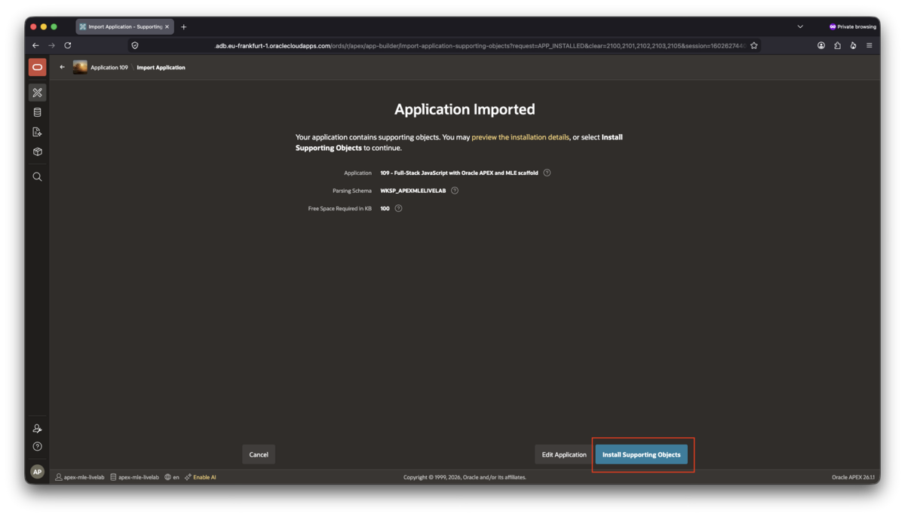

# Import the application scaffold to start building

## Introduction

Before you begin building the application, you'll import a prebuilt application scaffold. The scaffold provides the application structure, supporting database objects, and configuration required for the remaining labs, allowing you to focus on implementing new functionality rather than creating the project from scratch.

In this lab, you will download the scaffold and import it into the workspace you created in the earlier step.

This lab requires Oracle AI Database 26ai and Oracle APEX 26.1. Earlier versions are not supported because the application uses features introduced in these releases.

The application scaffold contains:

- The core of the APEX application itself
- Supporting objects required for the application to work

You can use any browser compatible with APEX to complete this lab.

Estimated time to complete: 5 minutes

### Objectives

In this lab, you will:

- Log into your APEX workspace
- Import the application scaffold

### Prerequisites

This lab assumes that you created an APEX workspace and downloaded the [application scaffold](../solution/scaffold.sql) file to a temporary location on your laptop.

## Task 1: Log into your APEX workspace

In a browser supported by APEX, **open the URL** for your APEX workspace. In order to sign in, you must provide:

- Workspace name
- Your username
- Your password

Note that an Always-Free Autonomous AI Database service has been used to create the screenshots for this LiveLab. The developer experience is identical across platforms though, it does not matter where you created your workspace as long as you have one for APEX 26.1.

You are now ready to import your application.

## Task 2: Import the application scaffold

You will load the application scaffold required for the LiveLab in this task.

1. After signing in, **click on App Builder**:

    

1. Next, click **Import** to begin the process of importing the application scaffold.

    

1. Drag and drop the application scaffold into the file upload box

    Alternatively, click inside the box and select the scaffold file from your local file system. Leave all the defaults in place, then click **Next**.

    

1. Acknowledge the confirmation dialog.

    A short confirmation dialog is displayed next. You can leave all the defaults, and click **Next**. APEX imports the application and displays the next step. The application includes supporting objects (1 table, 1 index and 1 trigger) that are installed during the import process. Click on **Install Supporting Objects** to initiate the execution of the build script.

    

1. Verify success

    After a few seconds, APEX displays a confirmation that the supporting objects have been installed successfully. Click on **Install Summary** to confirm the installation was successful. You should see _success_ for each script name listed in the table.

You can now return to the App Builder.

After the import completes, the application appears in App Builder and is ready for use in the remaining labs. In the next lab, you'll begin extending the imported application by adding the first AI-powered features.

## Learn More

- [App Builder User's Guide: Importing Export Files](https://docs.oracle.com/en/database/oracle/apex/26.1/htmdb/importing-export-files.html)
- [App Builder User's Guide: Installing Supporting Objects](https://docs.oracle.com/en/database/oracle/apex/26.1/htmdb/how-to-create-a-custom-packaged-application.html#GUID-0EB94EF2-9D80-4E49-AFB7-F513F4D3D092)

## Acknowledgements

- **Author** - Martin Bach, Senior Principal Product Manager
- **Contributors** - Sonja Meyer, Consulting Member of Technical Staff
- **Last Updated By/Date** - Martin Bach, Senior Principal Product Manager, August 2026
