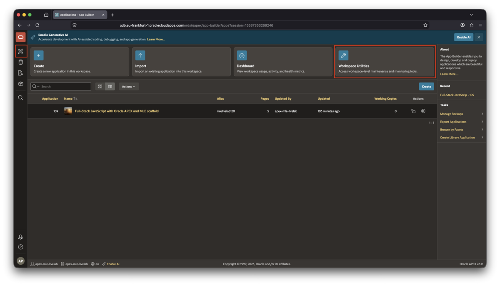
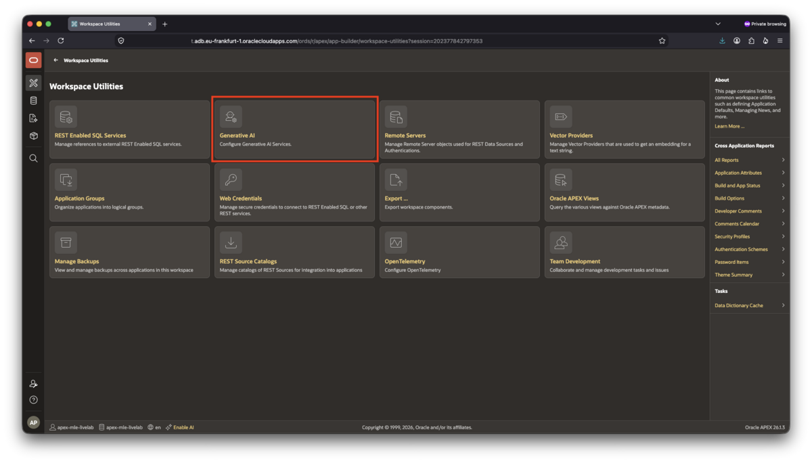
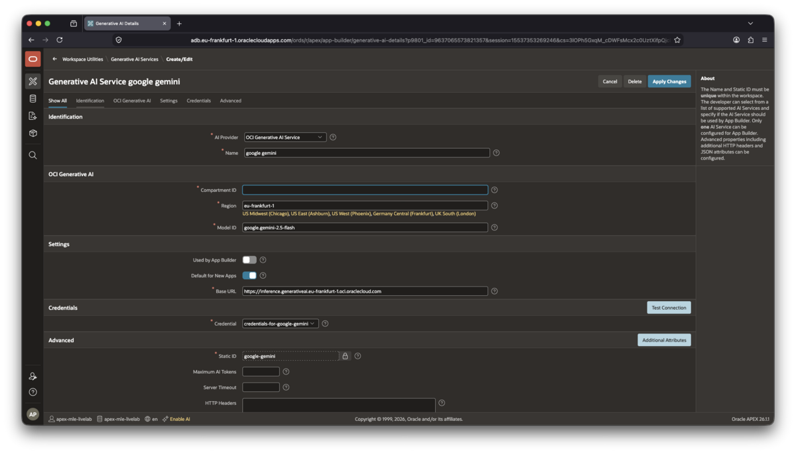

# Configure AI Services

## Introduction

In this lab, you will configure an **AI service** used by the application. The AI service, backed by Oracle Cloud Infrastructure (OCI) invokes Gemini. They call includes a set of prompts as well as the photo to be assessed. Should Gemini _think_ the photo is AI-generated, it will tell you so. Likewise, if this is not the case, an appropriate message is returned.

Before any assessment can be started, an AI service must be defined declaratively in APEX. This is what you are going to do in this lab. Later, in lab 4, you will see a call to `APEX_AI.generate()` where the magic happens.

The application uses an AI service through its Static ID, `google-gemini`. You can of course define your own AI service if you prefer, just make sure it "understands" photos and assign it's own static ID and use it throughout the entire lab. Later modules call this service from JavaScript running in the database.

This lab requires Oracle AI Database 26ai and Oracle APEX 26.1.

Estimated time to complete: 10 minutes

### Objectives

In this lab, you will:

- Create an OCI Generative AI service in APEX (or your alternative)
- Configure the service for the Google Gemini model
- Optionally configure an OpenAI model, gpt-4o, for use with the application

### Prerequisites

This lab assumes that you completed [Lab 1](../lab-1/lab-1.md) and imported the application scaffold, including its supporting objects.

You also need access to an [OCI Generative AI service](https://docs.oracle.com/en-us/iaas/Content/generative-ai/overview.htm) and permission to use the selected compartment and (AI) model. The service sends the image to the selected model for analysis. The OCI credentials are stored in the APEX workspace configuration and are not part of the application export. If you prefer not to use an OCI GenAI service, you are free to configure your own, this lab shows you how to configure OpenAI GPT-4o as an alternative. The model’s advantage is its low cost; GPT-4o may even be free of charge for you.

Regardless of which route you decide to take, make sure you understand the potential cost implications of using the AI model of choice.

## Task 1: Create the APEX AI service

1. Open **App Builder** by clicking on the stylized APEX icon underneath the Oracle logo in the top-left corner
1. From the App Builder home page, open **Workspace Utilities**.

    

1. Click on the **Generative AI** tile

    This is the second tile from the left on the top row.

    

    In this screen you have a choice to create either an OCI GenAI service as detailed in the next section, or GPT-4o as an example of a potentially free model as explained in step 5.

1. Create an OCI GenAI Service

    Click **Create** to begin the definition of the AI Service.

    Configure the service as follows, values you see on the screen but not in the following steps are left at their defaults. These values tell APEX which OCI service, model, and compartment to use.

    - **AI Provider**: OCI Generative AI Service
    - **Name**: `google gemini` (use this exact name, including the white space).
    - **Compartment ID**: The OCID of the compartment that contains the Generative AI resources. A compartment is the OCI container in which the service is authorized to access the model.
    - **Region**: Select the OCI region by clicking on the name _below the textbox_ where the service is available in, for example `Germany Central (Frankfurt)`. This click will populate the corresponding **Base URL**, like `eu-frankfurt-1`.
    - **Model ID**: `google.gemini-2.5-flash`. This identifies the Gemini model that will process the image.

    In the **Credentials** section, select an existing OCI credential configured for your workspace, or create one if your environment does not provide it. APEX uses this credential to authenticate the request without exposing secret values to the application. If you need to create the OCI API key, open the OCI Console, open your user profile in the top right corner, select **User Settings**, and open the **Tokens and Keys** tab. Click **Add API Key**, download the private key, and record the user OCID, tenancy OCID, fingerprint, and private key; these values are used to create the APEX Web Credential.

    If this is your first Web Credential, populate the values in the form. If not, create the Web Credential from **Workspace Utilities** > **Web Credentials**, then select it in the Generative AI service configuration. Keep the private key in the credential store and never publish it.

    - **Static ID**: `google-gemini` will be automatically filled.  The Static ID is different from the display name: it is the stable, code-friendly identifier used by the application and by the MLE module. It must remain exactly as set, `google-gemini`.

    

    Click **Test Connection** to verify the configuration, then click **Create** or **Apply Changes**. See [Troubleshooting](#troubleshooting) below should you encounter errors.

1. Create an OpenAI ChatGPT-4o Service [alternative to Gemini]

    The process is nearly identical to the one above. Click **Create** to begin the definition of the AI Service.

    Configure the service as follows, values you see on the screen but not in the following steps are left at their defaults.

    - **AI Provider**: OpenAI
    - **Name**: whichever name you prefer
    - **API Key**: your OpenAI API key
    - **AI Model**: `gpt-4o`

    You can use the **Test Connection** button to ensure your configuration works.

The AI service is now available to the application through APEX AI Services. The remainder of this Livelab assumes the use of Gemini. If you chose a different model, you need to adapt the later labs to your AI Service.

## Task 2: Verify the configuration

Confirm that the following objects are available:

- A Generative AI service using Gemini with Static ID `google-gemini`
- Alternatively an AI service with a static ID of your choice. Remember this static ID, you'll have to substitute it for `google-gemini` where applicable

You are now ready to continue with [Lab 3: Import third-party JavaScript modules into the database](../lab-3/lab-3.md).

## Troubleshooting

Depending on your configuration you may have to enable outbound network traffic for the AI service to work. Autonomous AI Database shouldn't require this step. Others, such as self-hosted instances do. Should you get errors similar in wording to "request denied due to Network ACL", this snippet should solve the problem. It must be executed by an administrator.

```sql
<copy>
begin
    dbms_network_acl_admin.append_host_ace(
        host => '*.oci.oraclecloud.com',
        ace  =>  xs$ace_type(
            privilege_list => xs$name_list('http'),
            principal_name => apex_application.g_flow_schema_owner,
            principal_type => xs_acl.ptype_db
        )
    );
    commit;
end;
/
</copy>
```

Refer to the [APEX documentation for more details](https://docs.oracle.com/en/database/oracle/apex/26.1/htmig/enabling-network-services.html).

## Learn More

- [APEX App Builder User's Guide: Generative AI](https://docs.oracle.com/en/database/oracle/apex/26.1/htmdb/using-generative-ai.html)
- [APEX App Builder User's Guide: JSON Sources](https://docs.oracle.com/en/database/oracle/apex/26.1/htmdb/managing-json-data.html)
- [Oracle Cloud Infrastructure Generative AI](https://docs.oracle.com/en-us/iaas/Content/generative-ai/home.htm)

## Acknowledgements

- **Author** - Sonja Meyer, Consulting Member of Technical Staff
- **Contributors** - Martin Bach, Senior Principal Product Manager
- **Last Updated By/Date** - Martin Bach, August 2026
