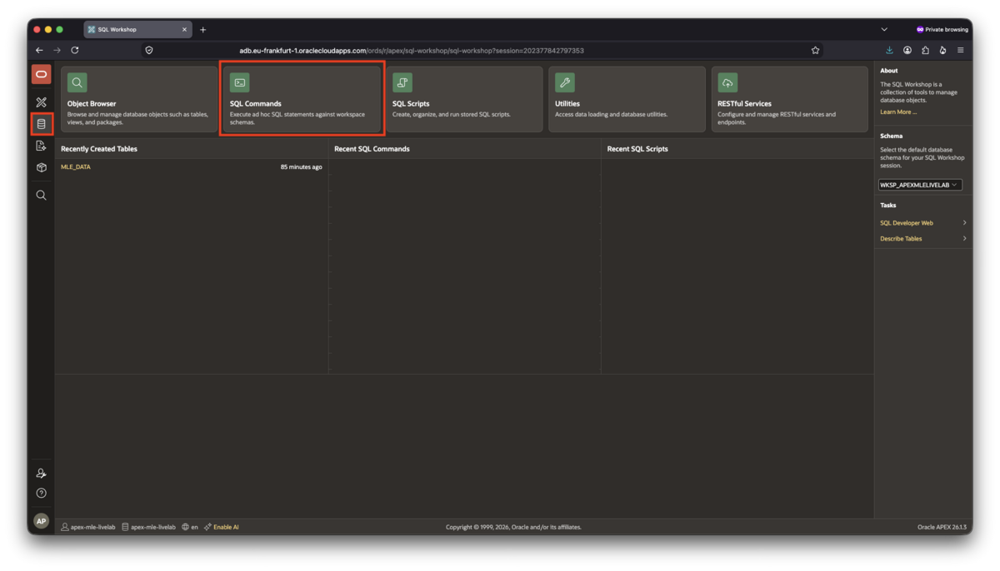
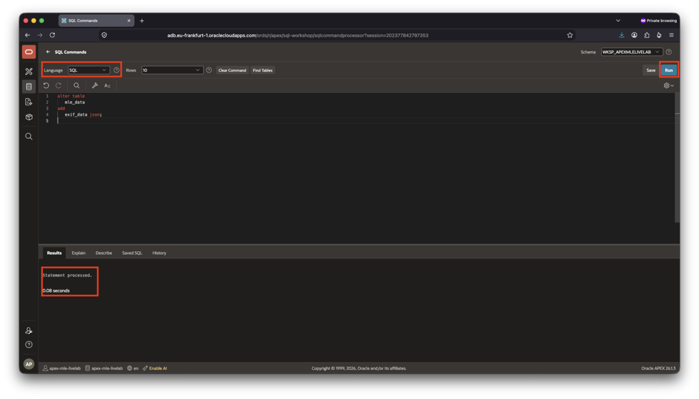
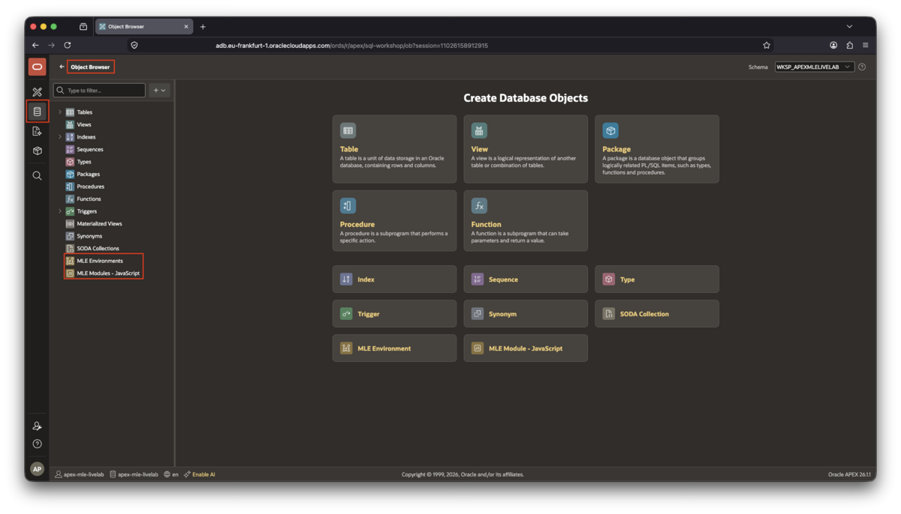
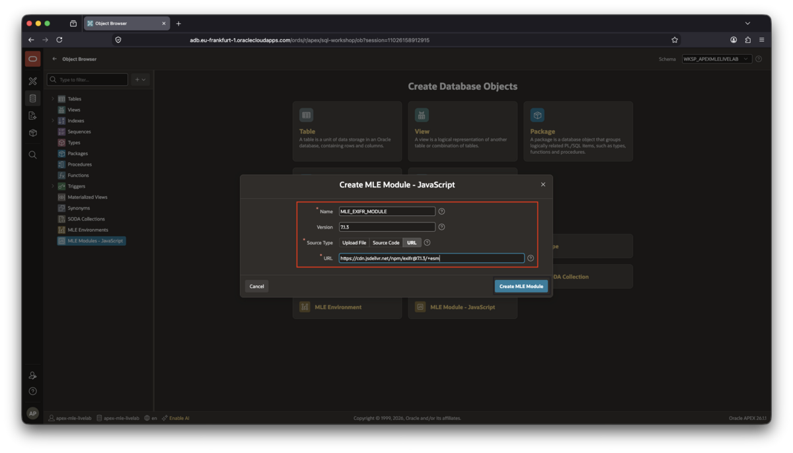
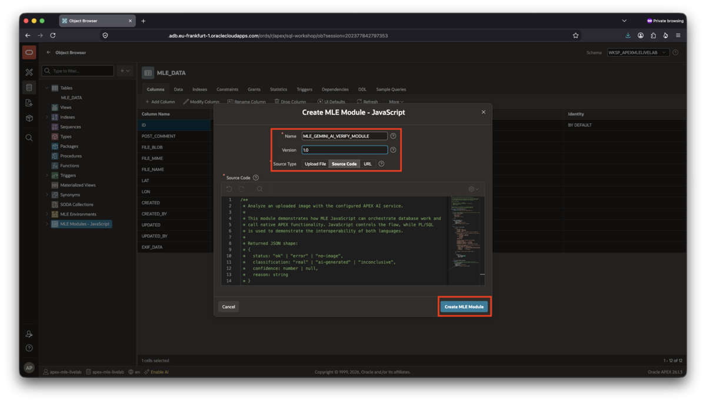
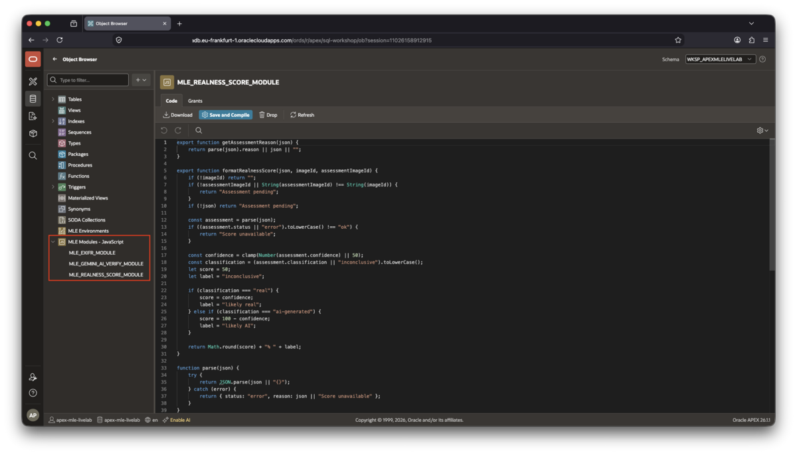
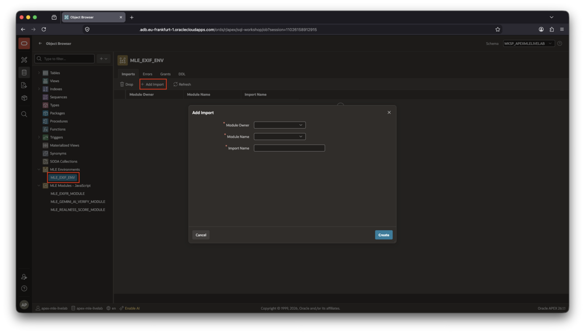
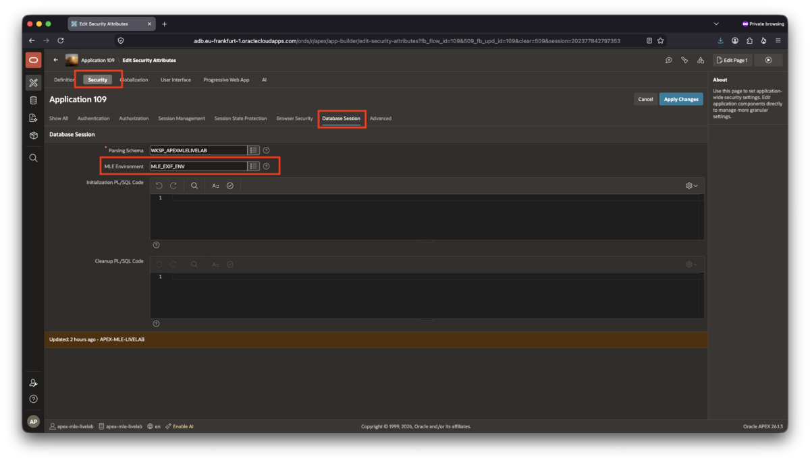

# Import JavaScript modules into the database

## Introduction

In this lab, you will import JavaScript modules into Oracle AI Database 26ai and make them available to APEX by means of an MLE environment. Multilingual Engine (MLE) allows JavaScript to run close to the data inside the database. The modules can query database tables, process files, and call database functionality while the application uses familiar JavaScript imports. You can think of JavaScript modules as PL/SQL packages, dedicated namespaces for grouping related functionality together. Just as with PL/SQL, JavaScript can have public and private variables, functions, etc. in a module.

You will create three modules for the image analysis application:

- `MLE_EXIFR_MODULE` loads the third-party `exifr` library. It extracts EXIF metadata from an uploaded image.
- `MLE_GEMINI_AI_VERIFY_MODULE` reads an image from `MLE_DATA` and calls the configured APEX AI service.
- `MLE_REALNESS_SCORE_MODULE` converts the structured AI response into text for the APEX user interface.

The modules are kept separate so that each one has a clear responsibility. The MLE environment then gives them the import names that the APEX application uses. The first module, `MLE_EXIF_MODULE` refers to a third-party module. It's fine to use it in this lab, however, in your commercial software product its license might exclude it from the project. Always be wary of a license, and those of its dependent components. They might not be compatible with your project's license.

As with all software, external libraries might come with (undetected) security vulnerabilities. It is imperative to keep and maintain a Software Bill of Materials (SBOM), and react swiftly to discovered software vulnerabilities.

The EXIF information made accessible via the new module is provided in JSON format. You will add a JSON column to the existing `MLE_DATA` table to persist the information. Creating the module in the database is the first step, later, in lab 4, you will create an APEX process to extract and store the metadata.

The other modules in this lab are used for interactions with the AI service.

This lab requires Oracle AI Database 26ai and Oracle APEX 26.1.

Estimated time to complete: 15 minutes

### Objectives

In this lab, you will:

- Allow the browser to provide location information for the map
- Create the three JavaScript MLE modules
- Create the `MLE_EXIF_ENV` environment
- Add the modules to the environment with the required import names

### Prerequisites

This lab assumes that you completed [Lab 2](../lab-2/lab-2.md) and created the `google gemini` Generative AI service (or your preferred alternative).

## Task 1: Add a JSON column to MLE_DATA

The EXIF information this app will extract from a photo is provided in JSON format. The best way to persist the meta information along with the photo is to store it in a JSON column. `MLE_DATA` currently doesn't feature a JSON column. You add it in the following step.

1. Open **SQL Workshop** and select **SQL Commands**.

    

1. Make sure the language drop-down is set to _SQL_
1. Run the following statement:

    ```sql
    <copy>
    alter table
        mle_data
    add
        exif_data json;
    </copy>
    ```

    The following screenshot shows you what the output should look like:

   

The DDL statement adds the `EXIF_DATA` JSON column without deleting or changing any existing image records. The JSON data type allows each image record to store a flexible set of metadata attributes, such as camera model, exposure settings, and GPS coordinates, without adding a separate relational column for every possible EXIF field. Confirm that the statement completes successfully before continuing.

## Task 2: Allow Location Access

The application includes a map that can use the browser's location service. When the browser displays a message such as **Allow _your host_:7005 to access your location?**, click **Allow**. You can select **Remember this decision** if you want the browser to remember the permission.

This permission belongs to the browser and is separate from the MLE environment. It allows the map to use the current location; it does not grant the application access to your OCI credentials or database account. If you select **Block** by mistake, open the browser's site permissions for the APEX URL and enable **Location** before continuing.

## Task 3: Open the MLE module area

MLE modules are database objects. They are not APEX page components, so create them in the database schema that owns `MLE_DATA` and the MLE environment. In the workshop environment, this is the schema you selected or created when you provisioned the workspace. Use **Object Browser** to create database objects in APEX.



You will create the actual MLE/JavaScript modules in the following tasks.

## Task 4: Create the EXIFR module in the database

This JavaScript module demonstrates the value added by JavaScript in MLE: instead of parsing the byte stream (the photo is stored as a BLOB in `MLE_DATA`) using PL/SQL, you can rely on someone else's work parsing and extracting the EXIF information stored along the photo. The module is later used in an APEX page process, but before that can happen it must be deployed as a schema object in the APEX workspace's parsing schema.

1. Open **Object Browser**.
1. In the tree structure on the left-hand side, right-click on **MLE Modules - JavaScript**
1. Select **Create MLE Module - JavaScript** from the context menu

Create a JavaScript module with the following values:

- **Module Name**: `MLE_EXIFR_MODULE`
- **Version**: 7.1.3
- **Source Type**: URL
- **URL**: `https://cdn.jsdelivr.net/npm/exifr@7.1.3/+esm`

Create the JavaScript module in the database by clicking on **Create MLE Module**.



Note that the module does _not_ call Gemini and does _not_ calculate a "realness" score, the other two key aspects of this application. Keeping this work in a separate module makes the EXIF extraction reusable and easier to understand. EXIFR is a third-party dependency in a production-like format typical for JavaScript.

## Task 5: Create the Gemini image verification module

Create a second JavaScript module, except this time you need to copy/paste the source code. **Right-click** MLE Modules/JavaScript again, select **Create MLE Module - JavaScript** and enter the following values in the dialog that appears:

- **Module Name**: `MLE_GEMINI_AI_VERIFY_MODULE`
- **Version**: 1.0
- **Source Type**: Source Code

Paste the following source into the code editor and click **Create MLE Module**:

```javascript
<copy>
/**
 * Analyze an uploaded image with the configured APEX AI service.
 *
 * This module demonstrates how MLE JavaScript can orchestrate database work and
 * call native APEX functionality. JavaScript controls the flow, while PL/SQL
 * is used to demonstrate the interoperability of both languages.
 *
 * Returned JSON shape:
 * {
 *   status: "ok" | "error" | "no-image",
 *   classification: "real" | "ai-generated" | "inconclusive",
 *   confidence: number | null,
 *   reason: string
 * }
 *
 * @param {number} id - MLE_DATA.ID of the uploaded image record.
 * @returns {string} JSON assessment returned to the APEX page.
 */
export function analyzePhotoWithGemini(id) {
    if (!id) {
        throw new Error("Please provide an image record ID.");
    }

    // First do a cheap database check so we avoid calling Gemini without an image.
    const photo = session.execute(
        `
        select 1 as has_photo
          from mle_data
         where id = :id
           and file_blob is not null
        `,
        { id }
    );

    if (photo.rows.length !== 1) {
        return JSON.stringify({
            status: "no-image",
            classification: "inconclusive",
            confidence: null,
            reason: "No image available for analysis."
        });
    }

    try {
        const result = session.execute(
            `
            declare
                l_file_blob   blob;
                l_file_mime   varchar2(255);
                l_file_name   varchar2(255);
                l_response    clob;
                l_attachments apex_ai.t_attachments := apex_ai.t_attachments();
            begin
                -- Load the image inside PL/SQL so the BLOB stays a native APEX AI attachment.
                select file_blob,
                       nvl(file_mime, 'image/jpeg'),
                       nvl(file_name, 'photo.jpg')
                  into l_file_blob,
                       l_file_mime,
                       l_file_name
                  from mle_data
                 where id = :id;

                -- Build the attachment expected by APEX_AI.GENERATE.
                l_attachments.extend;
                l_attachments(1).mime_type    := l_file_mime;
                l_attachments(1).content_blob := l_file_blob;
                l_attachments(1).file_name    := l_file_name;
                l_attachments(1).detail_level := apex_ai.c_detail_level_high;

                -- APEX manages the endpoint, model, and credential through the AI service static ID.
                l_response := apex_ai.generate(
                    p_service_static_id => 'google-gemini',
                    p_system_prompt     => 'You assess whether a photo is likely camera-captured or AI-generated. Return only valid JSON. No markdown. No code fences.',
                    p_prompt            => 'Return one JSON object with keys: status, classification, confidence, reason. status must be ok. classification must be real, ai-generated, or inconclusive. confidence must be an integer from 0 to 100. Reason must be one short sentence.',
                    p_temperature       => 0.2,
                    p_attachments       => l_attachments
                );

                :assessment := dbms_lob.substr(l_response, 4000, 1);
            end;
            `,
            {
                id,
                assessment: {
                    dir: oracledb.BIND_OUT,
                    type: oracledb.STRING,
                    maxSize: 4000
                }
            }
        );

        return result.outBinds.assessment;
    } catch (err) {
        // Return structured JSON even when the external AI call fails.
        // This keeps the APEX page simple and prevents false score calculations.
        return JSON.stringify({
            status: "error",
            classification: "inconclusive",
            confidence: null,
            reason: `AI assessment unavailable: ${err}`
        });
    }
}
</copy>
```

This module first checks whether the requested `MLE_DATA` record contains an image. It then uses `session.execute` to load the BLOB representing the image and calls `APEX_AI.GENERATE` with the native APEX attachment type. JavaScript controls the overall flow, while PL/SQL is used only inside the module where APEX AI requires native database types. MLE/JavaScript understands PL/SQL Records and Collections since release 23.9, alternatively this embedded PL/SQL block could have been written entirely in JavaScript. For the sake of this Livelab though the PL/SQL approach was chosen to demonstrate how easy it is to create interoperability between SQL, PL/SQL and JavaScript.

The module calls the AI service you created in lab 2 using the Static ID `google-gemini`. This is why the service created in Lab 2 must use the exact Static ID; update the static ID if you created your own AI service that deviates from the lab. Note how the module returns structured JSON containing a status, classification, confidence, and reason so the APEX page can handle successful and failed AI calls consistently.

Here is a screenshot showing you the dialog:



## Task 5: Create the realness score module

Create a third JavaScript module. It continues where the previous one left off, by picking up the assessment in JSON format and parsing it. The end result will be used in the next lab to display certain values on the page, including the assessment.

- **Module Name**: `MLE_REALNESS_SCORE_MODULE`
- **Version**: 1.0
- **Source Type**: Source Code

Paste the following source into the code editor and click **Create MLE Module**:

```javascript
<copy>
/**
 * Helper functions for presenting the Gemini assessment in APEX.
 *
 * The Gemini module returns JSON. This module keeps the UI-facing conversion in
 * JavaScript too, so the APEX page only receives simple display values.
 */

/**
 * Extracts the short text shown in the Google AI Analysis region.
 *
 * @param {string} assessmentJson - JSON returned by MLE_GEMINI_AI_VERIFY_MODULE.
 * @returns {string} Human-readable reason text.
 */
export function getAssessmentReason(assessmentJson) {
    const assessment = parseAssessment(assessmentJson);
    return assessment.reason || assessmentJson || "";
}

/**
 * Converts the structured Gemini assessment into a short score text.
 *
 * The score is intentionally simple for the lab:
 * - real:         confidence is the realness score
 * - ai-generated: realness is the inverse of confidence
 * - inconclusive: neutral 50% score
 *
 * @param {string} assessmentJson - JSON returned by MLE_GEMINI_AI_VERIFY_MODULE.
 * @param {number|string} imageId - Current MLE_DATA.ID displayed on the page.
 * @param {number|string} assessmentImageId - MLE_DATA.ID used for the assessment.
 * @returns {string} Plain text such as "82% likely real".
 */
export function formatRealnessScore(assessmentJson, imageId, assessmentImageId) {
    // Do not show a score when the page has no current image.
    if (imageId === undefined || imageId === null || imageId === "") {
        return "";
    }

    // Avoid showing a score that belongs to a previously viewed image.
    if (assessmentImageId === undefined || assessmentImageId === null || assessmentImageId === "" || (assessmentImageId + "") !== (imageId + "")) {
        return "Assessment pending";
    }

    // Wait until the Gemini assessment has been returned.
    if (assessmentJson === undefined || assessmentJson === null || (assessmentJson + "") === "") {
        return "Assessment pending";
    }

    const assessment = parseAssessment(assessmentJson);
    const status = valueAsText(assessment.status, "error").toLowerCase();

    // If Gemini failed, do not calculate a misleading score.
    if (status !== "ok") {
        return "Score unavailable";
    }

    const classification = valueAsText(assessment.classification, "inconclusive").toLowerCase();
    const confidence = clamp(valueAsNumber(assessment.confidence, 50));

    let score = 50;
    let label = "inconclusive";

    if (classification === "real") {
        score = confidence;
        label = "likely real";
    } else if (classification === "ai-generated") {
        score = 100 - confidence;
        label = "likely AI";
    }

    return Math.round(clamp(score)) + "% " + label;
}

/**
 * Parses JSON safely so malformed AI output does not break the page.
 */
function parseAssessment(assessmentJson) {
    try {
        return JSON.parse((assessmentJson === undefined || assessmentJson === null) ? "{}" : assessmentJson + "");
    } catch (error) {
        return {
            status: "error",
            reason: assessmentJson || "Score unavailable"
        };
    }
}

/**
 * Converts optional values to text with a fallback.
 */
function valueAsText(value, fallback) {
    return (value === undefined || value === null) ? fallback : value + "";
}

/**
 * Converts optional values to numbers with a fallback.
 */
function valueAsNumber(value, fallback) {
    const numberValue = Number(value);
    return isNaN(numberValue) ? fallback : numberValue;
}

/**
 * Keeps score values inside the 0-100 range.
 */
function clamp(value) {
    return Math.min(Math.max(value, 0), 100);
}
</copy>
```

This module contains only presentation helpers. It parses the JSON returned by the Gemini module, extracts the short reason shown in the application, and formats the score. It does not call an AI service and does not access the image table. Keeping this logic separate prevents the APEX page from having to calculate scores itself.

The Object Browser should list the following 3 JavaScript modules:



## Task 7: Create the MLE environment

Later in this lab you will make references to the three MLE modules you just created in Page Designer. In order to do so, you need to import the module by an import name of your choice. For Oracle AI Database to map the import name to a schema object, MLE environments are used.

1. In **Object Browser**, right-click **MLE Environments**.
1. Click **Create MLE Environment** in the context menu.
1. Enter `MLE_EXIF_ENV` as the environment name.
1. Click **Create MLE Environment** to create it.
1. Click on the environment's name to open the imports tab. You may have to expand the _MLE Environments_ node in the tree view.
1. Click **Add Import** for each of the three modules.



An MLE environment maps the module names used by JavaScript `import` statements to database MLE modules. The import name is therefore part of the application contract and must be entered exactly as shown below:

| Module Owner | Module Name | Import Name |
| --- | --- | --- |
| Your workspace's parsing schema | `MLE_EXIFR_MODULE` | `exifr-module` |
| Your workspace's parsing schema | `MLE_GEMINI_AI_VERIFY_MODULE` | `gemini-ai-verify-module` |
| Your workspace's parsing schema | `MLE_REALNESS_SCORE_MODULE` | `realness-score-module` |

Do not change the capitalization of the module names or the spelling of the import names. The APEX page uses these import names when it loads the modules. The module owner must match the schema in which you created the modules.

Confirm that all three imports are listed without errors. The environment is resolved when the APEX page runs the MLE code; there is no separate JavaScript compilation step for the import mappings.

## Task 8: Assign the MLE environment to the application

The MLE environment must also be assigned to the APEX application. Creating the environment in the database alone is not enough; the application needs to know which environment resolves imports such as `exifr-module` and `gemini-ai-verify-module`.

1. Return to **App Builder** and click on the application name.
1. Click on **Shared Components** then **Security Attributes**
1. Select the **Security** tab.
1. In the **Database Session** section, keep the correct **Parsing Schema** selected.
1. For **MLE Environment**, select `MLE_EXIF_ENV`.
1. Save the application settings.

Here is a screenshot showing the relevant settings:



The application is now associated with `MLE_EXIF_ENV`. When an APEX page executes MLE JavaScript, its `import` statements are resolved against this environment and its three module mappings.

## Verify the configuration

Confirm that the following objects are available in the database using the **Object Browser**:

- `MLE_EXIFR_MODULE`
- `MLE_GEMINI_AI_VERIFY_MODULE`
- `MLE_REALNESS_SCORE_MODULE`
- `MLE_EXIF_ENV`

Confirm that `MLE_EXIF_ENV` contains these exact import mappings:

- `exifr-module` → `MLE_EXIFR_MODULE`
- `gemini-ai-verify-module` → `MLE_GEMINI_AI_VERIFY_MODULE`
- `realness-score-module` → `MLE_REALNESS_SCORE_MODULE`

The environment is now ready for the APEX application. In the next lab, you will use the modules to extract EXIF metadata, call Gemini, and display the image assessment.

## Learn More

- [Oracle Database JavaScript Developer's Guide: Multilingual Engine](https://docs.oracle.com/en/database/oracle/oracle-database/26/mlejs/index.html)
- [Oracle Database JavaScript Developer's Guide: JavaScript Modules](https://docs.oracle.com/en/database/oracle/oracle-database/26/mlejs/using-javascript-modules.html)
- [Oracle Database JavaScript Developer's Guide: MLE Environments](https://docs.oracle.com/en/database/oracle/oracle-database/26/mlejs/using-mle-environments.html)

## Acknowledgements

- **Author** - Sonja Meyer, Consulting Member of Technical Staff
- **Contributors** - Martin Bach, Senior Principal Product Manager
- **Last Updated By/Date** - Martin Bach, Senior Principal Product Manager, August 2026
