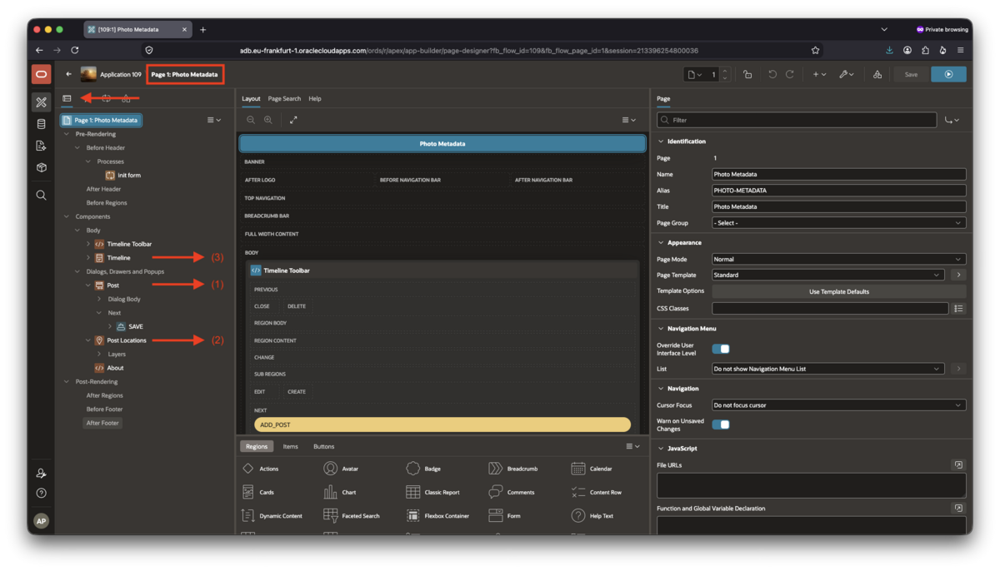
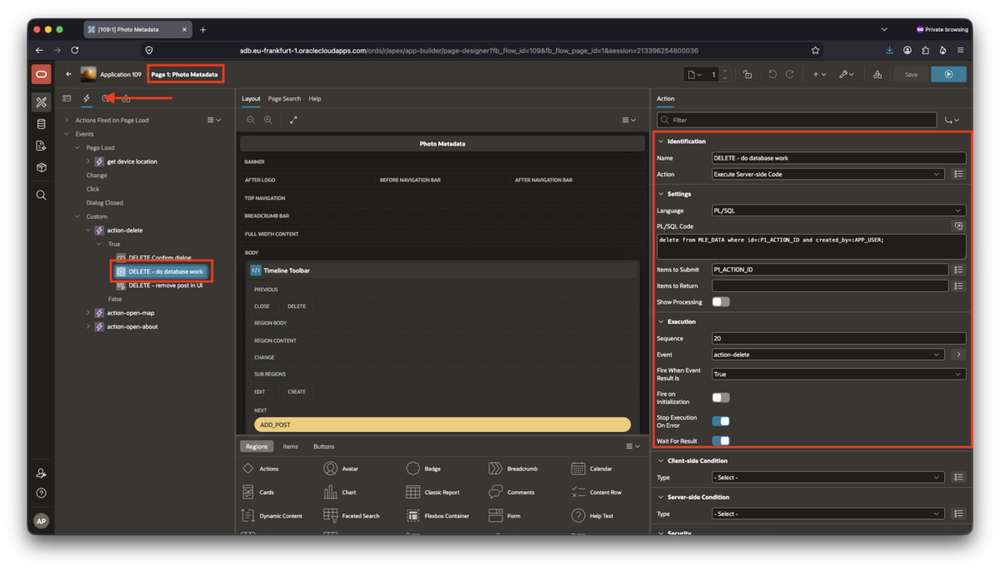
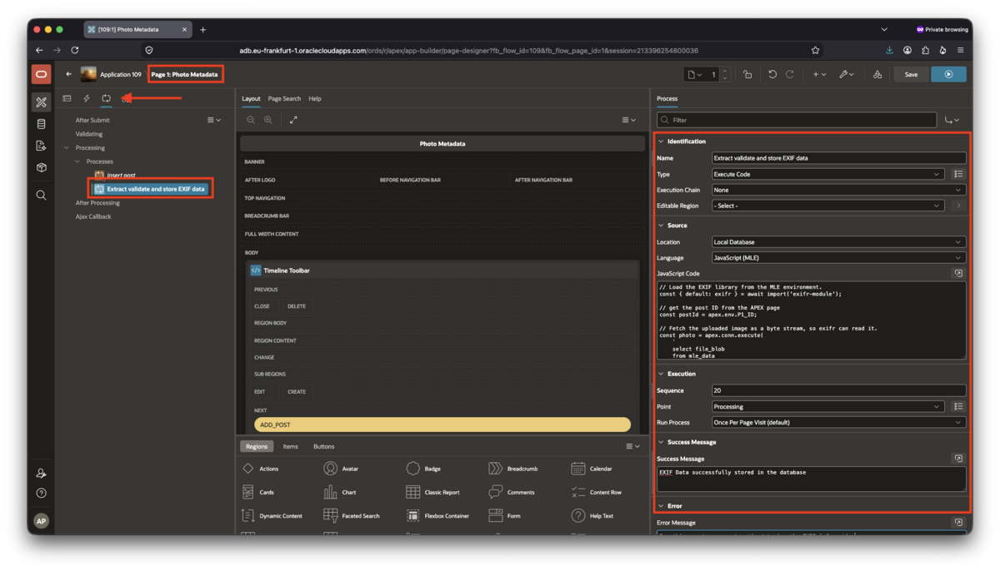
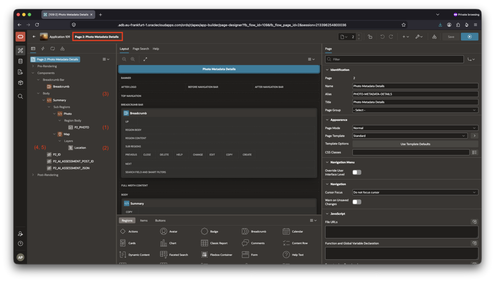
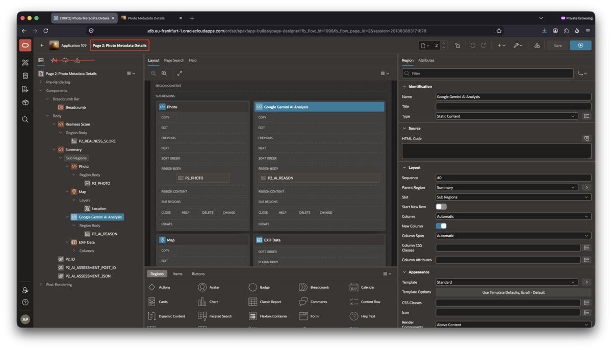
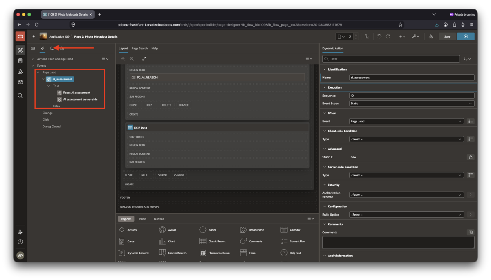

# Complete the image metadata application

## Introduction

In this lab, you will complete the application by connecting the pages to `MLE_DATA`, displaying the extracted EXIF metadata, and using the MLE modules created in Lab 3.

The final application will differ from the scaffold in three important ways:

- All APEX pages use the scaffold's updated and enhanced `MLE_DATA` table featuring the JSON column
- Processing is in largest parts performed in MLE/JavaScript on the server
- Page 2 displays
    - EXIF data based on a SQL query featuring a `JSON_TABLE()` expression
    - Google Gemini analysis (or your own model's conclusion)
    - A calculated _realness_ score with the intention of indicating whether the photo was AI generated, or not

This lab requires Oracle AI Database 26ai, Oracle APEX 26.1, and the `MLE_EXIF_ENV` environment plus all the MLE modules created in the previous lab.

Estimated time to complete: 20 minutes

### Prerequisites

Complete [Lab 3](../lab-3/lab-3.md) first. The application uses the `MLE_DATA` table, including its `EXIF_DATA` JSON column.

The `EXIF_DATA` column is populated by the EXIF MLE module after an image is uploaded. Keep the table name `MLE_DATA` throughout this lab.

### Objectives

In this lab, you will:

- Finish all APEX pages
- Add logic to extract EXIF data to page 1
- Complete the image detail page by passing it to Gemini for an assessment and displaying the location where the photo was taken

## Task 1: Update Page 1 and embed EXIF Data and the AI Assessment

The scaffold uses `MLE_DATA` as its source table. Keep this table name in all Page 1 components.

Open Page 1: _Photo Metadata_ in Page Designer and ensure the major properties align with these settings. Use this screenshot to locate the regions mentioned in the following sections:



1. **Form region**: Post

    Select the _Post_ form region (#1 in the screenshot) and set its table or view to `MLE_DATA` if not done so already. You can find it in the "Diaglogs, Drawers and Popups" section. In the Dialog Body, set all items' types, except `P1_FILE_BLOB` and `P1_POST_COMMENT` to _hidden_ to unclutter the popup dialog.

1. **Map region**: Post Locations

    Set the _Post Locations_ map region (#2 in the screenshot) and ensure this SQL query is used:

    ```sql
    <copy>
    select
        lat,
        lon,
        created_by as who,
        apex_util.get_since(created) as since
    from mle_data
    where lat is not null
    and lon is not null
    </copy>
    ```

1. **Cards region**: Timeline

    Set the _Timeline_ cards region (#3 in the screenshot) source to this SQL query should it differ:

    ```sql
    <copy>
    select
        p.id,
        p.created_by as user_name,
        p.post_comment as comment_text,
        p.file_blob,
        p.file_mime,
        apex_util.get_since(p.created) as post_date
    from mle_data p
    order by p.created desc
    </copy>
    ```

1. **Delete action**

    If the delete action (_Dynamic Actions_ > _Custom_ > _action-delete_ > _DELETE - do database work_) is retained in the application, ensure its server-side code looks as follows:

    ```sql
    <copy>
    delete from mle_data
    where id = :P1_ACTION_ID
    and created_by = :APP_USER;
    </copy>
    ```

    Compare your settings with this screenshot:

    

1. **EXIF Data Extraction**

    You created a JavaScript module `MLE_EXIF_HELPER_MODULE` in the previous lab. It's sole exported function, `extractAndSaveEXIF` takes an image ID and extracts the EXIF data, validates it, and stores it in `MLE_DATA.EXIF_DATA`. Only a subset of all available EXIF fields is stored to keep the example reasonably simple.

    Switch to the **Processes** pane and add the following process _after_ insert post. Keep the defaults, except for the following:

    - **Name**: Extract validate and store EXIF data
    - **Source**/**Language**: JavaScript (MLE)
    - **Source**/**JavaScript Code**

        ```javascript
        <copy>
        // Load the EXIF library from the MLE environment.
        const { default: exifr } = await import('exifr-module');

        // get the post ID from the APEX page
        const postId = apex.env.P1_ID;

        // Fetch the uploaded image as a byte stream, so exifr can read it.
        const photo = apex.conn.execute(
            `
            select file_blob
            from mle_data
            where id = :id
            `,
            {
                id: { val: postId }
            },
            {
                fetchInfo: {
                    FILE_BLOB: {
                        type: oracledb.UINT8ARRAY
                    }
                }
            });

        if (photo.rows.length !== 1) {
            throw new Error('no photo found on this page');
        }

        // Parse EXIF metadata with the JavaScript library.
        const exifData = await exifr.parse(photo.rows[0].FILE_BLOB.buffer);

        if (!exifData) {
            return;
        }

        // Store the EXIF JSON and GPS coordinates back in the database.
        const updateResult = apex.conn.execute(
            `
            update mle_data
            set exif_data = :data,
                lon = :lon,
                lat = :lat
            where id = :id
            `,
            {
                data: {
                    type: oracledb.DB_TYPE_JSON,
                    val: exifData
                },
                lon: {
                    type: oracledb.NUMBER,
                    val: exifData.longitude === undefined ? null : exifData.longitude
                },
                lat: {
                    type: oracledb.NUMBER,
                    val: exifData.latitude === undefined ? null : exifData.latitude
                },
                id: { val: postId }
            }
        );
        </copy>
        ```

    - **Success Message**: EXIF Data successfully stored in the database
    - **Error Message**: Something went wrong extracting/storing the EXIF information

    Compare with the following screenshot:

    

Save Page 1 before continuing.

## Task 2: Update Page 2 by adding the EXIF data display and AI Assessment

You are going to complete the design and code for the second APEX page in this task. Start by opening Page 2: _Photo Metadata Details_ in Page Designer. You will see the following:



The numbered items in the list indicate where you are going to add the new regions and page items as per the following steps.

1. **Photo item** P2_PHOTO

    Ensure the SQL source of `P2_PHOTO` (#1 in the screenshot) is set to:

    ```sql
    <copy>
    select file_blob
    from mle_data
    where id = :P2_ID
    </copy>
    ```

1. **Map region**'s Location details

    Confirm the map layer's table attribute (#2 in the screenshot) is set to `MLE_DATA` and features the following where condition:

    ```sql
    id = :P2_ID
    ```

1. **Realness Score**: a new region to be added

    This region displays the "realness score". This score is _not_ a forensic number, but rather an approximation whether the AI service (Google Gemini by default) considers the photo AI generated, or not. The realness score is calculated by sending the photo, along with a system and a regular prompt to the AI service. The latter returns an assessment in JSON format, which is parsed and displayed in this page. You created the code performing the calls to the AI model in the previous lab.

    Define the region as follows:

    - **Identification**
        - Name: Realness Score
        - Type: static content

    Place the region above the existing _Summary_ region, indicated by #3 in the screenshot.

    Add a page item named `P2_REALNESS_SCORE` in the region's body, with the following properties

    - **Type**: `Display Only`
    - **Format**: `Plain Text`
    - **Based On**: `Item Value`
    - **Show Line Breaks**: enabled
    - **Send On Page Submit**: enabled
    - **Region**: `Realness Score`
    - **Sequence**: `10`
    - **Slot**: `Region Body`
    - **Column Span**: `12`

1. **Google AI Analysis**

    Add the **Google AI Analysis** region as a static item. Create it as the third sub-region for the **Summary** Region, indicated by #4 in the screenshot. Set _Start New Row_ to false but toggle the switch to start a new column.

    Leave the label empty. The MLE realness-score module writes the formatted value, such as `85% likely real` or `50% inconclusive`, into the page item to create next.

    Configure `P2_AI_REASON` as follows:

    - **Type**: `Display Only`
    - **Format**: `HTML`
    - **Send On Page Submit**: enabled
    - **Region**: `Google Gemini AI Analysis`
    - **Sequence**: `10`
    - **Slot**: `Region Body`
    - **Start New Row**: enabled
    - **Column Span**: `12`

    Leave the label empty. The MLE Gemini module writes the concise assessment reason into this item.

1. **Additional Hidden Page Items** to be created

    Ensure the following hidden page items exist on the _summary_ region's level, create them if needed. All they need is creating, and the type set to `hidden`. Everything else is performed by Dynamic Actions you create in the next task.

    - `P2_AI_ASSESSMENT_JSON`
    - `P2_AI_ASSESSMENT_POST_ID`

1. **EXIF Data region** is the final region to be created

    Create a sub-region named **EXIF Data** and place it after the previously created AI Analysis region in the tree. This is marked by #4 in the screenshot. Change its type to _classic report_ and set the following properties:

    - **Identification**:
        - Name: `EXIF_DATA`
        - Title: EXIF Data
    - **Source**
        - Location: Local Database
        - Type: SQL Query
        - SQL query:

        ```sql
        <copy>
        select
            id,
            make,
            model,
            lens_make,
            lens_model,
            focal_length,
            case
                when exposure_time is null then null
                when exposure_time >= 1 then to_char(round(exposure_time, 2)) || ' s'
                else '1/' || to_char(round(1 / exposure_time)) || ' s'
            end as exposure_time,
            case
                when aperture is not null then 'f/' || to_char(round(aperture, 1))
            end as aperture,
            iso,
            flash,
            latitude,
            longitude
        from
            mle_data,
            json_table(
                mle_data.exif_data, '$'
                columns (
                    make          varchar2(150) path '$.Make',
                    model         varchar2(150) path '$.Model',
                    lens_make     varchar2(150) path '$.LensMake',
                    lens_model    varchar2(150) path '$.LensModel',
                    focal_length  varchar2(150) path '$.FocalLength',
                    exposure_time number        path '$.ExposureTime',
                    aperture      number        path '$.FNumber',
                    iso           number        path '$.ISO',
                    flash         varchar2(150) path '$.Flash',
                    latitude      number        path '$.latitude',
                    longitude     number        path '$.longitude'
                )
            ) jt
        where
            id = :P2_ID
        </copy>
        ```

    Set the region's attributes as follows:

    - **Appearance**
        - Template Type: Theme
        - Template: Value Attribute Pairs - Column
    - **Messages**:
        - when no data found: Photo does not contain EXIF data.

    Move the region next to the Map region and below the Gemini Analysis using the mouse.

The SQL query extracts only a subset of EXIF fields extracted by the application.

The final number of page items and regions is shown in this screenshot: 

## Task 3: Add Dynamic Actions to Page 2

Dynamic Actions breathe life into the page. They are executed whenever a condition such as _page loads_ is satisfied and make embedding JavaScript code much easier.

Start by creating a Dynamic Action named `ai_assessment` **on Page Load** by right clicking it and selecting _Create Dynamic Action_. The end result will look like this



Add these two actions in this order in the _True_ branch:

1. **Reset AI assessment**

    - **Name**: Reset AI assessment
    - **Action**: Execute JavaScript Code

    It's job is to clear the previous assessment before a new image is analyzed by executing the following JavaScript code:

    ```javascript
    <copy>
    apex.item("P2_AI_ASSESSMENT_POST_ID").setValue("");
    apex.item("P2_AI_ASSESSMENT_JSON").setValue("");
    apex.item("P2_AI_REASON").setValue("");
    apex.item("P2_REALNESS_SCORE").setValue("Assessment pending");
    </copy>
    ```

    The page items modified by the snippet have just been created by you in the previous task.

2. **AI assessment server-side**

    Create another _True_ action like so:

    - **Name**: AI assessment server-side
    - **Action**: Execute Server-Side Code
    - **Language**: JavaScript (MLE)
    - **Items to Submit**: leave empty
    - **Items to Return**: `P2_AI_ASSESSMENT_POST_ID,P2_AI_ASSESSMENT_JSON,P2_AI_REASON,P2_REALNESS_SCORE`
    - **Show Processing**: enabled
    - **Stop Execution on Error**: enabled
    - **Wait for Result**: enabled

    Use the following JavaScript code. It's job is to invoke the MLE JavaScript module you created earlier, sending the photo to Gemini for assessment.

    ```javascript
    <copy>
    const { analyzePhotoWithGemini } = await import('gemini-ai-verify-module');
    const { getAssessmentReason, formatRealnessScore } =
        await import('realness-score-module');

    const postId = apex.env.P2_ID;

    // this call returns a string, not a JSON
    const assessment = analyzePhotoWithGemini(postId);

    apex.env.P2_AI_ASSESSMENT_POST_ID = postId;
    apex.env.P2_AI_ASSESSMENT_JSON = assessment;

    apex.env.P2_AI_REASON = JSON.parse(assessment).reason || "assessment error";
    apex.env.P2_REALNESS_SCORE = formatRealnessScore(
        assessment,
        postId,
        postId
    );
    </copy>
    ```

    Return the values to the page items listed above. The Gemini module performs the image analysis; the realness-score module formats the result for the APEX page.

Save Page 2.

## Verify the application

Upload an image and confirm that:

- Page 1 stores the image in `MLE_DATA`.
- The EXIF MLE module writes metadata to `MLE_DATA.EXIF_DATA`.
- Page 2 displays the image, EXIF data, map, Gemini analysis, and realness score. It also displays the location where the photo was taken on a map.

## Learn More

- [Oracle Database JavaScript Developer's Guide: Multilingual Engine](https://docs.oracle.com/en/database/oracle/oracle-database/26/mlejs/index.html)
- [Oracle Database JSON Developer's Guide: JSON_TABLE](https://docs.oracle.com/en/database/oracle/oracle-database/26/adjsn/json_table-sql-function.html)
- [APEX App Builder User's Guide: Page Designer](https://docs.oracle.com/en/database/oracle/apex/26.1/htmdb/page-designer.html)

## Acknowledgements

- **Author** - Martin Bach, Senior Principal Product Manager
- **Contributors** - Sonja Meyer, Consulting Member of Technical Staff
- **Last Updated By/Date** - Martin Bach, Senior Principal Product Manager, August 2026
