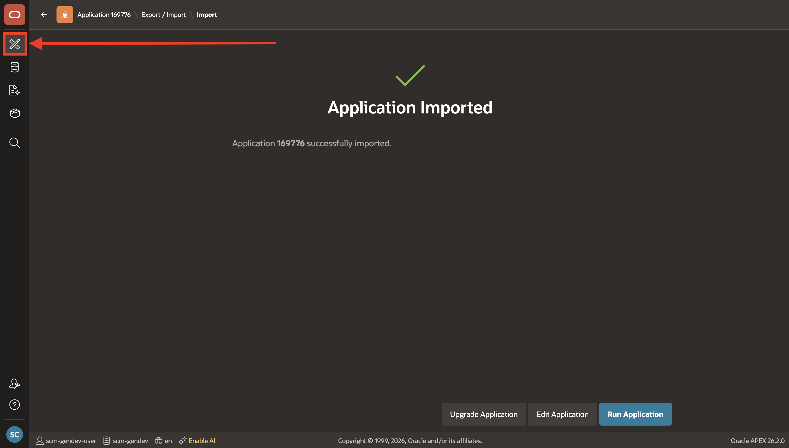
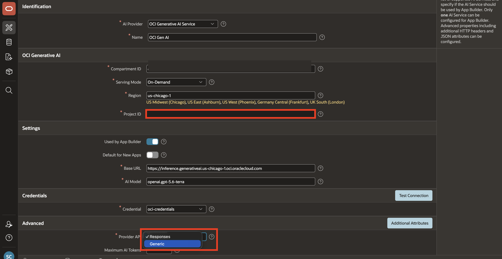
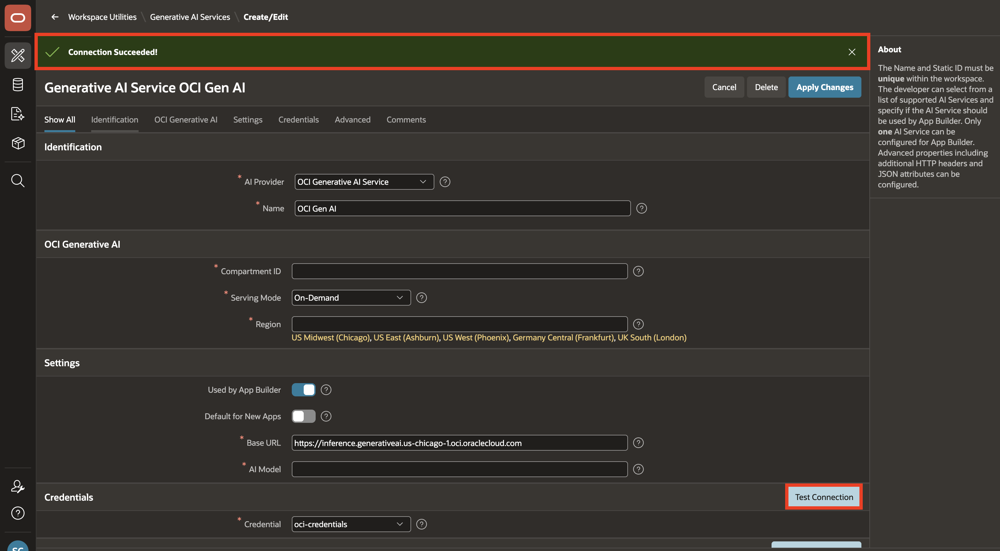
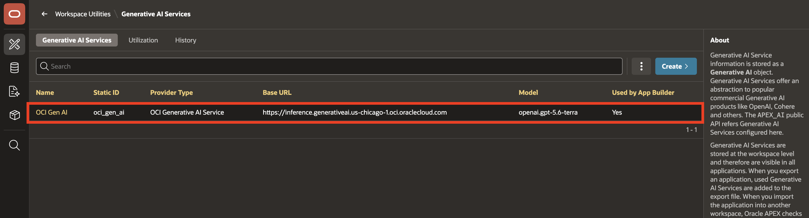
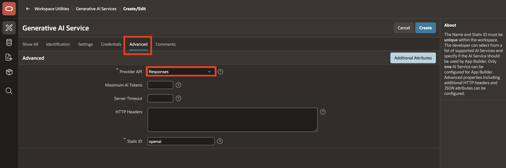
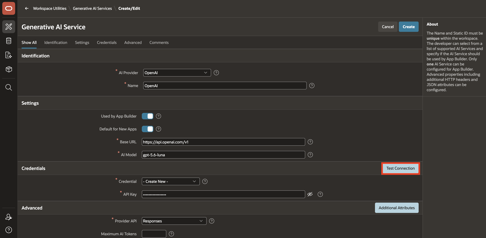
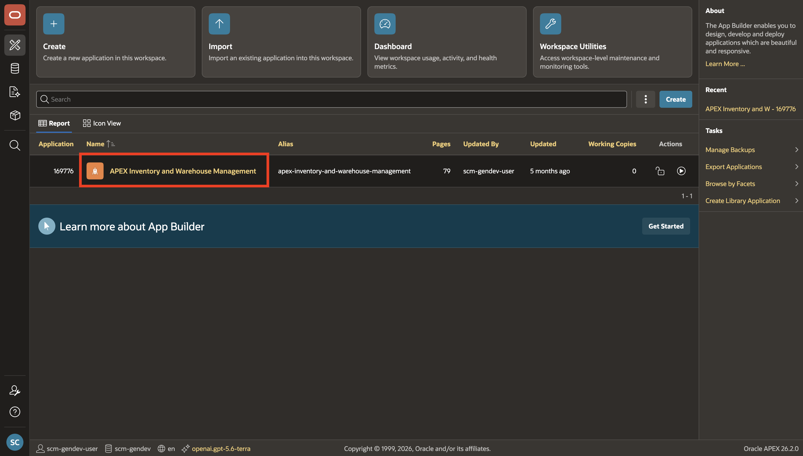
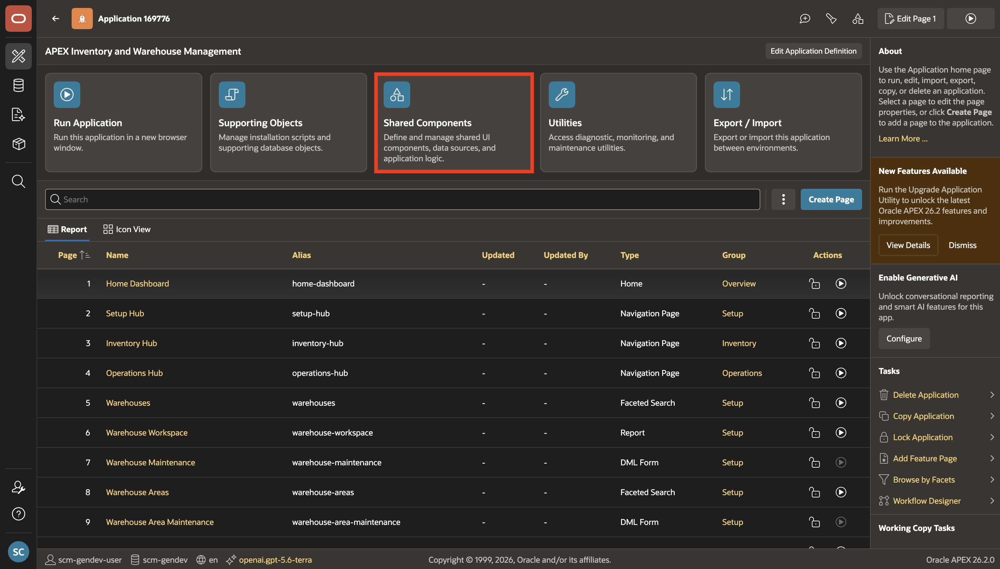
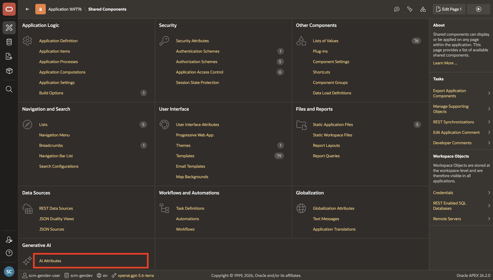

# Configure Generative AI Service

## Introduction

The AI Agent requires a connection to a Generative AI provider. In this lab, you will generate or gather the provider credentials, configure a workspace-level Generative AI Service, and link that service to the application.

> **Important:** Oracle APEX acts as the application layer and connects to the Generative AI provider of your choice using your own credentials. You will need an active account with a supported provider to complete this lab. Any charges for API usage are billed directly by your AI provider. Please review your provider's pricing before proceeding.

Estimated Lab Time: 5 minutes

### Objectives

In this lab, you will:

- Generate or gather provider credentials

- Configure a Generative AI Service in your APEX workspace

- Select the Provider API for your service

- Link the Generative AI Service to the application

<if type="OCIGenAI">

## Task 1: Generate OCI API Keys

In this task, you will generate the OCI API key details needed to configure OCI Generative AI Service in APEX. If you already have an OCI key pair and configuration details, you may skip this task.

1. Log in to your OCI account.

    

2. Click **Profile** at the top-right corner and select your user name.

    

3. Open the **Tokens and keys** tab, then click **Add API key**.

    

4. In the **Add API Key** dialog, select **Generate API Key Pair**.

5. Click **Download Private Key**. A `.pem` file is saved to your local machine. You do not need to download the public key.

6. Click **Add**.

    

7. Copy and save the configuration file preview. You will use these values when configuring the Generative AI Service in APEX.

    

## Task 2: Configure Generative AI Service

In this task, you will configure OCI Generative AI Service in your APEX workspace.

1. From the left navigation, click the **App Builder** icon.

    

2. From **App Builder**, select **Workspace Utilities**.

    

3. From **Workspace Utilities**, select **Generative AI**.

    

4. Click **Create**.

    

5. On the **Create Generative AI Service** page, enter/select the following:

    - AI Provider: **OCI Generative AI Service**
    - Name: **OCI Gen AI**
    - Compartment ID: Enter your OCI Compartment ID.
    - Region: Enter an OCI region where your selected model is available.
    - Serving Mode: **On-Demand**
    - Model ID: Enter the ID of a model available in your region that supports tool calling. The screenshot uses **cohere.command-a-03-2025**. Check the [available models](https://docs.oracle.com/en-us/iaas/Content/generative-ai/pretrained-models.htm#pretrained-models) before selecting it.
    - Used by App Builder: Toggle **On**
    - Base URL: Leave the auto-generated value unchanged.
    - Credential: Select an existing OCI credential if one is already available in your workspace. Otherwise, create a new OCI credential using the configuration details from Task 1.

    

6. Select **Advanced** and set **Provider API** to **Generic** for this OCI configuration.

    For an OCI model that requires **Responses**, select **Responses** and enter your OCI Generative AI project's OCID in **Project ID**. Confirm that the selected model supports that API.

    

7. Click **Test Connection**.

    

8. If the connection is successful, select **Create**.

    

9. Verify that the new **OCI Gen AI** service appears in the **Generative AI Services** list.

    

</if>

<if type="OpenAI">

## Task 1: Generate an OpenAI API Key

In this task, you will create an OpenAI API key to configure OpenAI as the Generative AI provider in APEX. If you already have an OpenAI API key, you may skip this task.

1. Create and log in to your [OpenAI account](https://platform.openai.com/).

    

2. Navigate to the [API keys](https://platform.openai.com/settings/organization/api-keys) page and create a new secret key.

    

3. Copy and save the secret key. You will use it when you configure the Generative AI Service in APEX.

    

## Task 2: Configure Generative AI Service

In this task, you will configure OpenAI as a Generative AI Service in your APEX workspace.

1. Return to your Oracle APEX workspace. From the left navigation, click the **App Builder** icon.

    

2. From **App Builder**, select **Workspace Utilities**.

    

3. From **Workspace Utilities**, select **Generative AI**.

    

4. Select **Create**.

    

5. On the **Create Generative AI Service** page, enter/select the following:

    - AI Provider: **OpenAI**
    - Name: **OpenAI**
    - Used by App Builder: Toggle **On**
    - Base URL: Leave the auto-generated value unchanged.
    - Credential: Select an existing OpenAI credential, or select **Create New** and enter the API key you created in Task 1.
    - AI Model: Enter the ID of a model available to your account that supports the Responses API and tool calling.

    

6. Select **Advanced** and set **Provider API** to **Responses**.

    

7. Click **Test Connection**. Verify that the connection succeeds before proceeding.

    

8. If the connection is successful, click **Create**.

    

</if>

## Task 3: Link Your Generative AI Service to the Application

In this task, you will link the Generative AI Service you configured in Task 2 to the SCM application.

1. From the **Generative AI Services** page, select the **App Builder** icon in the left navigation.

    

2. Select the application from the App Builder applications list.

    

3. On the application home page, select **Shared Components**.

    

4. From **Shared Components**, select **AI Attributes**.

    

5. On the **AI** page, under **Generative AI**, set the **Service** to the service you configured earlier in this lab, then select **Apply Changes**.

<if type="OCIGenAI">

    

</if>

<if type="OpenAI">

    

</if>

## Summary

You configured the Generative AI Service, selected its Provider API, and linked it to the application. You are ready to create the Procurement Agent and add tools in the next lab.

You may now **proceed to the next lab**.

## Learn More

- [Generative AI Provider APIs in Oracle APEX 26.2](https://blogs.oracle.com/apex/working-with-generative-ai-provider-apis-and-reasoning-effort)

## Acknowledgements

- **Author** - Sahaana Manavalan, Senior Product Manager, April 2026
- **Last Updated By/Date** - Sahaana Manavalan, Senior Product Manager, October 2026
